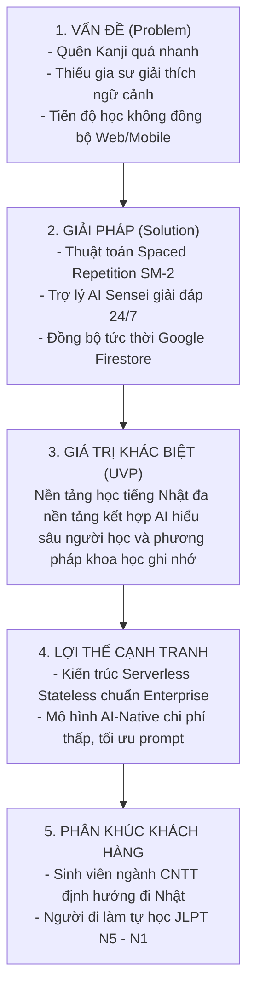

# 🧭 TÀI LIỆU KHÁM PHÁ SẢN PHẨM (PRODUCT DISCOVERY)
## DỰ ÁN: KIZUNA (絆) - ỨNG DỤNG HỌC TIẾNG NHẬT ĐA NỀN TẢNG HỖ TRỢ BỞI AI
**Học phần:** CS2028 - AI Product Development: End to End (Chuyên đề 4)  
**Trường:** Đại học Công nghệ Thông tin và Truyền thông Việt - Hàn (VKU) - Đại học Đà Nẵng  
**Mục tiêu học phần:** Đáp ứng Chuẩn đầu ra CLO1, CLO2, CLO3 - Nội dung Chương 3 (Mục 3.1)  

---

## 1. BỐI CẢNH & CƠ HỘI THỊ TRƯỜNG (MARKET OPPORTUNITY)

### 1.1. Thực trạng & Nhu cầu học tiếng Nhật
- Nhu cầu nhân lực CNTT biết tiếng Nhật (Kỹ sư cầu nối BrSE, Comtor, Lập trình viên làm việc với thị trường Nhật Bản) tại Việt Nam, đặc biệt là khu vực miền Trung (Đà Nẵng) tăng trưởng mạnh mẽ với mức thu nhập vượt trội (cao hơn 30% - 50% so với thị trường nội địa).
- Tuy nhiên, tiếng Nhật là một trong những ngôn ngữ khó nhất thế giới đối với người Việt, do có 3 bảng chữ cái (Hiragana, Katakana, Kanji) và hệ thống ngữ pháp phân cấp theo ngữ cảnh (kính ngữ, thể lịch sự, thể thông thường).
- Tỷ lệ bỏ cuộc giữa chừng trong giai đoạn học Kanji và sơ cấp (N5 - N4) lên đến hơn **60%** do người học bị ngợp bởi số lượng Hán tự, học trước quên sau và không có môi trường luyện tập hội thoại.

### 1.2. Phân tích đối thủ cạnh tranh (Competitive Analysis)

| Tiêu chí | Anki | Mazii | Duolingo | **KIZUNA (Giải pháp đề xuất)** |
| :--- | :--- | :--- | :--- | :--- |
| **Bản chất** | Flashcard mã nguồn mở | Từ điển & Luyện thi | Gamification học cơ bản | **AI-Native Learning Companion + SRS** |
| **Thuật toán ôn tập** | SM-2 cổ điển, cấu hình thủ công phức tạp | Không có thuật toán ngắt quãng mạnh | Nhắc nhở theo ngày | **Tự động tối ưu hóa chu kỳ nhớ SuperMemo SM-2** |
| **Hỗ trợ AI giải thích** | ❌ Không có | ⚠️ Giới hạn bản dịch máy đơn giản | ⚠️ AI giải thích có tính phí đắt đỏ | ✅ **Tích hợp AI Sensei giải thích ngữ cảnh, ngữ pháp sâu** |
| **Đa nền tảng** | Cần sync thủ công, giao diện mobile cũ | Web + App nhưng rời rạc | Web + Mobile | ✅ **Đồng bộ thời gian thực Web React + Mobile qua Firestore** |
| **Trải nghiệm người dùng (UX)** | Khó tiếp cận cho người mới bắt đầu | Nhiều quảng cáo làm xao nhãng | Bài học quá vụn vặt, ít giải thích sâu | ✅ **Giao diện Nhật Bản tối giản, tập trung, không quảng cáo** |

---

## 2. KHUNG TINH GỌN LEAN CANVAS

### Chi tiết các khối Lean Canvas:
1. **Vấn đề (Problem):**
   - Học trước quên sau, tốn hàng giờ học vẹt mà không đọng lại được Kanji.
   - Khi gặp một câu phức tạp hoặc từ đa nghĩa, không có người giải thích tại sao dùng từ này mà không dùng từ đồng nghĩa khác.
   - Bất tiện khi không thể tiếp tục bài học dang dở trên điện thoại khi rời máy tính.
2. **Khách hàng mục tiêu (Customer Segments):**
   - Sinh viên các trường đại học công nghệ (đặc biệt là VKU, Bách Khoa) theo học các chương trình kỹ sư CNTT định hướng Nhật Bản.
   - Kỹ sư phần mềm đang ôn luyện JLPT N3/N2 để apply học bổng hoặc việc làm tại Nhật Bản.
3. **Đề xuất giá trị độc nhất (Unique Value Proposition - UVP):**
   - *"Học 15 phút mỗi ngày với sự trợ giúp của AI Sensei và phương pháp lặp lại ngắt quãng khoa học, ghi nhớ Kanji và từ vựng bền vững gấp 3 lần."*
4. **Giải pháp cốt lõi (Solution):**
   - Kho bài học phân cấp theo lộ trình JLPT (N5 -> N1).
   - Động cơ Spaced Repetition tự động tính toán thời điểm vàng để ôn tập lại.
   - AI Sensei phân tích ngữ cảnh, đặt câu thực tế và chữa bài tập tự động.
   - Nền tảng Web React TypeScript kết hợp Mobile qua Capacitor / PWA.

---

## 3. CHÂN DUNG NGƯỜI DÙNG CHUYÊN SÂU & EMPATHY MAP (BẢN ĐỒ THẤU CẢM)

### 3.1. Persona: Nguyễn Minh Quân - Sinh viên IT năm 3 định hướng BrSE
- **Độ tuổi:** 21 tuổi | **Nơi ở:** Đà Nẵng
- **Mục tiêu:** Thi đỗ JLPT N3 vào kỳ thi tháng 12 để đủ điều kiện phỏng vấn chương trình thực tập kỹ sư cầu nối tại Tokyo.
- **Thói quen công nghệ:** Thường xuyên ngồi máy tính code ban ngày, sử dụng smartphone lướt tin tức ban đêm.
- **Nỗi sợ (Fears):** Bị rớt phỏng vấn vì tiếng Nhật giao tiếp yếu; không vượt qua được phần thi từ vựng và Kanji khó.

### 3.2. Empathy Map (Bản đồ thấu cảm) của Minh Quân:

| Góc nhìn | Nội dung chi tiết |
| :--- | :--- |
| **Nói & Làm (Say & Do)** | - *"Mình muốn học thuộc 500 chữ Kanji N3 nhưng mới được 50 chữ đã quên."* - Tìm kiếm các video dạy tiếng Nhật trên YouTube nhưng xem thụ động, không nhớ được lâu. - Cố gắng viết đi viết lại từng chữ vào vở nhưng tốn nhiều thời gian. |
| **Nghĩ & Cảm thấy (Think & Feel)** | - Cảm thấy áp lực vì vừa phải học môn chuyên ngành CNTT vừa phải cày tiếng Nhật. - Lo lắng vì ngữ pháp tiếng Nhật có quá nhiều thể biến đổi khó hiểu. - Thèm muốn một công cụ thông minh có thể giải thích tức thì như một gia sư kèm 1-1. |
| **Nghe thấy (Hear)** | - Thầy cô và anh chị cựu sinh viên khuyên: *"Cần có N2/N3 mới có lương khởi điểm nghìn đô."* - Bạn bè rủ nhau học nhóm nhưng lịch trình bận rộn khó duy trì. |
| **Nhìn thấy (See)** | - Thị trường tuyển dụng yêu cầu tiếng Nhật ngày càng khắt khe. - Các app học tiếng Nhật hiện tại có giao diện phức tạp hoặc chứa nhiều quảng cáo gây mất tập trung. |
| **Điểm đau (Pains)** | - Lãng phí thời gian ôn tập những từ đã nhớ trong khi từ quên lại không được nhắc lại kịp thời. - Không hiểu ngữ cảnh thực tế của từ vựng trong ngành CNTT Nhật Bản. |
| **Mong muốn (Gains)** | - Một hệ thống tự động nhắc nhở từ cần ôn tập mỗi ngày đúng thời điểm. - Một trợ lý AI có thể đặt câu ví dụ song ngữ Nhật - Việt sát với thực tế công việc. |

---

## 4. ỨNG DỤNG CÔNG CỤ GENERATIVE AI TRONG GIAI ĐOẠN KHÁM PHÁ SẢN PHẨM

Trong giai đoạn này, nhóm đã sử dụng Generative AI để:
1. **Phân tích Insight & Khảo sát:** Đưa vào các đoạn phỏng vấn mẫu của người học tiếng Nhật để AI trích xuất các cụm từ thể hiện nỗi đau (Pain points extraction).
2. **Xây dựng kịch bản phỏng vấn người dùng:** Dùng prompt yêu cầu AI đóng vai sinh viên CNTT gặp khó khăn với tiếng Nhật để thử nghiệm và hoàn thiện giả thuyết bài toán.
3. **Phản biện & Tinh chỉnh giải pháp:** Đặt câu hỏi chất vấn AI: *"Nếu chỉ làm Flashcard như Anki thì tại sao người dùng phải chuyển sang KIZUNA?"* -> Từ đó xác định tính năng then chốt tạo nên sự khác biệt là **AI Sensei giải thích ngữ cảnh đa chiều kết hợp Spaced Repetition**.
