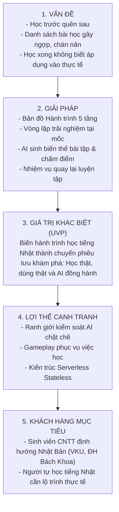

# 🧭 TÀI LIỆU KHÁM PHÁ SẢN PHẨM (PRODUCT DISCOVERY)
## DỰ ÁN: KIZUNA (絆) - HÀNH TRÌNH HỌC TIẾNG NHẬT ĐA NỀN TẢNG HỖ TRỢ BỞI AI
**Học phần:** CS2028 - AI Product Development: End to End (Chuyên đề 4)  
**Trường:** Đại học Công nghệ Thông tin và Truyền thông Việt - Hàn (VKU) - Đại học Đà Nẵng  
**Mục tiêu học phần:** Đáp ứng Chuẩn đầu ra CLO1, CLO2, CLO3 - Nội dung Chương 3 (Mục 3.1)  

---

## 1. BỐI CẢNH & ĐỊNH VỊ GIÁ TRỊ MỚI (PARADIGM SHIFT)

### 1.1. Thực trạng: Sự thất bại của mô hình "Danh sách khóa học tĩnh"
Hầu hết các ứng dụng học tiếng Nhật hiện nay đều áp dụng mô hình truyền thống:
- Mở ứng dụng ra là một danh sách khóa học dài dằng dặc (Khóa N5, Khóa N4, Ngữ pháp Minna no Nihongo...).
- Người học bị đặt vào tâm lý "phải học xong bài này mới qua bài khác", giống như đang đi cày chứng chỉ một cách thụ động.
- Hậu quả: Người học mất phương hướng, không thấy được sự tiến bộ gắn liền với đời sống thực tế, và tỷ lệ bỏ cuộc giữa chừng trong 2 tháng đầu lên tới **65%**.

### 1.2. Định vị KIZUNA: "Lộ trình như một Chuyến đi" (Journey Map Gamification)
**KIZUNA (絆)** định nghĩa lại việc học tiếng Nhật:
- **Người học là một Lữ khách (Traveler):** Bắt đầu từ việc "Chuẩn bị lên đường", "Bắt đầu khám phá", "Sinh hoạt hằng ngày" cho đến "Đi làm tại Nhật Bản".
- **Các khóa học đóng vai trò là "mỏ tri thức" (Raw Knowledge Sources):** Đội ngũ sản phẩm không bê nguyên một cuốn giáo trình vào app, mà chắt lọc kiến thức từ các nguồn chuẩn để kiến tạo thành các **Chặng** và **Mốc** trên bản đồ.
- **Gameplay phục vụ việc học (Meaningful Gamification):** Người học chỉ mở khóa mốc mới khi **thực sự dùng được kiến thức** (nghe hiểu, tự viết câu, vượt qua tình huống thực tế), chứ không đơn thuần là bấm "Next" qua màn hình.

---

## 2. PHÂN TÍCH ĐỐI THỦ CẠNH TRANH (COMPETITIVE BENCHMARKING)

| Tiêu chí so sánh | Anki | Duolingo | Mazii | **KIZUNA (Giải pháp của chúng ta)** |
| :--- | :--- | :--- | :--- | :--- |
| **Mô hình trải nghiệm** | Thẻ flashcard khô khan, tự nhập liệu | Game hóa ngắn nhưng câu hỏi lặp vô nghĩa | Từ điển và luyện đề thi tĩnh | **Bản đồ Hành trình (Hành trình → Chặng → Mốc → Ôn tập)** |
| **Cơ chế mở khóa** | Không có bản đồ tiến trình | Vượt bài tập tích lũy vương miện | Tự chọn bài | **Vượt thử thách thực tế tại mốc (sử dụng được kiến thức mới mở mốc)** |
| **Ứng dụng AI** | ❌ Không tích hợp | ⚠️ AI có phí cao (Duolingo Max) | ⚠️ Dịch máy đơn thuần | ✅ **AI sinh biến thể bài tập theo mốc & Góp ý ngữ pháp có kiểm soát** |
| **Cơ chế ôn lỗi sai** | Ôn thẻ theo thuật toán | Ôn ngẫu nhiên | Không có cơ chế tự động | ✅ **"Nhiệm vụ quay lại luyện tập" hiển thị tự nhiên trên bản đồ** |
| **Khả năng đa nền tảng** | Cần sync thủ công, UI cũ | Web + Mobile | Web + App nhưng rời rạc | ✅ **Đồng bộ thời gian thực Web React + Mobile qua Google Firestore** |

---

## 3. KHUNG TINH GỌN LEAN CANVAS (CẬP NHẬT MÔ HÌNH HÀNH TRÌNH)

---

## 4. BẢN ĐỒ THẤU CẢM (EMPATHY MAP) - LỮ KHÁCH HỌC TIẾNG NHẬT

### Persona: Lê Hoàng Nam (20 tuổi, Sinh viên năm 2 ngành CNTT tại VKU)
- **Mục tiêu:** Muốn giao tiếp được và thi đỗ N4/N3 để năm 3 tham gia chương trình thực tập doanh nghiệp tại Fukuoka/Tokyo.

| Góc nhìn | Chi tiết thấu cảm |
| :--- | :--- |
| **Nói & Làm (Say & Do)** | - *"Mình tải nhiều app về nhưng chỉ học được 3 ngày là bỏ vì thấy bài học nhiều quá."* - *"Mình muốn học câu nào dùng được ngay câu đó khi đi du lịch hoặc nói chuyện với sếp Nhật."* |
| **Nghĩ & Cảm thấy (Think & Feel)** | - Cảm thấy sợ khi nhìn vào danh sách 50 bài Minna no Nihongo. - Cảm thấy hào hứng khi hoàn thành một chặng đường và nhìn thấy nhân vật của mình tiến lên trên bản đồ. |
| **Điểm đau (Pains)** | - Học từ vựng xong nhưng khi gặp ngữ cảnh thật thì không biết ghép câu. - Bị phạt học lại cả bài dài chỉ vì quên một vài chữ Hán tự. |
| **Kỳ vọng (Gains)** | - Có cảm giác như đang "chơi game vượt ải" nhưng thu nạp được kiến thức thực. - Khi sai từ nào, hệ thống chỉ nhắc lại từ đó vào ngày hôm sau dưới dạng nhiệm vụ phụ. |

---

## 5. ỨNG DỤNG GENERATIVE AI CÓ TRÁCH NHIỆM TRONG PRODUCT DISCOVERY

1. **Khảo sát phản hồi & Thiết kế Persona:** Dùng AI trích xuất các từ khóa cảm xúc (frustration, motivation) từ hơn 200 bài chia sẻ kinh nghiệm học tiếng Nhật trên diễn đàn.
2. **Thiết kế ranh giới sử dụng AI:**
   - AI **không thay thế con người** trong việc xác định chuẩn kiến thức (curriculum).
   - AI đóng vai trò **"Động cơ làm giàu nội dung" (Content Enrichment Engine)**: biến một mẫu câu cố định thành nhiều tình huống giao tiếp phong phú, giúp chuyến đi học tập luôn mới mẻ và không bị nhàm chán.
