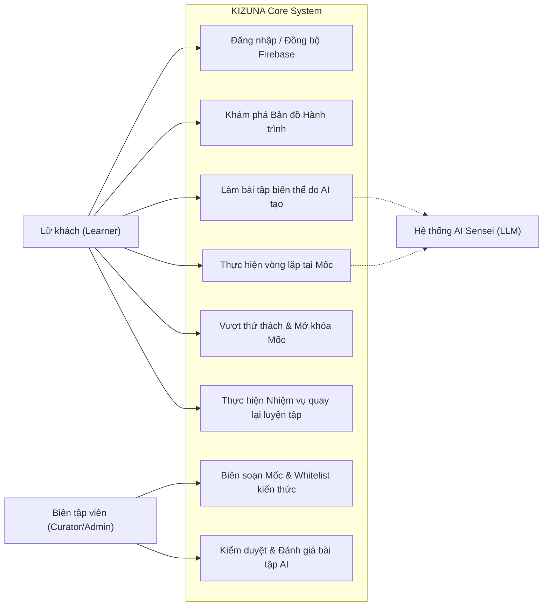

# 📊 TÀI LIỆU PHÂN TÍCH YÊU CẦU HỆ THỐNG (REQUIREMENTS ANALYSIS)
## DỰ ÁN: KIZUNA (絆) - HÀNH TRÌNH HỌC TIẾNG NHẬT ĐA NỀN TẢNG HỖ TRỢ BỞI AI
**Học phần:** CS2028 - AI Product Development: End to End (Chuyên đề 4)  
**Trường:** Đại học Công nghệ Thông tin và Truyền thông Việt - Hàn (VKU) - Đại học Đà Nẵng  
**Mục tiêu học phần:** Đáp ứng Chuẩn đầu ra CLO1, CLO2, CLO3 - Nội dung Chương 3 (Mục 3.3)  

---

## 1. MÔ HÌNH HÓA TRƯỜNG HỢP SỬ DỤNG (USE CASE MODELING)

### 1.1. Sơ đồ Use Case tổng thể theo mô hình Bản đồ Hành trình



### 1.2. Đặc tả các Use Case Trọng tâm (Core Use Cases)

#### Use Case UC-03: Trải nghiệm vòng lặp luyện tập tại Mốc (Milestone Micro-Loop)
- **Tác nhân chính:** Học viên (Learner), Trợ lý AI
- **Mô tả:** Học viên tham gia vòng luyện tập tích hợp tại một mốc cụ thể (ví dụ: Mốc *"Đổi lịch hẹn"* thuộc Chặng 3).
- **Luồng sự kiện chính (Main Flow):**
  1. Học viên bấm vào Mốc đang mở khóa trên Bản đồ Hành trình.
  2. **Bước 1 (Nghe & Ngữ cảnh):** Hệ thống phát đoạn hội thoại ngắn giữa hai nhân vật bản xứ về tình huống đổi lịch hẹn.
  3. **Bước 2 (Học từ & mẫu câu):** Giới thiệu từ vựng cốt lõi và 2 mẫu ngữ pháp chính liên quan (`〜ていただけますか`, `都合が悪い`).
  4. **Bước 3 (Phân biệt sắc thái):** Bài tập so sánh hai cách nói lịch sự và thân mật trong bối cảnh công ty vs bạn bè.
  5. **Bước 4 (Dịch câu phản xạ):** Người học dịch câu tình huống từ tiếng Việt sang tiếng Nhật.
  6. **Bước 5 (Tự tạo sản phẩm):** Người học tự viết tin nhắn đổi lịch hẹn với bạn học hoặc đồng nghiệp.
  7. **Bước 6 (AI phản hồi):** AI Sensei chấm câu viết, chỉ ra lỗi sai trợ từ hoặc ngữ pháp và đưa ra gợi ý sửa đổi.
  8. **Bước 7 (Thử thách mốc):** Vượt qua bài kiểm tra ngắn tổng hợp (đạt $\ge 80\%$ số điểm) để hoàn thành mốc.
- **Hậu điều kiện:** Mốc được chuyển trạng thái `COMPLETED`; Mốc kế tiếp trên hành trình chuyển sang `UNLOCKED`.

#### Use Case UC-04: Sinh và làm bài tập biến thể do AI tạo (AI Dynamic Variation)
- **Tác nhân chính:** Học viên, Động cơ Generative AI
- **Mục đích:** Giúp người học làm quen với nhiều tình huống thực tế khác nhau của cùng một mốc kiến thức mà không bị nhàm chán bởi các câu hỏi lặp lại y nguyên.
- **Tiền điều kiện:** AI chỉ được phép truy xuất kiến thức trong `knowledge_whitelist` của mốc đó.
- **Luồng sự kiện chính:**
  1. Khi người học bắt đầu phần thực hành, Backend gọi Prompt Engine gửi request tới LLM:
     - Context: Mục tiêu mốc, danh sách từ vựng cho phép, mẫu ngữ pháp của mốc.
     - Yêu cầu: Đổi ngữ cảnh (ví dụ: từ "đổi lịch hẹn đi xem phim" sang "đổi lịch hẹn đi ăn tối với khách hàng").
  2. Hàng rào kiểm chứng (Guardrail Checker) của hệ thống lọc câu hỏi của AI: Đảm bảo không chứa từ ngữ vượt ngoài trình độ.
  3. Hiển thị bài tập mới lạ cho học viên làm bài và chấm điểm theo tiêu chí chuẩn.

#### Use Case UC-06: Thực hiện "Nhiệm vụ quay lại luyện tập" (Spaced Re-engagement Quest)
- **Tác nhân chính:** Học viên
- **Mục đích:** Ôn tập các lỗi sai cũ một cách tự nhiên mà không cần phải cày lại toàn bộ chặng đã qua.
- **Luồng sự kiện chính:**
  1. Hằng ngày, thuật toán Spaced Repetition quét các từ vựng/mẫu câu học viên từng làm sai ở các mốc trước và đã đến hạn ôn tập.
  2. Nếu có lỗi cần củng cố, một biểu tượng đặc biệt **"Nhiệm vụ quay lại luyện tập" (Return Quest)** sẽ xuất hiện trên bản đồ gần mốc hiện tại.
  3. Người học chỉ cần hoàn thành 3-5 câu hỏi ngắn liên quan trực tiếp đến lỗi sai đó.
  4. Sau khi hoàn thành, điểm XP được thưởng thêm và người học tiếp tục tiến bước trên hành trình chính.

---

## 2. PHÂN TÍCH YÊU CẦU THEO CHUẨN FURPS+ (ISO/IEC 25010)

```
                         ┌──────────────────────────────────────────────┐
                         │      MÔ HÌNH YÊU CẦU FURPS+ (KIZUNA)         │
                         └──────────────────────┬───────────────────────┘
                                                │
        ┌───────────────────────┬───────────────┴───────────────┬───────────────────────┐
        ▼                       ▼                               ▼                       ▼
  Functionality             Usability                       Reliability             Performance
  (Chức năng Hành trình)    (Trải nghiệm Gameplay)          (Ranh giới AI an toàn)  (Hiệu năng hệ thống)
  - Bản đồ 5 cấp độ         - Bản đồ trực quan sinh động    - Whitelist tri thức    - Tải bản đồ < 300ms
  - Vòng lặp tại mốc        - Lật thẻ và làm bài 1 chạm     - Guardrail lọc từ vựng - Phản hồi AI < 1.5s
  - AI biến thể bài tập     - Phản hồi AI dễ hiểu           - Không crash khi mất mạng- Tối ưu Firestore index
  - Nhiệm vụ quay lại       - Phông chữ Noto Sans JP chuẩn  - Backup dữ liệu mốc    - Bundle Frontend < 400KB
```

### 2.1. F - Functionality (Yêu cầu Chức năng)
- **F-01 (Quản lý Bản đồ):** Hỗ trợ cấu trúc phân cấp linh hoạt: Hành trình -> Chặng -> Mốc -> Bài học/Nhiệm vụ -> Ôn tập.
- **F-02 (Điều kiện Mở khóa):** Mốc chỉ được mở khi học viên hoàn thành vòng lặp tại mốc trước và vượt qua bài thử thách đạt yêu cầu.
- **F-03 (AI Biến thể trong phạm vi):** AI chỉ sinh bài tập dựa trên từ vựng, ngữ pháp và mục tiêu do con người định nghĩa trong mốc.
- **F-04 (Ôn tập ngắt quãng tự nhiên):** Tự động phát sinh nhiệm vụ ôn lỗi sai trên bản đồ dựa trên thuật toán lặp lại ngắt quãng SM-2.

### 2.2. U - Usability (Yêu cầu Khả dụng & Gameplay)
- **U-01 (Bản đồ tương tác):** Bản đồ thể hiện các chặng rõ nét, có điểm xuất phát, các trạm dừng chân (mốc) và đích đến cuối cùng.
- **U-02 (Gameplay phục vụ việc học):** Tránh hiện tượng "click-through" (bấm qua màn hình để hoàn thành); mọi thử thách đều yêu cầu học viên chủ động gõ phím, chọn câu hoặc phát âm.

### 2.3. R - Reliability & AI Guardrails (Độ tin cậy & Ranh giới an toàn AI)
- **R-01 (Knowledge Whitelist Constraint):** 100% bài tập do AI tạo phải được đối soát với danh mục từ vựng của mốc. Nếu AI tự ý đưa vào từ vựng thuộc trình độ N2/N1 vào mốc N5/N4, bộ lọc Guardrail sẽ từ chối và yêu cầu AI tái tạo.
- **R-02 (No Raw Crawling Direct to Users):** Tuyệt đối không cào thô dữ liệu từ bên ngoài rồi đẩy thẳng cho người dùng mà không qua khâu biên tập và đóng gói thành đơn vị kiến thức chuẩn của KIZUNA.

### 2.4. P - Performance (Yêu cầu Hiệu năng)
- **P-01:** Bản đồ hành trình và trạng thái các mốc phải được tải trong vòng dưới $300\text{ms}$.
- **P-02:** Kết quả phân tích và chấm câu từ AI Sensei phản hồi trong vòng dưới $2\text{s}$ (kết hợp streaming text nếu có thể).

### 2.5. Plus (+) - Security & Multiplatform (Bảo mật RBAC và Phân hệ Khách hàng)
- **Backend dùng chung (Single Backend RBAC):** 
  - Tầng API Gateway Spring Boot bảo vệ bởi JWT Token từ Firebase.
  - Phân quyền theo vai trò: Endpoint `/api/v1/admin/**` chỉ cho phép `ROLE_ADMIN`; Endpoint `/api/v1/user/**` và các endpoint học tập cho phép `ROLE_USER`.
- **Phân hệ Frontend riêng biệt:**
  - **Admin Web Portal:** Ứng dụng Web Desktop tối ưu cho chuột và bàn phím, phục vụ biên soạn bản đồ hành trình, thiết lập whitelist mốc và kiểm duyệt câu hỏi AI.
  - **User Multi-Platform Client:** Giao diện tối ưu cảm ứng (Touch-friendly / Mobile-First), chạy mượt mà trên trình duyệt Web và sẵn sàng xuất bản thành file cài đặt **Android APK** (thông qua Capacitor framework).

---

## 3. MA TRẬN TRUY VẾT YÊU CẦU (RTM - CẬP NHẬT)

| Mã Yêu cầu | Tên Yêu cầu | Thành phần Hiện thực | Nguồn gốc bài toán | Chuẩn đầu ra (CLO) |
| :---: | :--- | :--- | :--- | :---: |
| **REQ-J01** | Quản lý Bản đồ Hành trình (Hành trình - Chặng - Mốc) | `JourneyController`, `StageService`, `JourneyMap.tsx` | Khắc phục mô hình danh sách khóa học tĩnh gây nản | CLO3, CLO4 |
| **REQ-J02** | Vòng lặp Micro-loop tại Mốc (Nghe -> Học -> Viết -> AI) | `MilestoneLoopComponent.tsx`, `MilestoneService.java` | Gameplay phục vụ việc học, buộc dùng được kiến thức | CLO3, CLO4 |
| **REQ-J03** | AI sinh biến thể bài tập có kiểm soát phạm vi | `AiExerciseService.java`, `AiGuardrailFilter.java` | Chống nhàm chán lặp lại, giữ vững chất lượng kiến thức | CLO1, CLO2, CLO3 |
| **REQ-J04** | Nhiệm vụ quay lại luyện tập (Spaced Revisit Quest) | `SpacedRevisitScheduler.java`, `ReturnQuestCard.tsx` | Ôn lỗi sai mà không phải chơi lại cả chặng dài | CLO3, CLO4 |
| **REQ-J05** | Xác thực đa nền tảng không lưu pass (Shared Backend) | `FirebaseAuthenticationFilter.java`, `SecurityConfig.java` | Bảo mật và đồng bộ mượt mà Web/Mobile | CLO3, CLO4 |
| **REQ-ADM01**| Phân hệ Admin Web Portal (Quản lý bản đồ & Whitelist) | `AdminJourneyEditor.tsx`, `AdminMilestoneController.java` | Giúp biên tập viên làm chủ chuẩn kiến thức | CLO3, CLO4 |
| **REQ-APK01**| Phân hệ User Client xuất bản Android APK | Capacitor config, User Mobile View, Responsive UI | Học viên học tiện lợi trên điện thoại di động | CLO3, CLO4 |

---

## 4. BÀI HỌC VỀ RANH GIỚI KIỂM SOÁT AI (AI GOVERNANCE LESSONS - CLO1 & CLO3 MỨC A)

Nhóm đồ án đã thảo luận và thống nhất các nguyên tắc "sống còn" khi ứng dụng AI trong dự án KIZUNA:
1. **Con người giữ vai trò Kiến trúc sư Tri thức (Human as Knowledge Architect):** Người làm đồ án phải tự tay xây dựng bản đồ, xác định mục tiêu từng mốc, từ vựng chuẩn, ngữ pháp chuẩn và điều kiện mở khóa. AI không thể và không được phép tự ý thay đổi giáo trình cốt lõi.
2. **AI là Động cơ Cá nhân hóa và Biến thể (AI as Variation & Feedback Engine):** AI chỉ can thiệp vào tầng biến thể tình huống bài tập và chấm câu trả lời mở, giúp trải nghiệm học tập sinh động gấp nhiều lần so với ngân hàng đề tĩnh.
3. **Kiểm tra trước khi phát hành:** Bất kỳ nội dung bài tập nào do AI sinh ra cũng phải trải qua tiêu chí kiểm tra: Đúng trình độ mục tiêu, dùng kiến thức trong mốc, có đáp án và tiêu chí chấm minh bạch.

