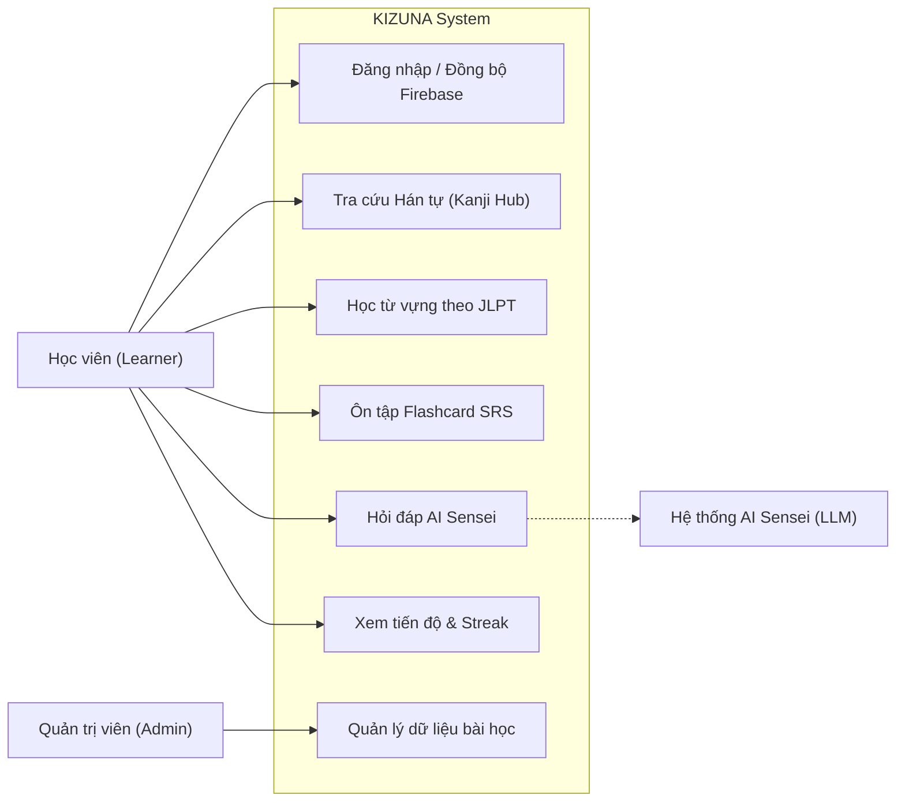

# 📊 TÀI LIỆU PHÂN TÍCH YÊU CẦU HỆ THỐNG (REQUIREMENTS ANALYSIS)
## DỰ ÁN: KIZUNA (絆) - ỨNG DỤNG HỌC TIẾNG NHẬT ĐA NỀN TẢNG HỖ TRỢ BỞI AI
**Học phần:** CS2028 - AI Product Development: End to End (Chuyên đề 4)  
**Trường:** Đại học Công nghệ Thông tin và Truyền thông Việt - Hàn (VKU) - Đại học Đà Nẵng  
**Mục tiêu học phần:** Đáp ứng Chuẩn đầu ra CLO1, CLO2, CLO3 - Nội dung Chương 3 (Mục 3.3)  

---

## 1. MÔ HÌNH HÓA TRƯỜNG HỢP SỬ DỤNG (USE CASE MODELING)

### 1.1. Sơ đồ Use Case tổng thể (Use Case Diagram)



### 1.2. Đặc tả các Use Case Trọng tâm (Detailed Use Case Specifications)

#### Use Case UC-04: Ôn tập Flashcard theo thuật toán Spaced Repetition (SRS)
- **Tác nhân chính (Actor):** Học viên đã đăng nhập (Learner)
- **Mục đích:** Giúp học viên ôn lại các từ vựng/Kanji đến hạn trong ngày và ghi nhận kết quả đánh giá để thuật toán SM-2 tính toán ngày ôn tiếp theo.
- **Tiền điều kiện (Pre-conditions):** Người dùng đã đăng nhập và có ít nhất một mục bài học trong danh sách hoặc hệ thống tự động gán thẻ mới.
- **Luồng sự kiện chính (Main Flow):**
  1. Người dùng chọn chức năng "Ôn tập SRS" từ màn hình chính hoặc từ một thẻ Kanji.
  2. Hệ thống hiển thị mặt trước của thẻ (ký tự Kanji hoặc từ vựng tiếng Nhật).
  3. Người dùng suy nghĩ và click/chạm vào thẻ để lật mặt sau xem nghĩa, cách đọc và ví dụ.
  4. Người dùng tự đánh giá mức độ ghi nhớ theo 4 mức lựa chọn (1: Quên hẳn, 3: Nhớ khó khăn, 4: Nhớ tốt, 5: Hoàn hảo).
  5. Hệ thống gửi yêu cầu `POST /api/v1/progress` lên Backend Spring Boot.
  6. Backend tính toán chu kỳ ôn tập mới qua thuật toán SuperMemo SM-2, cộng điểm kinh nghiệm (XP) và lưu vào Firestore collection `user_progress`.
  7. Hệ thống thông báo kết quả và chuyển tiếp sang thẻ ôn tập tiếp theo.
- **Luồng sự kiện rẽ nhánh (Alternative Flow):**
  - *Người dùng chưa đăng nhập:* Hệ thống vẫn cho phép lật thẻ và chấm điểm mô phỏng cục bộ (Local Mock Mode) để trải nghiệm trước khi đăng nhập lưu đám mây.
- **Hậu điều kiện (Post-conditions):** Thuộc tính `nextReviewDate`, `intervalDays`, `easeFactor` được cập nhật chính xác trên Firestore.

#### Use Case UC-05: Nhận phân tích và giải thích từ Trợ lý AI Sensei
- **Tác nhân chính:** Học viên (Learner) và Hệ thống Generative AI
- **Mục đích:** Cung cấp lời giải thích sâu về ngữ nghĩa, ngữ cảnh sử dụng và phân biệt các điểm ngữ pháp/từ vựng dễ nhầm lẫn.
- **Luồng sự kiện chính:**
  1. Người dùng bấm biểu tượng "AI Sensei" tại thanh điều hướng hoặc nút "Nhờ AI phân tích" tại thẻ từ vựng.
  2. Người dùng nhập câu hỏi hoặc chọn các mẫu câu hỏi nhanh (Quick Prompts).
  3. Client gửi request kèm bối cảnh từ vựng.
  4. AI Sensei phân tích thông qua System Prompt được định hình chuyên môn giáo viên tiếng Nhật.
  5. Hệ thống hiển thị kết quả có cấu trúc: (1) Phân tích ngữ cảnh, (2) Mẫu câu hội thoại song ngữ Nhật - Việt, (3) Lưu ý tránh lỗi cho người Việt.

---

## 2. PHÂN TÍCH YÊU CẦU THEO CHUẨN FURPS+ (ISO/IEC 25010)

Để đảm bảo chất lượng phần mềm chuẩn công nghiệp, các yêu cầu của dự án KIZUNA được phân loại theo mô hình **FURPS+**:

```
                         ┌─────────────────────────────────┐
                         │   MÔ HÌNH YÊU CẦU FURPS+        │
                         └────────────────┬────────────────┘
                                          │
        ┌───────────────┬─────────────────┼────────────────┬───────────────┐
        ▼               ▼                 ▼                ▼               ▼
  Functionality     Usability        Reliability      Performance     Supportability
  (Chức năng)       (Khả dụng)       (Tin cậy)        (Hiệu năng)     (Hỗ trợ)
  - Auth Token      - UX Nhật Bản    - Không crash    - Phản hồi nhanh- Code phân lớp
  - SRS Engine      - Lật thẻ 1 chạm - Firestore sync - < 200ms API   - Docker ready
  - AI Sensei       - Đa thiết bị    - SM-2 ổn định   - Bundle nhẹ    - OpenAPI docs
        │
        └──────► Plus (+) Extensions: Security (JWT) & Multiplatform (CORS)
```

### 2.1. F - Functionality (Yêu cầu Chức năng)
- **F-01 (Định danh):** Hỗ trợ xác thực Stateless bằng Firebase ID Token JWT. Không lưu trữ mật khẩu nhạy cảm trên máy chủ Backend.
- **F-02 (Dữ liệu học):** Tra cứu, lọc theo cấp độ JLPT (N5 - N1), hiển thị đầy đủ Hán tự, âm On, âm Kun, số nét bút, bộ thủ và ví dụ ghép từ.
- **F-03 (Khoa học ghi nhớ):** Cài đặt đầy đủ công thức SuperMemo SM-2 cho spaced repetition:
  $$\text{EF}' = \text{EF} + \left(0.1 - (5 - q) \times (0.08 + (5 - q) \times 0.02)\right)$$
  với điều kiện ràng buộc $\text{EF}' \ge 1.3$.
- **F-04 (Trợ lý AI):** Khả năng đàm thoại và phân tích ngữ pháp tự động có cấu trúc.

### 2.2. U - Usability (Yêu cầu Khả dụng & Trải nghiệm người dùng)
- **U-01:** Giao diện tối giản mang phong cách hiện đại Nhật Bản (Wabi-sabi + Neumorphism nhẹ), phông chữ Noto Sans JP và Plus Jakarta Sans đảm bảo hiển thị sắc nét ký tự Kanji.
- **U-02:** Thao tác lật thẻ và chấm điểm hoàn thành trong tối đa 2 thao tác chạm/click.
- **U-03:** Hỗ trợ hiển thị tối ưu trên màn hình điện thoại di động (chiều rộng từ 360px trở lên) và màn hình máy tính (lên đến 4K).

### 2.3. R - Reliability (Yêu cầu Độ tin cậy)
- **R-01 (Tính sẵn sàng cao):** Hệ thống có cơ chế Fallback an toàn: Khi mất kết nối Firebase hoặc chạy môi trường dev offline, ứng dụng tự động chuyển sang chế độ dữ liệu mẫu có sẵn, tuyệt đối không bị sập (crash) hệ thống.
- **R-02 (Toàn vẹn dữ liệu):** Dữ liệu tiến độ học tập trên Firestore được ghi nhận nhất quán với cấu trúc ID composite `{userId}_{itemType}_{itemId}`, tránh trùng lặp bản ghi.

### 2.4. P - Performance (Yêu cầu Hiệu năng)
- **P-01:** Thời gian xử lý API Backend (Response Latency) đạt dưới $200\text{ms}$ cho các truy vấn tra cứu thông thường.
- **P-02:** Kích thước gói nén Frontend khi build production tối ưu dưới $400\text{KB}$ (Gzip ~ $110\text{KB}$), thời gian tải trang đầu tiên dưới $1.5\text{s}$.
- **P-03:** Các câu lệnh query trên Firestore đều được giới hạn số lượng (`limit`) và đánh index tự động.

### 2.5. S - Supportability & Mở rộng (Supportability)
- **S-01:** Kiến trúc mã nguồn Backend tuân thủ Clean Layered Architecture (Controller -> Service -> Repository -> Database Driver).
- **S-02:** Dự án hỗ trợ đóng gói Docker và Docker Compose đa tầng (multi-stage build) sẵn sàng triển khai trên bất kỳ nền tảng đám mây nào (Google Cloud Run, AWS, Render, VPS).
- **S-03:** Tự động sinh tài liệu API sống bằng Springdoc OpenAPI 3.1 tại `/swagger-ui.html`.

### 2.6. Plus (+) - Security & Multiplatform (Bảo mật và Đa nền tảng)
- **Security:** Tắt CSRF (vì kiến trúc REST Stateless), bảo vệ các endpoint nhạy cảm bằng Spring Security Filter và Firebase Token Verification.
- **Multiplatform CORS:** Cấu hình mở linh hoạt cho Web dev (`localhost:5173`), Web production, và các Custom Schemes của Mobile WebView (`capacitor://localhost`, `ionic://localhost`).

---

## 3. MA TRẬN TRUY VẾT YÊU CẦU (REQUIREMENTS TRACEABILITY MATRIX - RTM)

Ma trận này giúp kết nối các yêu cầu phân tích từ bài toán thực tế đến thiết kế kỹ thuật và chuẩn đầu ra học phần (CLOs):

| Mã Yêu cầu | Tên Yêu cầu | Nguồn gốc bài toán | Thành phần Mã nguồn Hiện thực | Use Case liên kết | Chuẩn đầu ra (CLO) |
| :---: | :--- | :--- | :--- | :---: | :---: |
| **REQ-01** | Xác thực đa nền tảng không lưu pass | Nhu cầu bảo mật & đồng bộ Web/Mobile | `FirebaseAuthenticationFilter.java`, `SecurityConfig.java`, `firebase.ts` | UC-01 | CLO3, CLO4 |
| **REQ-02** | Tra cứu & quản lý kho Hán tự Kanji | Nhu cầu học bài bản chuẩn JLPT N5-N1 | `KanjiRepository.java`, `KanjiService.java`, `KanjiCard.tsx` | UC-02 | CLO3, CLO4 |
| **REQ-03** | Động cơ ôn tập Spaced Repetition | Giải quyết vấn đề hay quên Kanji | `ProgressServiceImpl.java` (SM-2), `FlashcardReview.tsx` | UC-04 | CLO3, CLO4 |
| **REQ-04** | Trợ lý gia sư AI Sensei | Giải quyết việc thiếu gia sư kèm 1-1 | `AiSenseiModal.tsx`, `AI_PROMPT_ENGINEERING_LOGS.md` | UC-05 | CLO1, CLO2, CLO3 |
| **REQ-05** | Chuỗi học Streak & Gamification | Tạo động lực học mỗi ngày | `UserProfile.java`, `Navbar.tsx` | UC-06 | CLO3, CLO4 |
| **REQ-06** | Bắt lỗi tập trung & API Chuẩn hóa | Đảm bảo hệ thống ổn định, dễ debug | `GlobalExceptionHandler.java`, `ApiResponse.java` | Toàn hệ thống | CLO3, CLO4 |

---

## 4. KIỂM CHỨNG & PHẢN BIỆN YÊU CẦU DO AI SINH RA (AI VERIFICATION - MỨC A CLO3)

Trong quá trình sử dụng Generative AI để phân tích yêu cầu, nhóm sinh viên đã phát hiện và cải tiến các điểm bất hợp lý sau:

1. **AI đề xuất lưu mật khẩu và tự sinh mã hóa bcrypt trên Backend:**
   - *Phản biện của nhóm:* Mô hình này lỗi thời và làm tăng rủi ro bảo mật thông tin người dùng. KIZUNA là ứng dụng đa nền tảng, giải pháp chuẩn hiện đại là sử dụng **Firebase Authentication** làm Identity Provider độc lập; Backend chỉ cần nhận và verify JWT ID Token.
2. **AI đề xuất sử dụng cơ sở dữ liệu quan hệ SQL (PostgreSQL/MySQL):**
   - *Phản biện của nhóm:* Cấu trúc Kanji và từ vựng tiếng Nhật có nhiều trường mảng động (như danh sách âm On, âm Kun, từ ghép ví dụ, nghĩa mở rộng). Việc dùng SQL sẽ phải tạo nhiều bảng quan hệ phụ và join phức tạp. Chuyển sang **Google Cloud Firestore (NoSQL Document Store)** giúp truy vấn cực nhanh, dễ mở rộng và đồng bộ thời gian thực cho mobile client.
3. **AI đề xuất tính chu kỳ ôn tập cố định theo ngày:**
   - *Phản biện của nhóm:* Chu kỳ cố định phá vỡ nguyên lý đường cong lãng quên của Hermann Ebbinghaus. Nhóm đã yêu cầu và cài đặt chính xác thuật toán **SuperMemo SM-2** với hệ số Ease Factor và chu kỳ biến thiên dựa trên điểm số đánh giá thực tế của học viên.
