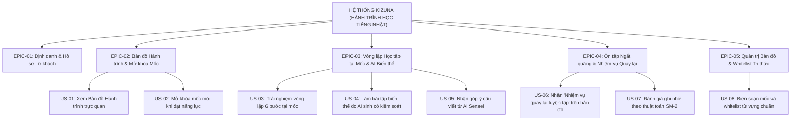

# 📝 TÀI LIỆU USER STORIES & TIÊU CHÍ CHẤP NHẬN (USER STORIES & ACCEPTANCE CRITERIA)
## DỰ ÁN: KIZUNA (絆) - HÀNH TRÌNH HỌC TIẾNG NHẬT ĐA NỀN TẢNG HỖ TRỢ BỞI AI
**Học phần:** CS2028 - AI Product Development: End to End (Chuyên đề 4)  
**Trường:** Đại học Công nghệ Thông tin và Truyền thông Việt - Hàn (VKU) - Đại học Đà Nẵng  
**Mục tiêu học phần:** Đáp ứng Chuẩn đầu ra CLO1, CLO2, CLO3, CLO4 - Nội dung Chương 3 (Mục 3.4)  

---

## 1. DANH MỤC EPIC VÀ PHÂN RÃ THEO HÀNH TRÌNH (EPIC BREAKDOWN)



---

## 2. QUY CHUẨN XÂY DỰNG USER STORY (NGUYÊN TẮC INVEST)

Mọi User Story trong hệ thống đều tuân thủ chặt chẽ 6 tiêu chuẩn **INVEST**:
- **I (Independent):** Các mốc học và nhiệm vụ ôn tập có thể phát triển độc lập.
- **N (Negotiable):** Số bước trong vòng lặp mốc có thể linh hoạt theo độ khó của từng chặng.
- **V (Valuable):** Đảm bảo người học **thực sự dùng được kiến thức** trước khi đi tiếp.
- **E (Estimable):** Đội ngũ ước lượng Story Points dựa trên độ phức tạp của thuật toán và prompt.
- **S (Small):** Mỗi story được đóng gói để có thể hoàn thành và kiểm thử trong vòng 2-3 ngày.
- **T (Testable):** 100% story đều có kịch bản kiểm thử tự động hoặc kiểm thử chấp nhận bằng cú pháp Gherkin.

---

## 3. CHI TIẾT CÁC USER STORIES TRỌNG TÂM & TIÊU CHÍ CHẤP NHẬN (GHERKIN SYNTAX)

### Story US-01: Khám phá Bản đồ Hành trình (Hành trình → Chặng → Mốc)
- **Epic:** EPIC-02: Bản đồ Hành trình & Mở khóa Mốc
- **Story Point:** 3 SP | **Độ ưu tiên:** Must-have
- **Cấu trúc:**
  > Là một **học viên tiếng Nhật (Lữ khách)**,  
  > Tôi muốn **nhìn thấy lộ trình học hiển thị như một bản đồ hành trình với các chặng và các mốc điểm đến**,  
  > Để **luôn biết rõ mình đang ở đâu, đã chinh phục được những gì và đích đến tiếp theo là gì thay vì học danh sách tĩnh khô khan**.
- **Tiêu chí chấp nhận (Acceptance Criteria):**
  ```gherkin
  Feature: Hiển thị Bản đồ Hành trình

    Scenario: Người dùng mới mở bản đồ lần đầu
      Given Người dùng đã đăng nhập vào hệ thống
      When Người dùng truy cập trang chủ "Hành trình"
      Then Bản đồ hiển thị Chặng 1 "Chuẩn bị lên đường (Hiragana)" với Mốc đầu tiên ở trạng thái "UNLOCKED"
      And Tất cả các Mốc tiếp theo và các Chặng sau hiển thị biểu tượng ổ khóa "LOCKED"
      And Giao diện thể hiện rõ biểu tượng vị trí hiện tại của người học ở Mốc 1.

    Scenario: Xem tiến độ tổng thể của chuyến đi
      Given Người dùng đã hoàn thành một số mốc
      When Người dùng cuộn dọc theo bản đồ
      Then Các mốc đã hoàn thành hiển thị màu xanh lá cây kèm dấu tích "COMPLETED"
      And Thanh tiến độ hiển thị tỉ lệ phần trăm chặng đường đã hoàn thành (ví dụ: "Chặng 1: 75%").
  ```

---

### Story US-03: Trải nghiệm Vòng lặp Học tập tại Mốc (Milestone Micro-Loop)
- **Epic:** EPIC-03: Vòng lặp Học tập tại Mốc & AI Biến thể
- **Story Point:** 5 SP | **Độ ưu tiên:** Must-have
- **Cấu trúc:**
  > Là một **người học tại mốc "Đổi lịch hẹn"**,  
  > Tôi muốn **trải qua một chuỗi thử thách ngắn từ nghe hội thoại, học từ, dịch câu đến tự viết tin nhắn đổi lịch và nhận góp ý AI**,  
  > Để **thực sự làm chủ được cách ứng biến tình huống trong đời sống thực tế**.
- **Tiêu chí chấp nhận (Acceptance Criteria):**
  ```gherkin
  Feature: Vòng lặp luyện tập tại Mốc

    Scenario: Hoàn thành trọn vẹn vòng lặp tại mốc
      Given Người dùng nhấn vào Mốc "Đổi lịch hẹn" đang mở khóa
      When Người dùng trải qua lần lượt các bước:
        | Bước | Hoạt động                                              |
        | 1    | Nghe đoạn hội thoại mẫu đổi lịch hẹn giữa hai đồng nghiệp |
        | 2    | Học 3 từ vựng và 2 mẫu câu cốt lõi (〜ていただけますか)   |
        | 3    | Làm bài tập phân biệt cách nói lịch sự vs thân mật     |
        | 4    | Dịch một câu phản xạ sang tiếng Nhật                  |
        | 5    | Tự gõ một tin nhắn đổi lịch hẹn theo tình huống giả định|
      Then Hệ thống gửi câu viết của người dùng tới AI Sensei để chấm điểm
      And AI Sensei phản hồi nhận xét ngữ pháp và đề xuất chỉnh sửa
      And Hệ thống ghi nhận hoàn thành thử thách mốc
      And Cập nhật trạng thái mốc thành "COMPLETED"
      And Tự động mở khóa Mốc kế tiếp trên Bản đồ Hành trình.

    Scenario: Bỏ dở giữa chừng vòng lặp mốc
      Given Người dùng đang ở bước 3 của vòng lặp mốc
      When Người dùng thoát ra ngoài bản đồ
      Then Tiến độ bước làm dở được lưu tạm thời
      And Khi quay lại, người dùng có thể tiếp tục từ bước 3 mà không phải làm lại từ đầu.
  ```

---

### Story US-04: Làm bài tập biến thể do AI tạo trong phạm vi kiểm soát
- **Epic:** EPIC-03: Vòng lặp Học tập tại Mốc & AI Biến thể
- **Story Point:** 5 SP | **Độ ưu tiên:** Must-have
- **Cấu trúc:**
  > Là một **người học đang làm bài tập tại mốc**,  
  > Tôi muốn **AI sinh ra các câu hỏi biến thể với tình huống phong phú nhưng chỉ sử dụng kiến thức trong phạm vi mốc đó**,  
  > Để **được thử thách đa dạng mà không bị quá tải bởi những từ ngữ vượt quá trình độ**.
- **Tiêu chí chấp nhận (Acceptance Criteria):**
  ```gherkin
  Feature: AI sinh biến thể bài tập có kiểm soát phạm vi

    Scenario: Sinh câu hỏi biến thể đổi ngữ cảnh thành công
      Given Mốc "Đổi lịch hẹn" có whitelist gồm các từ: [予定, 都合, 変更, 来週, 申し訳ありません]
      When Backend gửi prompt yêu cầu AI tạo 1 bài tập trắc nghiệm tình huống mới
      Then Câu hỏi và các phương án trả lời do AI sinh ra phải thỏa mãn:
        - 100% từ vựng và ngữ pháp nằm trong whitelist hoặc đã học ở các mốc trước
        - Có đáp án đúng và lời giải thích chi tiết
      And Bài tập hiển thị lên màn hình học viên mượt mà không có độ trễ lớn (< 1.5s).

    Scenario: AI sinh câu hỏi có từ ngữ vượt trình độ (Bị chặn bởi Guardrail)
      Given AI sinh câu hỏi có chứa từ vựng N1 không nằm trong whitelist của mốc N4
      When Bộ lọc AI Guardrail của Backend quét câu hỏi
      Then Bộ lọc từ chối câu hỏi không đạt chuẩn
      And Yêu cầu AI sinh lại câu hỏi khác thỏa mãn whitelist
      And Học viên không nhìn thấy câu hỏi lỗi đó.
  ```

---

### Story US-06: Nhận "Nhiệm vụ quay lại luyện tập" trên Bản đồ (Spaced Re-engagement)
- **Epic:** EPIC-04: Ôn tập Ngắt quãng & Nhiệm vụ Quay lại
- **Story Point:** 5 SP | **Độ ưu tiên:** Must-have
- **Cấu trúc:**
  > Là một **người học đang tiến bước trên bản đồ**,  
  > Tôi muốn **thỉnh thoảng nhìn thấy một 'Nhiệm vụ quay lại luyện tập' nhắc ôn lại các lỗi sai cũ**,  
  > Để **kịp thời gia cố kiến thức bị quên mà không bị bắt phải chơi lại cả chặng dài**.
- **Tiêu chí chấp nhận (Acceptance Criteria):**
  ```gherkin
  Feature: Nhiệm vụ quay lại luyện tập theo chu kỳ Spaced Repetition

    Scenario: Xuất hiện nhiệm vụ quay lại luyện tập trên bản đồ
      Given Học viên đã làm sai từ "都合" ở Mốc 3 cách đây 3 ngày
      And Thuật toán SuperMemo SM-2 xác định hôm nay là ngày đến hạn ôn tập (nextReviewDate <= today)
      When Học viên mở Bản đồ Hành trình
      Then Một biểu tượng "Nhiệm vụ quay lại luyện tập" (vòng lặp ôn tập) xuất hiện cạnh Mốc 3
      And Học viên click vào để làm nhanh bài tập 3 câu hỏi củng cố từ "都合"
      And Sau khi hoàn thành đúng, biểu tượng nhiệm vụ biến mất và học viên nhận thêm +15 XP.

    Scenario: Không có lỗi sai đến hạn
      Given Tất cả các từ vựng đã học đều chưa đến ngày ôn tập tiếp theo
      When Học viên mở Bản đồ Hành trình
      Then Bản đồ chỉ hiển thị luồng đi thẳng về phía trước
      And Không có bất kỳ nhiệm vụ quay lại nào gây xao nhãng.
  ```

---

## 4. TIÊU CHUẨN DEFINITION OF READY (DoR) & DEFINITION OF DONE (DoD)

### 4.1. Definition of Ready (DoR - Điều kiện đưa vào Sprint)
- [x] Mỗi Story gắn liền với một Mốc cụ thể trên Bản đồ Hành trình.
- [x] Có danh mục Whitelist kiến thức (từ vựng, mẫu câu) quy định cho mốc đó.
- [x] Kịch bản Gherkin mô tả đủ cả luồng thành công (Happy path) và luồng xử lý lỗi (Alternative path).
- [x] Có tiêu chuẩn chấm điểm và rubric rõ ràng cho phản hồi của AI.

### 4.2. Definition of Done (DoD - Điều kiện nghiệm thu Story)
- [x] Tính năng hoạt động mượt mà trên cả giao diện Web và Mobile.
- [x] Trạng thái Mốc và Nhiệm vụ quay lại đồng bộ thời gian thực với Google Firestore.
- [x] AI biến thể bài tập tuân thủ 100% Whitelist, không bị lỗi ảo giác hay vượt trình độ.
- [x] Test case tự động cho thuật toán mở khóa và thuật toán SM-2 chạy thành công.
- [x] Sinh viên demo được kịch bản hoàn chỉnh trước giảng viên.
