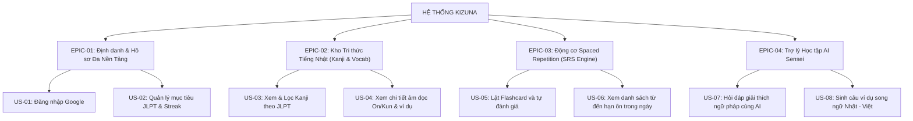

# 📝 TÀI LIỆU USER STORIES & TIÊU CHÍ CHẤP NHẬN (USER STORIES & ACCEPTANCE CRITERIA)
## DỰ ÁN: KIZUNA (絆) - ỨNG DỤNG HỌC TIẾNG NHẬT ĐA NỀN TẢNG HỖ TRỢ BỞI AI
**Học phần:** CS2028 - AI Product Development: End to End (Chuyên đề 4)  
**Trường:** Đại học Công nghệ Thông tin và Truyền thông Việt - Hàn (VKU) - Đại học Đà Nẵng  
**Mục tiêu học phần:** Đáp ứng Chuẩn đầu ra CLO1, CLO2, CLO3, CLO4 - Nội dung Chương 3 (Mục 3.4)  

---

## 1. DANH MỤC EPIC VÀ PHÂN RÃ TÍNH NĂNG (EPIC BREAKDOWN)

Hệ thống KIZUNA được chia thành 4 Epic cốt lõi:



---

## 2. QUY CHUẨN XÂY DỰNG USER STORY (CHUẨN INVEST)

Mỗi User Story trong KIZUNA đều được thiết kế đáp ứng đầy đủ 6 tiêu chí của nguyên tắc **INVEST**:
1. **I - Independent (Độc lập):** Các Story có thể được phát triển và kiểm thử độc lập mà không bị ràng buộc chặt chẽ.
2. **N - Negotiable (Có thể thương lượng):** Nội dung Story không phải là hợp đồng cố định, có thể tinh chỉnh dựa trên phản hồi của người dùng và kết quả AI.
3. **V - Valuable (Có giá trị):** Story mang lại giá trị cụ thể, đo lường được cho người học tiếng Nhật.
4. **E - Estimable (Ước lượng được):** Được nhóm đánh giá độ phức tạp và gán Story Points rõ ràng.
5. **S - Small (Đủ nhỏ):** Có thể hoàn thành trong 1 Sprint ngắn (1-2 tuần).
6. **T - Testable (Kiểm thử được):** Luôn đi kèm Tiêu chí chấp nhận (Acceptance Criteria) rõ ràng theo định dạng Gherkin.

---

## 3. CHI TIẾT CÁC USER STORIES & TIÊU CHÍ CHẤP NHẬN (GHERKIN SYNTAX)

### Story US-01: Đăng nhập & Đồng bộ hóa Đa Nền Tảng qua Firebase
- **Epic:** EPIC-01: Định danh & Hồ sơ Đa Nền Tảng
- **Story Point:** 3 SP | **Ưu tiên:** High (Must-have)
- **Cấu trúc:**
  > Là một **học viên tiếng Nhật**,  
  > Tôi muốn **đăng nhập bằng tài khoản Google chỉ với 1 click trên cả Web lẫn Mobile**,  
  > Để **toàn bộ tiến độ học, điểm XP và chuỗi streak được đồng bộ tự động lên đám mây**.
- **Tiêu chí chấp nhận (Acceptance Criteria):**
  ```gherkin
  Feature: Đăng nhập người dùng bằng Firebase Auth

    Scenario: Đăng nhập thành công lần đầu và khởi tạo hồ sơ
      Given Người dùng đang mở ứng dụng KIZUNA ở trạng thái chưa đăng nhập
      When Người dùng bấm nút "Đăng nhập" và xác thực thành công popup Google
      Then Firebase Client SDK trả về Firebase ID Token JWT hợp lệ
      And Frontend tự động gửi request GET /api/v1/auth/me kèm token trong Authorization header
      And Backend xác thực token qua Firebase Admin SDK
      And Backend tự động lưu tài liệu UserProfile mới vào Firestore với targetJlptLevel="N5", dailyStreak=1, totalXp=0
      And Trả về HTTP 200 kèm dữ liệu UserProfile
      And Giao diện Frontend hiển thị ảnh đại diện và tên người dùng trên Navbar.

    Scenario: Gửi request khi Token không hợp lệ
      Given Một yêu cầu gửi đến API bảo mật /api/v1/auth/me với token sai hoặc bị chỉnh sửa
      When Bộ lọc FirebaseAuthenticationFilter kiểm tra token
      Then Hệ thống từ chối quyền truy cập
      And Trả về mã lỗi HTTP 401 Unauthorized
      And Nội dung body trả về JSON format ApiResponse: code="UNAUTHORIZED", message="Authentication required...".
  ```

---

### Story US-03: Tra cứu & Lọc Danh sách Kanji theo Cấp độ JLPT
- **Epic:** EPIC-02: Kho Tri thức Tiếng Nhật
- **Story Point:** 2 SP | **Ưu tiên:** High (Must-have)
- **Cấu trúc:**
  > Là một **học viên đang ôn thi JLPT N5**,  
  > Tôi muốn **lọc và xem danh sách các chữ Hán tự thuộc cấp độ N5 kèm số nét và nghĩa**,  
  > Để **tập trung học đúng khối lượng kiến thức của kỳ thi mục tiêu**.
- **Tiêu chí chấp nhận (Acceptance Criteria):**
  ```gherkin
  Feature: Tra cứu danh sách Kanji theo cấp độ JLPT

    Scenario: Lọc danh sách Kanji cấp độ N5
      Given Người dùng đang ở màn hình chính
      When Người dùng chọn tab "N5" trên thanh chọn cấp độ
      Then Frontend gọi API GET /api/v1/kanji?jlptLevel=N5&limit=50
      And Backend truy vấn Firestore collection "kanji" với điều kiện whereEqualTo("jlptLevel", "N5")
      And Trả về HTTP 200 kèm danh sách các chữ Kanji (ví dụ: 日, 本, 人, 学,...)
      And Mỗi thẻ hiển thị rõ: Ký tự Hán tự to rõ, nghĩa tiếng Việt, âm On, âm Kun, số nét bút.

    Scenario: Mất kết nối internet hoặc Firestore chưa cấu hình
      Given Ứng dụng Frontend không thể kết nối tới Backend (Backend offline)
      When Người dùng chuyển tab cấp độ
      Then Hệ thống tự động kích hoạt cơ chế Fallback sử dụng danh sách Kanji mẫu có sẵn
      And Hiển thị thông báo trạng thái "Chưa kết nối Backend (Đang dùng dữ liệu Local)"
      And Giao diện không bị trắng màn hình hay treo ứng dụng.
  ```

---

### Story US-05: Ôn tập Flashcard và Chấm điểm theo Thuật toán SM-2
- **Epic:** EPIC-03: Động cơ Spaced Repetition
- **Story Point:** 5 SP | **Ưu tiên:** High (Must-have)
- **Cấu trúc:**
  > Là một **người học cần ghi nhớ sâu Hán tự**,  
  > Tôi muốn **lật thẻ flashcard và tự chấm điểm khả năng nhớ từ 1 đến 5 điểm**,  
  > Để **hệ thống tự động tính toán chính xác ngày ôn tập tiếp theo cho thẻ đó**.
- **Tiêu chí chấp nhận (Acceptance Criteria):**
  ```gherkin
  Feature: Động cơ Spaced Repetition SuperMemo SM-2

    Scenario: Chấm điểm nhớ tốt (Quality = 4)
      Given Người dùng đang mở thẻ Hán tự "日" ở chế độ ôn tập
      When Người dùng lật mặt sau và bấm chọn nút "4 - Nhớ tốt"
      Then Hệ thống gửi POST /api/v1/progress kèm itemId="日", itemType="KANJI", quality=4
      And Backend áp dụng công thức SM-2:
        | Tham số cũ      | Giá trị mới tính toán         |
        | repetitionCount | tăng thêm 1                   |
        | intervalDays    | nếu lần 0 -> 1; lần 1 -> 6    |
        | easeFactor      | EF mới tính theo công thức SM-2 (min 1.3) |
        | nextReviewDate  | được cộng thêm intervalDays ngày từ thời điểm hiện tại |
      And Người dùng được cộng thêm 10 điểm XP vào UserProfile
      And Hiển thị thông báo chúc mừng trên màn hình và tự động quay về sau 1.5 giây.

    Scenario: Chấm điểm quên từ (Quality = 1)
      Given Người dùng không nhớ nghĩa của chữ Hán tự
      When Người dùng lật mặt sau và bấm nút "1 - Quên hẳn"
      Then Hệ thống gửi POST /api/v1/progress với quality=1
      And Thuật toán SM-2 reset repetitionCount về 0 và intervalDays về 1 ngày
      And nextReviewDate được đặt là ngày hôm sau
      And Thẻ được đánh dấu trạng thái "LEARNING" để học lại.
  ```

---

### Story US-07: Hỏi đáp & Giải thích Ngữ pháp với AI Sensei
- **Epic:** EPIC-04: Trợ lý Học tập AI Sensei
- **Story Point:** 5 SP | **Ưu tiên:** High (Must-have)
- **Cấu trúc:**
  > Là một **học viên gặp khó khăn với ngữ cảnh dùng từ**,  
  > Tôi muốn **hỏi AI Sensei để được giải thích chi tiết cách dùng từ trong câu thực tế**,  
  > Để **hiểu sâu bản chất ngôn ngữ và tự tin giao tiếp như người bản xứ**.
- **Tiêu chí chấp nhận (Acceptance Criteria):**
  ```gherkin
  Feature: Trợ lý gia sư AI Sensei

    Scenario: Hỏi AI phân tích từ vựng từ nút gợi ý nhanh
      Given Người dùng đang mở bảng điều khiển AI Sensei Modal
      When Người dùng bấm vào nút gợi ý "Phân biệt cách dùng âm On và Kun trong thực tế"
      Then Hệ thống hiển thị trạng thái loading "AI Sensei đang phân tích..."
      And Sau khi xử lý, câu trả lời hiển thị rõ ràng 3 phần:
        1. Phân tích ngữ cảnh và ý nghĩa thực tế
        2. Mẫu câu đàm thoại song ngữ Nhật - Việt có phiên âm
        3. Lưu ý tránh lỗi nhầm lẫn điển hình của người học Việt Nam
      And Người dùng có thể tiếp tục nhập câu hỏi mới vào ô chat.
  ```

---

## 4. TIÊU CHUẨN DEFINITION OF READY (DoR) & DEFINITION OF DONE (DoD)

### 4.1. Definition of Ready (DoR - Điều kiện để Story được đưa vào phát triển)
- [x] Story được viết theo đúng cấu trúc chuẩn: *"Là một... Tôi muốn... Để..."*.
- [x] Đầy đủ tiêu chí chấp nhận theo cú pháp Gherkin (Given - When - Then).
- [x] Xác định rõ ràng các API Contract (Endpoint, Request Body, Response Data).
- [x] Đã được ước lượng Story Points bởi các thành viên trong nhóm.
- [x] Không còn phụ thuộc chưa được giải quyết (No blocker).

### 4.2. Definition of Done (DoD - Điều kiện để Story được coi là hoàn thành)
- [x] Mã nguồn Backend được viết đúng Clean Architecture, không có code smells.
- [x] Mã nguồn Frontend có kiểu dữ liệu TypeScript chặt chẽ, không có lỗi type error.
- [x] Lệnh `.\mvnw.cmd clean compile` và `npm run build` chạy thành công 100%.
- [x] API được tích hợp và test thông qua Swagger UI tại `/swagger-ui.html`.
- [x] Toàn bộ tiêu chí chấp nhận (Acceptance Criteria) trong Story đều được kiểm thử đạt.
- [x] Mã nguồn được commit lên Git với thông điệp rõ ràng theo chuẩn Conventional Commits.
