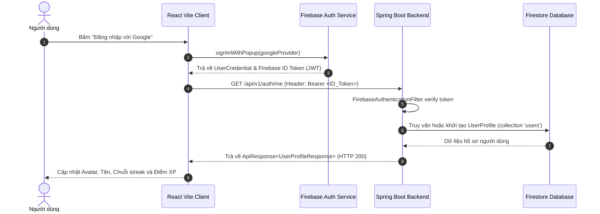
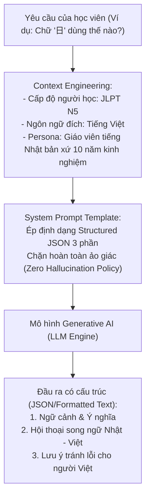

# ⚙️ TÀI LIỆU ĐẶC TẢ TÍNH NĂNG KỸ THUẬT (FEATURE SPECIFICATIONS)
## DỰ ÁN: KIZUNA (絆) - ỨNG DỤNG HỌC TIẾNG NHẬT ĐA NỀN TẢNG HỖ TRỢ BỞI AI
**Học phần:** CS2028 - AI Product Development: End to End (Chuyên đề 4)  
**Trường:** Đại học Công nghệ Thông tin và Truyền thông Việt - Hàn (VKU) - Đại học Đà Nẵng  
**Mục tiêu học phần:** Đáp ứng Chuẩn đầu ra CLO1, CLO2, CLO3, CLO4 - Nội dung Chương 3 (Mục 3.5)  

---

## 1. TÍNH NĂNG 1: XÁC THỰC & HỒ SƠ ĐA NỀN TẢNG (AUTHENTICATION & PROFILE)

### 1.1. Mô tả tổng quan
Cung cấp giải pháp đăng nhập một chạm (Single Sign-On) không mật khẩu cho người dùng trên đa nền tảng (Web Browser, Mobile iOS/Android, PWA) thông qua Firebase Authentication. Hệ thống tự động đồng bộ tài khoản người dùng vào cơ sở dữ liệu Google Cloud Firestore.

### 1.2. Sơ đồ tuần tự xác thực (Sequence Diagram)



### 1.3. Đặc tả API Contract
- **Endpoint:** `GET /api/v1/auth/me`
- **Yêu cầu bảo mật:** `Authorization: Bearer <firebase_id_token>`
- **Response Format (JSON):**
  ```json
  {
    "success": true,
    "code": "SUCCESS",
    "message": "User profile synchronized",
    "data": {
      "uid": "google-user-123456",
      "email": "student@vku.udn.vn",
      "displayName": "Nguyễn Minh Quân",
      "photoUrl": "https://lh3.googleusercontent.com/a/...",
      "targetJlptLevel": "N5",
      "dailyStreak": 3,
      "totalXp": 180,
      "role": "ROLE_USER"
    },
    "timestamp": "2026-09-08T10:30:00Z"
  }
  ```

---

## 2. TÍNH NĂNG 2: KHO TRI THỨC HÁN TỰ (KANJI HUB)

### 2.1. Mô tả tổng quan
Cung cấp kho Hán tự chuẩn hóa phân loại từ JLPT N5 đến N1. Mỗi chữ Hán tự được số hóa với đầy đủ thuộc tính: Ký tự gốc, nghĩa Hán - Việt, âm On (Onyomi), âm Kun (Kunyomi), số nét bút, bộ thủ cấu tạo và các từ ghép thực tế trong giao tiếp.

### 2.2. Cấu trúc dữ liệu Firestore (Document Schema: `kanji`)
- **Document ID:** Ký tự Hán tự (ví dụ: `日`, `本`, `人`)
- **Trường dữ liệu:**
  - `character` (String): Ký tự Kanji
  - `meanings` (Array of Strings): Danh sách nghĩa tiếng Việt
  - `onyomi` (Array of Strings): Âm Hán (Katakana)
  - `kunyomi` (Array of Strings): Âm Nhật thuần (Hiragana)
  - `strokeCount` (Integer): Số nét bút
  - `jlptLevel` (String): "N5", "N4", "N3", "N2", "N1"
  - `radicals` (Array of Strings): Bộ thủ
  - `examples` (Array of Objects): Mảng các từ ghép gồm `{ word, reading, meaning }`

### 2.3. Đặc tả API Contract
- **Endpoint:** `GET /api/v1/kanji?jlptLevel=N5&limit=50`
- **Quyền truy cập:** Public (không yêu cầu token)
- **Response Format:**
  ```json
  {
    "success": true,
    "code": "SUCCESS",
    "message": "Operation completed successfully",
    "data": [
      {
        "id": "日",
        "character": "日",
        "meanings": ["mặt trời", "ngày", "Nhật Bản"],
        "onyomi": ["ニチ", "ジツ"],
        "kunyomi": ["ひ", "-び", "-か"],
        "strokeCount": 4,
        "jlptLevel": "N5",
        "radicals": ["日"],
        "examples": [
          { "word": "日本", "reading": "にほん", "meaning": "Nhật Bản" },
          { "word": "日曜日", "reading": "にちようび", "meaning": "Chủ nhật" }
        ]
      }
    ],
    "timestamp": "2026-09-08T10:30:00Z"
  }
  ```

---

## 3. TÍNH NĂNG 3: ĐỘNG CƠ SPACED REPETITION (SRS - SUPERMEMO SM-2)

### 3.1. Mô tả thuật toán cốt lõi
Dựa trên nghiên cứu đường cong lãng quên của Hermann Ebbinghaus và thuật toán SuperMemo SM-2 của Tiến sĩ Piotr Wozniak, hệ thống tự động điều chỉnh khoảng cách ngày giữa các lần ôn tập:

```
                               ┌────────────────────────────────┐
                               │   Đánh giá của học viên (q)    │
                               │  (Thang điểm chất lượng: 0..5) │
                               └───────────────┬────────────────┘
                                               │
                       ┌───────────────────────┴───────────────────────┐
                       ▼                                               ▼
               Nếu q >= 3 (Nhớ được)                           Nếu q < 3 (Quên)
                       │                                               │
         ┌─────────────┴─────────────┐                                 │
         │ Lần 1: I = 1 ngày         │                                 ▼
         │ Lần 2: I = 6 ngày         │                         - Reset lặp: n = 0
         │ Lần n: I = I_cũ * EF      │                         - Khoảng cách: I = 1 ngày
         └─────────────┬─────────────┘                         - Trạng thái: "LEARNING"
                       │
                       ▼
       Tính toán Hệ số Dễ dàng (EF mới):
       EF' = EF + (0.1 - (5-q) * (0.08 + (5-q)*0.02))
       (Ràng buộc ngưỡng an toàn: EF' >= 1.3)
                       │
                       ▼
       Cập nhật Ngày ôn tiếp theo:
       nextReviewDate = now + (I * 24 giờ)
```

### 3.2. Công thức toán học cài đặt trong Backend (`ProgressServiceImpl.java`):
1. **Tính chu kỳ ôn tập (Interval $I$ tính bằng ngày):**
   $$I(n) = \begin{cases} 1 & \text{khi } n = 0 \\ 6 & \text{khi } n = 1 \\ \text{round}(I(n-1) \times \text{EF}) & \text{khi } n > 1 \end{cases}$$
2. **Cập nhật hệ số dễ dàng (Ease Factor $\text{EF}$):**
   $$\text{EF}' = \max\left(1.3, \ \text{EF} + (0.1 - (5 - q) \times (0.08 + (5 - q) \times 0.02))\right)$$
   Trong đó:
   - $q \in \{0, 1, 2, 3, 4, 5\}$ là điểm tự đánh giá chất lượng ghi nhớ.
   - $\text{EF}$ khởi tạo ban đầu là $2.5$.
   - Khi $q < 3$, chu kỳ ôn tập $n$ lập tức bị reset về $0$ và $I = 1$ ngày.

---

## 4. TÍNH NĂNG 4: TRỢ LÝ HỌC TẬP AI SENSEI (GENERATIVE AI COMPANION)

### 4.1. Kiến trúc Tích hợp AI (AI-Native Architecture)
Hệ thống sử dụng mô hình ngôn ngữ lớn (Gemini 1.5/3.8 Flash / OpenAI GPT-4o-mini) với kỹ thuật quản trị ngữ cảnh chặt chẽ (Context Engineering):



### 4.2. Đặc tả System Prompt Template (Mục 2.3 & 2.4 Chương 2)
```markdown
[ROLE & PERSONA]
Bạn là "AI Sensei" - Trợ lý gia sư tiếng Nhật chuyên sâu cho người Việt Nam.
Phong cách giảng dạy: Tận tâm, súc tích, chuẩn ngữ pháp tiếng Nhật giao tiếp thực tế.

[CONTEXT & CONSTRAINTS]
- Trình độ học viên hiện tại: JLPT N5 - N4.
- Mọi câu tiếng Nhật bắt buộc phải có phiên âm Hiragana/Katakana và dịch nghĩa tiếng Việt chính xác.
- Tuyệt đối không bịa đặt hoặc đưa ra thông tin sai lệch về ngữ pháp (Zero Hallucination).
- Nếu không chắc chắn, hãy khuyến nghị tra từ điển chính thống.

[OUTPUT STRUCTURE]
Câu trả lời phải được định dạng chính xác theo 3 phần:
1. 💡 Phân tích ngữ cảnh & Bản chất từ vựng
2. 🇯🇵 Mẫu câu ví dụ hội thoại song ngữ (Nhật - Việt)
3. ⚠️ Lưu ý tránh lỗi nhầm lẫn điển hình của người Việt Nam
```

---

## 5. TÍNH NĂNG 5: GAMIFICATION & CHUỖI HỌC TẬP (STREAKS & XP)

### 5.1. Cơ chế tính điểm kinh nghiệm (XP Matrix):
- Trả lời Flashcard mức Hoàn hảo ($q = 5$): **+20 XP**
- Trả lời Flashcard mức Nhớ tốt ($q \in \{3, 4\}$): **+10 XP**
- Trả lời ôn tập mức Quên ($q < 3$): **+2 XP** (khuyến khích tinh thần nỗ lực)
- Hoàn thành bài học mới: **+50 XP**

### 5.2. Cơ chế duy trì Chuỗi ngày học (Daily Streak):
- Người dùng phát sinh ít nhất 1 hành động học tập trong ngày (từ 00:00 đến 23:59 GMT+7):
  - Nếu ngày học trước đó là hôm qua: `dailyStreak = dailyStreak + 1`.
  - Nếu ngày học trước đó là hôm nay: Giữ nguyên streak.
  - Nếu bỏ lỡ hơn 1 ngày: Reset `dailyStreak = 1`.
