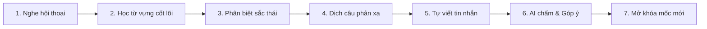

# ⚙️ TÀI LIỆU ĐẶC TẢ TÍNH NĂNG KỸ THUẬT (FEATURE SPECIFICATIONS)
## DỰ ÁN: KIZUNA (絆) - HÀNH TRÌNH HỌC TIẾNG NHẬT ĐA NỀN TẢNG HỖ TRỢ BỞI AI
**Học phần:** CS2028 - AI Product Development: End to End (Chuyên đề 4)  
**Trường:** Đại học Công nghệ Thông tin và Truyền thông Việt - Hàn (VKU) - Đại học Đà Nẵng  
**Mục tiêu học phần:** Đáp ứng Chuẩn đầu ra CLO1, CLO2, CLO3, CLO4 - Nội dung Chương 3 (Mục 3.5)  

---

## 1. TÍNH NĂNG 1: BẢN ĐỒ HÀNH TRÌNH ĐA CẤP ĐỘ (JOURNEY MAP ENGINE)

### 1.1. Mô hình thực thể dữ liệu Firestore (Data Schema)

```
journeys/ (Hành trình)
  └── stages/ (Chặng)
        └── milestones/ (Mốc)
              └── quests/ (Nhiệm vụ & Bài tập)
```

#### A. Collection `stages` (Chặng trên Bản đồ)
```json
{
  "id": "stage-01-hiragana",
  "journeyId": "japan-mastery",
  "orderIndex": 1,
  "title": "Chuẩn bị lên đường",
  "theme": "Làm quen tiếng Nhật cơ bản",
  "knowledgeSource": "Bảng chữ cái Hiragana",
  "totalMilestones": 4,
  "createdAt": "2026-09-13T10:00:00Z"
}
```

#### B. Collection `milestones` (Mốc điểm đến)
```json
{
  "id": "milestone-s3-reschedule",
  "stageId": "stage-03-daily-life",
  "orderIndex": 3,
  "title": "Đổi lịch hẹn",
  "situationContext": "Bạn có hẹn đi ăn với đồng nghiệp/bạn bè nhưng có việc đột xuất cần dời lịch hẹn sang tuần sau.",
  "knowledgeWhitelist": {
    "vocabularies": ["予定", "都合", "変更", "来週", "申し訳ありません", "時間", "大丈夫"],
    "grammarPoints": ["〜ていただけますか", "〜都合が悪い", "〜はいかがでしょうか"]
  },
  "unlockCriteria": {
    "requiredMilestoneId": "milestone-s3-directions",
    "minScorePercentage": 80
  },
  "createdAt": "2026-09-13T10:00:00Z"
}
```

#### C. Collection `user_journey_progress` (Tiến độ của Người học)
```json
{
  "userId": "user-vku-001",
  "currentStageId": "stage-03-daily-life",
  "currentMilestoneId": "milestone-s3-reschedule",
  "completedMilestones": [
    "milestone-s1-letters",
    "milestone-s1-sounds",
    "milestone-s2-katakana",
    "milestone-s3-intro",
    "milestone-s3-directions"
  ],
  "pendingRevisitQuests": [
    {
      "milestoneId": "milestone-s3-directions",
      "failedItemId": "都合",
      "dueDate": "2026-09-14T00:00:00Z",
      "status": "DUE"
    }
  ],
  "updatedAt": "2026-09-13T12:00:00Z"
}
```

---

## 2. TÍNH NĂNG 2: VÒNG LẶP HỌC TẬP TẠI MỐC (MILESTONE MICRO-LOOP ENGINE)

### 2.1. Quy trình 6 bước tại Mốc (Sequential Pipeline)



### 2.2. Điều kiện Mở khóa Mốc tiếp theo (Milestone Unlock Engine)
- Người học chỉ được mở mốc tiếp theo khi thỏa mãn:
  1. Hoàn thành toàn bộ các bước trong vòng lặp.
  2. Điểm kiểm tra thử thách cuối mốc đạt tối thiểu $\ge 80\%$.
  3. Câu viết tự do ở Bước 5 được AI chấm đạt điểm ngữ pháp và từ vựng phù hợp với ngữ cảnh.
- **Quy tắc Gameplay:** Nếu không đạt, hệ thống không phạt trừ điểm mà chỉ ra cụ thể điểm yếu (ví dụ: *"Bạn cần chú ý cách dùng trợ từ に khi chỉ thời gian hẹn"*) và mời học viên thử lại với một biến thể câu hỏi mới từ AI.

---

## 3. TÍNH NĂNG 3: ĐỘNG CƠ TẠO BIẾN THỂ BÀI TẬP CÓ KIỂM SOÁT BỞI AI (CONTROLLED AI VARIATION)

### 3.1. Ranh giới Tri thức & Rào cản An toàn (Guardrails Architecture)
Nhằm loại trừ triệt để hiện tượng ảo giác (Hallucination) và việc AI sinh ra từ vựng vượt quá trình độ, hệ thống cài đặt kiến trúc 3 lớp:

```
[Mốc tri thức chuẩn] ──► [Prompt Engine + Whitelist] ──► [LLM Generator] ──► [Guardrail Verifier] ──► [Bài tập hiển thị]
```

### 3.2. Cấu trúc Prompt Template ép khuôn AI (Context Engineering)
```json
{
  "system_instruction": "Bạn là chuyên gia thiết kế bài tập tiếng Nhật KIZUNA. Nhiệm vụ của bạn là sinh 01 câu hỏi trắc nghiệm tình huống biến thể cho mốc học.",
  "constraints": {
    "level": "JLPT N4",
    "situation": "Đổi lịch hẹn",
    "strict_whitelist_vocab": ["予定", "都合", "変更", "来週", "申し訳ありません", "時間", "大丈夫", "会う", "日曜日"],
    "allowed_grammar": ["〜ていただけますか", "〜都合が悪い", "〜はいかがでしょうか"],
    "forbidden": "Tuyệt đối không sử dụng từ vựng ngoài whitelist quá 1 từ. Không sử dụng từ vựng trình độ N3/N2/N1."
  },
  "response_schema": {
    "scenario_ja": "string (Tình huống bằng tiếng Nhật có Furigana)",
    "scenario_vi": "string (Giải nghĩa tình huống tiếng Việt)",
    "question": "string (Câu hỏi lựa chọn cách diễn đạt đúng nhất)",
    "options": ["string", "string", "string", "string"],
    "correct_option_index": "integer (0..3)",
    "explanation": "string (Giải thích tại sao đúng và tại sao các phương án khác chưa tự nhiên)"
  }
}
```

### 3.3. Thuật toán Guardrail Verifier (`AiGuardrailFilter.java`)
Trước khi trả câu hỏi do AI tạo về cho Frontend:
1. Tokenize câu văn tiếng Nhật thành các từ đơn (Morphological Analysis).
2. Đối soát từng từ với `knowledgeWhitelist.vocabularies` của mốc và danh mục từ đã học ở các mốc trước.
3. Nếu tỷ lệ từ ngoài danh mục $> 10\%$, câu hỏi bị **hủy bỏ** và hệ thống tự động yêu cầu LLM sinh lại câu khác (tối đa 2 lần retry).

---

## 4. TÍNH NĂNG 4: NHIỆM VỤ QUAY LẠI LUYỆN TẬP (SPACED RE-ENGAGEMENT QUEST)

### 4.1. Cơ chế cắm cờ nhiệm vụ trên Bản đồ (Map Flagging Mechanism)
- Khi học viên làm sai một từ hoặc mẫu câu ở bất kỳ mốc nào:
  - Hệ thống ghi nhận vào mảng `pendingRevisitQuests` với thời gian `dueDate = now + 1 day`.
  - Nếu sau 1 ngày học viên ôn đúng: `dueDate = now + 3 days` (chu kỳ giãn cách theo thuật toán SM-2).
  - Nếu tiếp tục làm đúng: `dueDate = now + 7 days`.
- **Hiển thị trên Bản đồ:**
  - Bản đồ hành trình không buộc người dùng phải lùi lại chơi cả chặng cũ.
  - Một biểu tượng trạm dừng chân phụ (Side Quest Marker) màu cam xuất hiện cạnh mốc cũ: *"Bạn có 3 từ cần ôn tập để giữ vững ký ức"*.
  - Học viên hoàn thành trong 2-3 phút, nhận thêm điểm XP và quay trở lại mốc đang chinh phục dở dang.

---

## 5. TÍNH NĂNG 5: AI SENSEI PHẢN HỒI CÂU TRẢ LỜI MỞ (AI WRITING COACH)

### 5.1. Mô tả
Khi người học tự viết tin nhắn hoặc câu thoại ở Bước 5 của vòng lặp mốc, AI Sensei đóng vai trò là giáo viên bản xứ đọc và góp ý câu viết.

### 5.2. Cấu trúc phản hồi chuẩn hóa của AI
```json
{
  "user_submission": "来週の月曜日は都合が悪いですから、火曜日に変更してください。",
  "score": 85,
  "is_acceptable": true,
  "analysis": {
    "grammar_check": "Đúng ngữ pháp, trợ từ dùng chính xác.",
    "nuance_feedback": "Câu của bạn dùng '変更してください' (Hãy đổi) có phần hơi áp đặt nếu nói với cấp trên hoặc người mới quen. Nên dùng mẫu câu đề nghị lịch sự hơn.",
    "better_expression": "来週の月曜日は少し都合が悪くなってしまいまして、もしよろしければ火曜日に変更していただけないでしょうか。"
  }
}
```
