# 📐 BẢN THIẾT KẾ CƠ SỞ DỮ LIỆU & SƠ ĐỒ THỰC THỂ LIÊN KẾT (ERD)
## DỰ ÁN: KIZUNA (绊) - NỀN TẢNG HỌC TIẾNG NHẬT ĐA NỀN TẢNG HỖ TRỢ BỞI AI
**Học phần:** CS2028 - AI Product Development: End to End  
**Đơn vị:** Trường Đại học Công nghệ Thông tin và Truyền thông Việt - Hàn (VKU)  
**Phiên bản:** v2.1.0  
**Cập nhật lần cuối:** 2026-09-22  

---

## 🏛️ 1. TỔNG QUAN KIẾN TRÚC DỮ LIỆU (HYBRID FIRESTORE ARCHITECTURE)

Hệ thống cơ sở dữ liệu KIZUNA được thiết kế theo mô hình lai (Hybrid NoSQL) trên **Google Cloud Firestore** kết hợp bộ đệm In-Memory và tệp dữ liệu hạt nhân `docs/KIZUNA_NEJ_SEED_DATA.json` (1,202 bản ghi chuẩn hóa).

Kiến trúc phân chia rạch ròi thành 4 nhóm dữ liệu:
1. **Nhóm Dữ Liệu Giáo Trình Tĩnh (Master Curriculum - Read-only cho User, CRUD cho Admin):** `stages`, `milestones`, `milestone_quests`, `vocabulary_items`, `kanji_dictionary`, `grammar_items`.
2. **Nhóm Định Danh & Tài Khoản (Identity & Auth):** `users`.
3. **Nhóm Tiến Trình Học Tập Cách Ly (User Learning State & Isolation):** `user_progress`, `user_srs_items`, `leaderboard`.
4. **Nhóm Giám Sát AI & Human-in-the-Loop (AI Governance & Audit):** `ai_evaluation_audits`.

---

## 📊 2. SƠ ĐỒ THỰC THỂ LIÊN KẾT (ENTITY-RELATIONSHIP DIAGRAM)

```mermaid
erDiagram
    %% Master Curriculum Group
    STAGES ||--o{ MILESTONES : "chứa (1:N)"
    MILESTONES ||--o{ MILESTONE_QUESTS : "gồm 4 bài học (1:4)"
    MILESTONES ||--o{ VOCABULARY_ITEMS : "dạy 26 từ (1:N)"
    MILESTONES ||--o{ KANJI_DICTIONARY : "rèn chữ Hán (1:N)"
    MILESTONES ||--o{ GRAMMAR_ITEMS : "tổng kết mẫu câu (1:N)"

    %% User & Identity Group
    USERS ||--o{ USER_PROGRESS : "lưu tiến độ riêng (1:N)"
    MILESTONES ||--o{ USER_PROGRESS : "gắn liền mốc (1:N)"
    USERS ||--o{ USER_SRS_ITEMS : "hàng đợi ôn tập SM-2 (1:N)"
    USERS ||--|| LEADERBOARD : "vinh danh 1-1 (1:1)"
    USERS ||--o{ AI_EVALUATION_AUDITS : "khiếu nại phán quyết (1:N)"
    MILESTONES ||--o{ AI_EVALUATION_AUDITS : "ngữ cảnh mốc (1:N)"

    STAGES {
        string id PK "Mã chặng (vd: stage_01_alphabet)"
        string title "Tên chặng học"
        int orderIndex "Thứ tự chặng (1..4)"
        string description "Mô tả chặng"
        string themeColor "Mã màu nhận diện"
    }

    MILESTONES {
        string id PK "Mã mốc (vd: ms_s1_01_hiragana)"
        string stageId FK "Khóa ngoại tới STAGES.id"
        string title "Tên mốc học tập"
        string nejUnit "Bài tương ứng giáo trình NEJ"
        int orderIndex "Thứ tự mốc toàn trình (1..28)"
        string communicationContext "Bối cảnh giao tiếp thực tế"
        int xpReward "Điểm kinh nghiệm thưởng"
        int activePointsReward "Điểm Năng Động thưởng"
        string prerequisiteMilestoneId FK "Mốc điều kiện tiên quyết"
        boolean isActive "Cờ bật/tắt hiển thị mốc"
    }

    MILESTONE_QUESTS {
        string id PK "Mã bài học (vd: quest_ms_s1_01_q1)"
        string milestoneId FK "Khóa ngoại tới MILESTONES.id"
        int stepIndex "Thứ tự bài học trong mốc (1..4)"
        string questType "Phân loại bài: SRS, Gatekeeper, Scramble, Practice"
        string title "Tiêu đề bài học"
        string description "Mô tả nhiệm vụ"
        int xpReward "XP nhận khi hoàn thành bài"
        int activePointsReward "Điểm Năng Động nhận"
        json additionalData "Dữ liệu câu hỏi, thẻ từ, thẻ kanji"
    }

    VOCABULARY_ITEMS {
        string id PK "Mã từ vựng (vd: vocab_001)"
        string milestoneId FK "Khóa ngoại tới MILESTONES.id"
        string term "Từ vựng tiếng Nhật (Kanji/Kana)"
        string reading "Cách đọc Hiragana"
        string sinoVietnamese "Âm Hán Việt"
        string vietnameseMeaning "Nghĩa tiếng Việt ngữ cảnh"
        string wordType "Loại từ: Danh từ, Động từ..."
        string exampleSentenceJp "Câu ví dụ tiếng Nhật"
        string exampleSentenceVi "Dịch nghĩa câu ví dụ"
        string nejSource "Vị trí trong giáo trình NEJ"
        boolean isCore "Trọng tâm (Core) hay Mở rộng"
    }

    KANJI_DICTIONARY {
        string id PK "Mã chữ Hán (vd: kanji_001)"
        string milestoneId FK "Khóa ngoại tới MILESTONES.id"
        int kanjiNumber "Số thứ tự Kanji NEJ (1..300)"
        string kanji "Chữ Hán mục tiêu"
        int strokeCount "Số nét vẽ chuẩn"
        string radicals "Bộ thủ cấu thành"
        string onyomi "Âm On"
        string kunyomi "Âm Kun"
        string sinoVietnamese "Âm Hán Việt in hoa"
        string vietnameseMeaning "Định nghĩa ý nghĩa chữ Hán"
        string mnemonicStory "Câu chuyện mẹo nhớ chữ Hán"
        json exampleCompounds "Danh sách từ ghép thực tế"
    }

    GRAMMAR_ITEMS {
        string id PK "Mã ngữ pháp (vd: gr_001)"
        string milestoneId FK "Khóa ngoại tới MILESTONES.id"
        string pattern "Mẫu câu cấu trúc"
        string titleVi "Tiêu đề tiếng Việt"
        string explanation "Giải thích ngữ pháp"
        string nuanceReason "Sắc thái tự nhiên & Lý do người Nhật dùng"
        string masterExampleJp "Câu ví dụ chuẩn tiếng Nhật"
        string masterExampleVi "Dịch nghĩa ví dụ chuẩn"
        json scrambledTest "Bộ thẻ từ phục vụ bài tập ghép câu"
    }

    USERS {
        string id PK "Mã người dùng (UID)"
        string username "Tên đăng nhập duy nhất"
        string password "Mật khẩu mã hóa BCrypt"
        string fullName "Họ và tên hiển thị"
        string email "Địa chỉ thư điện tử"
        string role "Phân quyền: ROLE_ADMIN hoặc ROLE_USER"
        boolean enabled "Trạng thái kích hoạt tài khoản"
        boolean isDeleted "Cờ xóa mềm tài khoản"
        int activePoints "Tổng Điểm Năng Động tích lũy"
        int totalXp "Tổng kinh nghiệm (XP)"
        int currentStreak "Chuỗi ngày học liên tục hiện tại"
        int longestStreak "Kỷ lục chuỗi ngày dài nhất"
        string avatarUrl "Ảnh đại diện"
        string level "Cấp độ hiện tại (N5, N4)"
    }

    USER_PROGRESS {
        string id PK "Khóa kết hợp: {userId}_{milestoneId}"
        string userId FK "Khóa ngoại tới USERS.id"
        string milestoneId FK "Khóa ngoại tới MILESTONES.id"
        string status "LOCKED, UNLOCKED, IN_PROGRESS, COMPLETED"
        array completedQuests "Danh sách quest đã xong: [quest_1, quest_2]"
        int currentQuestIndex "Bài học tiếp theo cần làm (1..4)"
        float vocabMasteryRate "Tỉ lệ chính xác từ vựng (0%..100%)"
        int activePointsEarned "Điểm Năng Động thu được tại mốc này"
        timestamp unlockedAt "Thời điểm mở khóa mốc"
        timestamp completedAt "Thời điểm hoàn tất 4 bài"
        timestamp lastReviewedAt "Thời điểm tương tác gần nhất"
    }

    USER_SRS_ITEMS {
        string id PK "Khóa kết hợp: {userId}_{itemId}"
        string userId FK "Khóa ngoại tới USERS.id"
        string itemType "VOCABULARY, KANJI, GRAMMAR"
        string itemId FK "Khóa ngoại tới từ vựng/kanji"
        int repetitionLevel "Cấp độ lặp lại chuỗi (0..5)"
        int intervalDays "Khoảng cách số ngày ôn tiếp theo"
        float easeFactor "Hệ số dễ SM-2 (khởi tạo 2.5, min 1.3)"
        timestamp nextReviewDate "Mốc thời gian kích hoạt ôn tập lại"
        int failedCount "Số lần người học chọn sai"
        boolean isFailedQueue "Cờ đánh dấu cần ôn ngay trong phiên"
        int lastReviewQuality "Điểm đánh giá gần nhất (0..5 sao)"
    }

    LEADERBOARD {
        string userId PK "Khóa ngoại 1-1 tới USERS.id"
        string displayName "Tên hiển thị công khai"
        string avatarUrl "Ảnh đại diện công khai"
        int activePoints "Tổng Điểm Năng Động xếp hạng"
        int rankPosition "Vị trí thứ hạng (1, 2, 3...)"
        int currentStreak "Số ngày học liên tục"
        int weeklyPoints "Điểm Năng Động kiếm trong tuần"
        timestamp updatedAt "Dấu thời gian cập nhật gần nhất"
    }

    AI_EVALUATION_AUDITS {
        string id PK "Mã phiếu khiếu nại (vd: audit_001)"
        string userId FK "Khóa ngoại tới USERS.id"
        string username "Tên học viên khiếu nại"
        string milestoneId FK "Khóa ngoại tới MILESTONES.id"
        string promptText "Đề bài viết tự do"
        string studentInput "Câu viết tiếng Nhật của học viên"
        string aiResponse "Phản hồi nhận xét của AI Sensei"
        int aiScore "Điểm AI đã chấm (1..10)"
        string studentReason "Lý do học viên báo AI chấm sai"
        string status "PENDING, APPROVED, REJECTED"
        string adminNote "Ghi chú xử lý của Admin"
        string resolvedBy "Tài khoản Admin đã xử lý"
        timestamp createdAt "Thời điểm gửi khiếu nại"
        timestamp resolvedAt "Thời điểm Admin phán quyết"
    }

    LISTENING_ITEMS {
        string id PK "Mã bài nghe Choukai (vd: listening_n5_m1_q1)"
        string milestoneId FK "Khóa ngoại tới MILESTONES.id"
        string jlptLevel "Cấp độ N5..N1"
        string mondaiName "Tên Mondai / Hội thoại"
        string setting "Bối cảnh tình huống nghe"
        string questionPrompt "Câu hỏi nghe hiểu"
        json dialogue "Transcript hội thoại (speaker, jp, vi)"
        array options "Các phương án trả lời"
        int correctAnswer "Chỉ số đáp án đúng"
        string explanationVi "Giải thích chi tiết đáp án"
    }

    VIDEO_LESSONS {
        string id PK "Mã bài học video (vd: video_916)"
        string youtubeVideoId "Mã video YouTube"
        string title "Tiêu đề tiếng Nhật"
        string titleEn "Tiêu đề dịch nghĩa"
        string jlptLevel "Cấp độ JLPT (N5..N1)"
        string category "Chủ đề (conversation, anime, news...)"
        string channelName "Tên kênh giảng dạy"
        int durationSeconds "Thời lượng (giây)"
        int segmentCount "Số câu phụ đề tương tác"
    }

    LIBRARY_ITEMS {
        string id PK "Mã học liệu thư viện (vd: lib_kanji-n4-jf)"
        string slug "Định danh URL trên thư viện"
        string jlptLevel "Cấp độ N5..N1 hoặc ALL"
        string type "course, mock, vocabulary_book, skill_category"
        string eyebrow "Nhãn phân loại học liệu"
        string title "Tên giáo trình / Bộ đề"
        string description "Mô tả chi tiết nội dung"
        string routeTo "Đường dẫn điều hướng"
    }
```



---

## 🛡️ 3. NGUYÊN TẮC CÁCH LY DỮ LIỆU NGƯỜI HỌC (DATA ISOLATION PRINCIPLE)

> [!IMPORTANT]
> **Quy tắc Bất Biến trong Cơ sở Dữ liệu KIZUNA:**
> Toàn bộ thao tác học tập, nộp bài, tích lũy điểm và mở khóa của học viên **CHỈ ĐƯỢC PHÉP ĐỌC/GHI VÀO HAI BẢNG RIÊNG BIỆT:**
> 1. **`user_progress`**: Lưu tiến trình từng mốc cho từng học viên theo khóa `{userId}_{milestoneId}`.
> 2. **`user_srs_items`**: Lưu hàng đợi ôn tập ngắt quãng SuperMemo-2 theo khóa `{userId}_{itemId}`.
>
> **Tuyệt đối KHÔNG BAO GIỜ chỉnh sửa, cập nhật hay ghi đè vào các collection giáo trình gốc:**
> `stages`, `milestones`, `milestone_quests`, `vocabulary_items`, `kanji_dictionary`, `grammar_items`.

### Cơ Chế Chuyển Đổi Trạng Thái Mốc Tự Động (State Progression Flow)
1. **Khởi tạo Học viên mới:**
   - Hệ thống tự động ghi bản ghi vào `user_progress`:
     `{ id: "{uid}_ms_s1_01_hiragana", userId: "{uid}", milestoneId: "ms_s1_01_hiragana", status: "UNLOCKED", currentQuestIndex: 1 }`.
   - Toàn bộ 27 mốc còn lại mặc định hiển thị ở trạng thái `LOCKED`.
2. **Nộp bài từng Quest (1 -> 2 -> 3):**
   - Bản ghi `user_progress` cập nhật: `status: "IN_PROGRESS"`, `currentQuestIndex: questIndex + 1`, bổ sung quest vào danh sách `completedQuests`.
   - Nếu ở Quest 2 (Vocab Gatekeeper) học viên chọn sai bất kỳ từ nào, hệ thống tự động ghi từ đó vào `user_srs_items` với cờ `isFailedQueue: true`.
3. **Nộp bài hoàn tất Quest 4 (Practice & Về đích):**
   - Bản ghi `user_progress` của mốc hiện tại chuyển sang: `status: "COMPLETED"`, `completedAt: now`.
   - Hệ thống tự động tìm mốc kế tiếp có `orderIndex = currentOrderIndex + 1`.
   - Tự động tạo hoặc cập nhật bản ghi `user_progress` của mốc kế tiếp thành: `status: "UNLOCKED"`, `currentQuestIndex: 1`, `unlockedAt: now`.
   - Cập nhật điểm `activePoints` và `currentStreak` trong bảng `users` và đồng bộ tức thời lên `leaderboard`.

---

## 🔍 4. CHIẾN LƯỢC ĐÁNH CHỈ MỤC (INDEXING STRATEGY)

Để đảm bảo các truy vấn trên Web và Mobile có độ trễ cực thấp (< 50ms), các chỉ mục sau được thiết lập trên Firestore:

| Collection | Loại chỉ mục | Trường đánh chỉ mục | Mục đích nghiệp vụ |
| :--- | :---: | :--- | :--- |
| `milestones` | Phức hợp (Compound) | `stageId ASC` + `orderIndex ASC` | Tải nhanh danh sách mốc theo chặng trên bản đồ roadmap. |
| `milestones` | Đơn (Single) | `orderIndex ASC` | Tìm mốc kế tiếp khi học viên hoàn thành bài 4. |
| `milestone_quests` | Phức hợp (Compound) | `milestoneId ASC` + `stepIndex ASC` | Lấy đúng thứ tự 4 bài học khi học viên vào phòng học. |
| `vocabulary_items` | Đơn (Single) | `milestoneId ASC` | Tải 26 từ vựng của mốc để học Flashcard và Gatekeeper. |
| `kanji_dictionary` | Phức hợp (Compound) | `milestoneId ASC` + `kanjiNumber ASC` | Tải thẻ chữ Hán và tra cứu từ ghép. |
| `user_progress` | Phức hợp (Compound) | `userId ASC` + `status ASC` | Lấy toàn bộ tiến độ các mốc của học viên để vẽ bản đồ hành trình. |
| `user_progress` | Đơn (Single) | `milestoneId ASC` | Phục vụ biểu đồ phễu rơi rụng (Drop-off Funnel) của Admin. |
| `user_srs_items` | Phức hợp (Compound) | `userId ASC` + `nextReviewDate ASC` | Lọc các thẻ từ vựng/kanji đến hạn ôn tập hôm nay của học viên. |
| `leaderboard` | Phức hợp (Compound) | `activePoints DESC` + `updatedAt ASC` | Xuất bảng xếp hạng Top 50 toàn thời gian. |
| `leaderboard` | Phức hợp (Compound) | `weeklyPoints DESC` + `updatedAt ASC` | Xuất bảng xếp hạng Top 50 theo tuần. |
| `ai_evaluation_audits`| Phức hợp (Compound) | `status ASC` + `createdAt DESC` | Lấy danh sách khiếu nại đang chờ Admin duyệt (`PENDING`). |

---

## 🔒 5. QUY TẮC BẢO MẬT & PHÂN QUYỀN TRUY CẬP (FIRESTORE SECURITY RULES)

```javascript
rules_version = '2';
service cloud.firestore {
  match /databases/{database}/documents {
    
    // Hàm trợ giúp kiểm tra vai trò
    function isAuthenticated() {
      return request.auth != null;
    }
    
    function isAdmin() {
      return isAuthenticated() && request.auth.token.role == 'ROLE_ADMIN';
    }
    
    function isOwner(userId) {
      return isAuthenticated() && request.auth.uid == userId;
    }

    // 1. Giáo trình tĩnh: Mọi user đã đăng nhập đều đọc được; Chỉ Admin có quyền ghi
    match /stages/{stageId} {
      allow read: if isAuthenticated();
      allow write: if isAdmin();
    }
    match /milestones/{milestoneId} {
      allow read: if isAuthenticated();
      allow write: if isAdmin();
    }
    match /milestone_quests/{questId} {
      allow read: if isAuthenticated();
      allow write: if isAdmin();
    }
    match /vocabulary_items/{vocabId} {
      allow read: if isAuthenticated();
      allow write: if isAdmin();
    }
    match /kanji_dictionary/{kanjiId} {
      allow read: if isAuthenticated();
      allow write: if isAdmin();
    }
    match /grammar_items/{grammarId} {
      allow read: if isAuthenticated();
      allow write: if isAdmin();
    }

    // 2. Dữ liệu tiến độ học viên: Chỉ chủ tài khoản hoặc Admin được đọc/ghi
    match /user_progress/{progressId} {
      allow read: if isAuthenticated() && (resource.data.userId == request.auth.uid || isAdmin());
      allow write: if isAuthenticated() && (request.resource.data.userId == request.auth.uid || isAdmin());
    }
    match /user_srs_items/{srsId} {
      allow read: if isAuthenticated() && (resource.data.userId == request.auth.uid || isAdmin());
      allow write: if isAuthenticated() && (request.resource.data.userId == request.auth.uid || isAdmin());
    }

    // 3. Bảng xếp hạng: Mọi người đọc được; Ghi chỉ thông qua Backend API
    match /leaderboard/{userId} {
      allow read: if isAuthenticated();
      allow write: if isAdmin();
    }

    // 4. Hàng đợi kiểm duyệt AI: Học viên tạo khiếu nại của mình, Admin toàn quyền duyệt
    match /ai_evaluation_audits/{auditId} {
      allow read: if isAuthenticated() && (resource.data.userId == request.auth.uid || isAdmin());
      allow create: if isAuthenticated() && request.resource.data.userId == request.auth.uid;
      allow update, delete: if isAdmin();
    }
  }
}
```

---

*Tài liệu này được đồng bộ trực tiếp với mã nguồn Java Model, Repository, Service Layer của Spring Boot Backend và tệp dữ liệu hạt nhân `docs/KIZUNA_NEJ_SEED_DATA.json`.*
