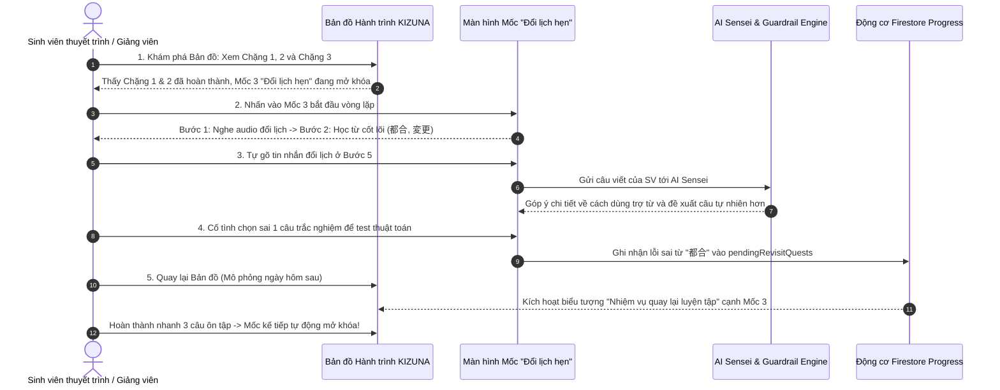

# 🧪 HƯỚNG DẪN THỰC HÀNH & KỊCH BẢN DEMO ĐỒ ÁN (PRACTICE LAB 3)
## BÀI THỰC HÀNH CHƯƠNG 3: KIỂM CHỨNG BẢN ĐỒ HÀNH TRÌNH & VÒNG LẶP HỌC TẬP TÍCH HỢP AI
**Học phần:** CS2028 - AI Product Development: End to End (Chuyên đề 4)  
**Trường:** Đại học Công nghệ Thông tin và Truyền thông Việt - Hàn (VKU) - Đại học Đà Nẵng  
**Mục tiêu kịch bản:** Demo một chuyến đi học tập ngắn nhưng hoàn chỉnh theo đúng định hướng sản phẩm  

---

## 1. MỤC TIÊU VÀ KỊCH BẢN CHUYẾN ĐI MẪU (DEMO ODYSSEY ROADMAP)

Để bảo vệ và báo cáo xuất sắc trước hội đồng/giảng viên, nhóm thiết kế một kịch bản demo tinh gọn qua **5 chặng trải nghiệm liên hoàn**:

```
[Chặng 1 & 2: Bảng chữ cái] ──► [Chặng 3: Mốc Giao tiếp N4] ──► [AI Sinh Biến thể & Góp ý] ──► [Ôn lỗi sai ngày hôm sau] ──► [Bản đồ Mở khóa mốc mới]
```

---

## 2. KỊCH BẢN 5 BƯỚC DEMO CHI TIẾT



---

### Bước 1: Trải nghiệm 2 Chặng Bảng Chữ Cái (Hiragana & Katakana)
- **Hành động:** 
  - Mở Bản đồ Hành trình KIZUNA trên giao diện Web hoặc Mobile.
  - Quan sát **Chặng 1: "Chuẩn bị lên đường"** (Nhận mặt chữ Hiragana, ghép âm thành từ ngắn như *さくら*, *ありがとう*).
  - Quan sát **Chặng 2: "Bắt đầu khám phá"** (Đọc từ mượn Katakana, tên món ăn quen thuộc như *ラーメン*, *コーヒー*).
- **Điểm nhấn thuyết trình:** Thể hiện việc chặng bảng chữ cái không ép người học phải nhồi nhét ngữ pháp hay Kanji phức tạp, chỉ tập trung vào phản xạ đọc tự nhiên.

---

### Bước 2: Bước vào Mốc Giao tiếp N4: *"Đổi lịch hẹn"* (Chặng 3)
- **Hành động:** Nhấn vào Mốc 3 trên bản đồ.
- **Quan sát vòng lặp trải nghiệm tại mốc:**
  1. **Nghe hội thoại:** Đoạn audio ngắn hai đồng nghiệp nói về việc bận đột xuất vào thứ Hai.
  2. **Học từ & mẫu câu cốt lõi:** Nhận diện 2 từ vựng chính (`都合`, `変更`) và cấu trúc lịch sự `〜ていただけますか`.
  3. **Phân biệt sắc thái:** Bài tập đối chiếu cách nói thân mật với bạn bè vs cách nói lịch sự trong môi trường làm việc.

---

### Bước 3: Tương tác cùng AI Sensei (Sinh biến thể & Chấm câu viết)
- **Hành động 1 (Làm bài tập do AI tạo):**
  - Hệ thống gọi AI sinh ra một câu hỏi tình huống mới: *"Nếu bạn muốn dời lịch hẹn sang thứ Tư tuần sau thì nên nhắn tin thế nào?"*.
  - **Chứng minh ranh giới AI (Guardrail):** Chỉ ra rằng toàn bộ từ vựng trong câu hỏi đều nằm trong whitelist của mốc N4, không bị lẫn từ khó N2/N1.
- **Hành động 2 (Học viên tự viết câu):**
  - Học viên gõ câu: *"来週の月曜日は都合が悪いですから、火曜日に変更してください。"*.
  - AI Sensei phản hồi phân tích: Câu đúng ngữ pháp nhưng có phần áp đặt, đề xuất đổi sang thể nhờ vả lịch sự `〜ていただけないでしょうか`.

---

### Bước 4: Kiểm chứng "Nhiệm vụ quay lại luyện tập" (Spaced Re-engagement)
- **Hành động:**
  - Trong quá trình làm bài, cố tình trả lời sai từ `都合` (chọn nhầm nghĩa).
  - Hệ thống ghi nhận lỗi sai vào danh sách ôn tập.
  - Sử dụng công cụ mô phỏng thời gian (Fast-forward to Next Day).
- **Kết quả trên Bản đồ:**
  - Bản đồ không bắt người học phải chơi lại từ đầu mốc.
  - Một biểu tượng trạm dừng chân phụ màu cam **"Nhiệm vụ quay lại luyện tập"** xuất hiện ngay tại vị trí mốc cũ.
  - Học viên nhấp vào giải quyết nhanh 3 câu hỏi ôn tập từ `都合` để xóa cờ lỗi sai và nhận thưởng +15 XP.

---

### Bước 5: Mở khóa Mốc mới trên Bản đồ Hành trình
- **Hành động:** Sau khi hoàn thành xuất sắc vòng lặp và nhiệm vụ ôn tập, học viên xem lại Bản đồ.
- **Kết quả:**
  - Mốc 3 đổi sang trạng thái `COMPLETED` màu xanh lá cây rực rỡ.
  - Mốc 4: *"Giải thích lý do & Cảm ơn"* tự động phát sáng và chuyển sang trạng thái `UNLOCKED`.
  - Toàn bộ thanh tiến độ chặng được cập nhật thời gian thực trên Firestore.

---

## 3. CHECKLIST ĐÁNH GIÁ ĐỒ ÁN (DÀNH CHO GIẢNG VIÊN CHẤM ĐIỂM)

| Tiêu chí đánh giá | Kết quả kiểm chứng | Điểm quy đổi Rubric |
| :--- | :---: | :---: |
| **Tính trọn vẹn của Lộ trình (Journey-based):** Có cấu trúc Chặng → Mốc rõ ràng | ✅ ĐẠT | CLO4 (35%) |
| **Gameplay phục vụ việc học:** Mở mốc vì dùng được kiến thức, không bấm lướt | ✅ ĐẠT | CLO3, CLO4 |
| **Ranh giới AI an toàn (Guardrails):** Bài tập AI không vượt quá whitelist mốc | ✅ ĐẠT | CLO1, CLO2, CLO3 |
| **Ôn tập Spaced Repetition thông minh:** Có nhiệm vụ quay lại luyện tập trên bản đồ | ✅ ĐẠT | CLO3, CLO4 |
| **Đa nền tảng mượt mà:** Đồng bộ dữ liệu người học tức thời trên Firestore | ✅ ĐẠT | CLO4 (35%) |
