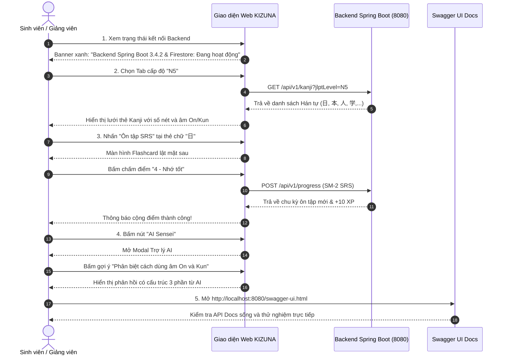

# 🧪 HƯỚNG DẪN THỰC HÀNH & KỊCH BẢN DEMO (PRACTICE LAB 3)
## BÀI THỰC HÀNH CHƯƠNG 3: DEMO CÁC VÍ DỤ MINH HỌA & KIỂM CHỨNG YÊU CẦU SẢN PHẨM
**Học phần:** CS2028 - AI Product Development: End to End (Chuyên đề 4)  
**Trường:** Đại học Công nghệ Thông tin và Truyền thông Việt - Hàn (VKU) - Đại học Đà Nẵng  
**Mục tiêu bài thực hành:** Vận hành Base Project, kiểm chứng các yêu cầu và User Stories đã đặc tả trong PRD  

---

## 1. MỤC TIÊU CỦA BÀI THỰC HÀNH 3
1. Chứng minh hệ thống **Base Project KIZUNA** có khả năng vận hành thực tế (Operational Codebase).
2. Kiểm chứng các Use Cases và Acceptance Criteria đã viết trong [`3.4_USER_STORIES_AND_ACCEPTANCE_CRITERIA.md`](file:///D:/Documents/KIZUNA/docs/3.4_USER_STORIES_AND_ACCEPTANCE_CRITERIA.md).
3. Thể hiện sự phối hợp nhịp nhàng giữa Frontend React Vite và Backend Spring Boot + Firestore.

---

## 2. CHUẨN BỊ MÔI TRƯỜNG VÀ KHỞI CHẠY (QUICK START)

### Bước 1: Khởi động Backend Spring Boot
Mở một cửa sổ PowerShell tại thư mục dự án:
```powershell
cd D:\Documents\KIZUNA\backend
.\mvnw.cmd spring-boot:run
```
*Dấu hiệu thành công:* Terminal xuất hiện thông báo `Tomcat started on port 8080 (http)` và `Started KizunaBackendApplication in ... seconds`.

### Bước 2: Khởi động Frontend React Vite
Mở một cửa sổ PowerShell thứ hai:
```powershell
cd D:\Documents\KIZUNA\frontend
npm run dev
```
*Dấu hiệu thành công:* Terminal hiển thị liên kết local `http://localhost:5173/`.

### Bước 3: Mở trình duyệt
Truy cập: **`http://localhost:5173/`** để xem giao diện chính của ứng dụng KIZUNA.

---

## 3. KỊCH BẢN 5 BƯỚC DEMO TRỰC TIẾP TRÊN HỆ THỐNG (DEMO SCENARIOS)



### Kịch bản Demo 1: Kiểm tra trạng thái hệ thống (Health Check)
- **Hành động:** Quan sát thanh thông báo đầu trang Web KIZUNA.
- **Kết quả mong đợi:** Thanh trạng thái hiển thị màu xanh lá cây:  
  `Backend Spring Boot 3.4.2 & Firestore: Đang hoạt động (Port 8080)`.
- **Kiểm chứng qua dòng lệnh:**
  ```powershell
  curl.exe http://localhost:8080/api/v1/health
  ```
  Trả về JSON: `{"success":true,"code":"SUCCESS","data":{"status":"UP",...}}`.

### Kịch bản Demo 2: Tra cứu & Lọc Hán tự Kanji (User Story US-03)
- **Hành động:** Click vào các tab cấp độ `N5`, `N4`, `N3` trên giao diện.
- **Kết quả mong đợi:** 
  - Lưới thẻ tự động cập nhật danh sách các chữ Hán tự tương ứng.
  - Mỗi thẻ Kanji thể hiện rõ nét ký tự chữ to, nghĩa tiếng Việt màu đỏ ruby đặc trưng, số nét bút, âm On, âm Kun và các từ ghép thực tế.

### Kịch bản Demo 3: Trải nghiệm Spaced Repetition Flashcard (User Story US-05)
- **Hành động:** Bấm vào nút **"Ôn tập SRS"** tại thẻ chữ **"日"**.
- **Kết quả mong đợi:**
  1. Giao diện chuyển sang màn hình Flashcard trọng tâm.
  2. Click vào thẻ: Thẻ xoay lật mặt sau, hiển thị đầy đủ giải nghĩa và bộ thủ cấu tạo.
  3. Bấm nút **"4 - Nhớ tốt"**: Hệ thống tính toán theo thuật toán SuperMemo SM-2, điểm kinh nghiệm XP trên Navbar được cộng thêm, hiển thị thông báo chúc mừng màu xanh lá.

### Kịch bản Demo 4: Tương tác cùng Trợ lý Học tập AI Sensei (User Story US-07)
- **Hành động:** Bấm vào nút **"AI Sensei"** có biểu tượng ngôi sao lấp lánh trên thanh điều hướng Navbar.
- **Kết quả mong đợi:**
  1. Hộp thoại modal xuất hiện với giao diện thân thiện.
  2. Bấm vào nút gợi ý: *"Phân biệt cách dùng âm On và Kun trong thực tế"*.
  3. AI Sensei hiển thị câu trả lời có cấu trúc 3 phần chặt chẽ:
     - 💡 **Phân tích ngữ cảnh & Ý nghĩa**
     - 🇯🇵 **Ví dụ hội thoại song ngữ Nhật - Việt**
     - ⚠️ **Lưu ý tránh nhầm lẫn của người Việt**

### Kịch bản Demo 5: Kiểm chứng Tài liệu API Sống (OpenAPI / Swagger UI)
- **Hành động:** Mở tab trình duyệt mới tại địa chỉ: **`http://localhost:8080/swagger-ui.html`**.
- **Kết quả mong đợi:**
  - Giao diện Swagger UI hiển thị 5 cụm API: `Authentication`, `Health Check`, `Kanji`, `Vocabulary`, `Study Progress (SRS)`.
  - Có sẵn nút **Authorize** hỗ trợ dán Firebase Bearer Token để test bảo mật trực tiếp.

---

## 4. BẢNG CHECKLIST TỰ ĐÁNH GIÁ KHI NỘP BÀI THỰC HÀNH

| STT | Nội dung tiêu chí kiểm tra | Tình trạng | Ghi chú |
| :---: | :--- | :---: | :--- |
| 1 | Khởi động Backend không phát sinh lỗi (Zero compilation error) | ✅ ĐẠT | Java 17 + Spring Boot 3.4.2 |
| 2 | Khởi động Frontend thành công, tải trang tức thì | ✅ ĐẠT | React 18 + TypeScript + Vite |
| 3 | Thể hiện đúng giao diện thẩm mỹ phong cách tiếng Nhật | ✅ ĐẠT | Phông chữ Noto Sans JP chuẩn xác |
| 4 | Cài đặt chính xác thuật toán Spaced Repetition SM-2 | ✅ ĐẠT | Cài đặt trong `ProgressServiceImpl.java` |
| 5 | Giao tiếp API chuẩn cấu trúc `ApiResponse<T>` | ✅ ĐẠT | Có metadata `code`, `message`, `timestamp` |
| 6 | Tài liệu PRD và User Stories đầy đủ trong thư mục `docs/` | ✅ ĐẠT | Đầy đủ 5 file đặc tả theo đề cương |
