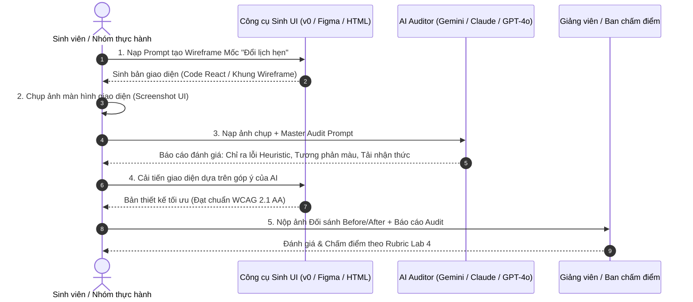

# 🧪 HƯỚNG DẪN THỰC HÀNH & KỊCH BẢN DEMO THIẾT KẾ UX/UI (PRACTICE LAB 4)
## BÀI THỰC HÀNH CHƯƠNG 4: THIẾT KẾ SẢN PHẨM & ĐÁNH GIÁ GIAO DIỆN TỰ ĐỘNG BẰNG AI
**Học phần:** CS2028 - AI Product Development: End to End (Chuyên đề 4)  
**Trường:** Đại học Công nghệ Thông tin và Truyền thông Việt - Hàn (VKU) - Đại học Đà Nẵng  
**Giảng viên phụ trách:** ThS. Lê Thành Công  
**Thời lượng phân bổ:** 3 tiết (2 tiết Lý thuyết + 1 tiết Thực hành)  
**Tài liệu tham chiếu:** [PRD_UX_UI_DESIGN_KIZUNA.md](file:///d:/Documents/KIZUNA/docs/PRD_UX_UI_DESIGN_KIZUNA.md)  

---

## 1. KẾ HOẠCH BÀI GIẢNG & PHÂN BỔ THỜI GIAN (LESSON TIMELINE)

| Giai đoạn | Thời lượng | Nội dung trọng tâm | Hoạt động của Giảng viên | Hoạt động của Sinh viên |
| :--- | :---: | :--- | :--- | :--- |
| **Tiết 1 (Lý thuyết)** | 45 phút | **4.1 Luồng người dùng (User Flow)** & **4.2 Bố cục khung (Wireframing)** | - Nêu vấn đề: Sự thất bại của UI danh sách tĩnh.<br>- Hướng dẫn phân tích User Flow dạng Journey.<br>- Trình bày quy chuẩn 8pt grid & Thumb-zone. | - Tiếp nhận đề bài Mốc "Đổi lịch hẹn".<br>- Thảo luận nhóm 4-5 SV.<br>- Vẽ phác thảo User Flow & Edge Cases lên giấy/Miro. |
| **Tiết 2 (Lý thuyết)** | 45 phút | **4.3 Tạo bản mẫu (Prototyping)** & **4.4 AI Đánh giá thiết kế (AI Design Review)** | - Hướng dẫn thiết lập Design Tokens.<br>- Phân tích 10 Heuristics Nielsen & WCAG 2.1 AA.<br>- Thị phạm (Live Demo) dùng Master Prompt để AI Review UI. | - Đặt câu hỏi phản biện.<br>- Tải bộ Prompt mẫu.<br>- Chuẩn bị ảnh chụp giao diện bài tập nhóm để test AI. |
| **Tiết 3 (Thực hành)** | 45 phút | **Bài thực hành 4: Hands-on Lab & AI Design Audit** | - Giám sát, đi từng bàn giải đáp thắc mắc.<br>- Cố vấn xử lý lỗi tương phản và trạng thái AI Streaming.<br>- Hỗ trợ sinh viên tối ưu Prompt. | - **Thực hành cá nhân:**<br>1. Sinh Wireframe/UI bằng AI.<br>2. Chụp ảnh đưa vào AI Design Review.<br>3. Sửa thiết kế & Nộp bài báo cáo. |

---

## 2. KỊCH BẢN DEMO CHI TIẾT DÀNH CHO GIẢNG VIÊN VÀ SINH VIÊN



---

## 3. BỘ PROMPT THỰC HÀNH MẪU (HANDS-ON PROMPT TEMPLATES)

### Prompt 1: Dùng AI sinh Code Wireframe React + Tailwind (Generative UI)
```text
Hãy đóng vai trò là Senior Frontend UI Engineer. Hãy viết một component React (TypeScript + Tailwind CSS) cho màn hình học tập của ứng dụng KIZUNA:
- Bối cảnh: Mốc "Đổi lịch hẹn" (Tiếng Nhật N4).
- Các thành phần bắt buộc:
  1. Top bar: Nút quay lại (X), thanh tiến độ bước 5/7 (màu đỏ #DC2626), huy hiệu mạng (5 tim).
  2. Card tình huống: Hiển thị ngữ cảnh giao tiếp thực tế bằng tiếng Việt và audio player thu nhỏ.
  3. Knowledge Whitelist Chips: 2 chip từ vựng gợi ý "都合 (thuận tiện)" và "変更 (thay đổi)".
  4. Textarea nhập liệu: Có placeholder tiếng Nhật, hỗ trợ đếm số ký tự, nút bật bàn phím ảo Kana.
  5. Sticky Bottom Action Bar: Nút CTA lớn "Gửi cho AI Sensei chấm" nằm ở vùng ngón tay cái dễ bấm.
- Yêu cầu kỹ thuật: Tối ưu mobile viewport (max-width 420px), tuân thủ 8pt grid, độ tương phản màu chuẩn WCAG AA.
```

---

### Prompt 2: Dùng AI Đa Phương Thức để Audit & Chấm Điểm Thiết Kế (AI Design Review)
```text
[ĐÍNH KÈM ẢNH CHỤP GIAO DIỆN Ở ĐÂY]

Bạn là Trưởng nhóm Đánh giá Trải nghiệm Người dùng (UX & Accessibility Auditor). 
Hãy thẩm định bức ảnh chụp giao diện đính kèm theo 4 tiêu chí khắt khe:

1. 10 Nguyên lý Khả dụng Nielsen Norman:
   - Liệt kê các điểm vi phạm (kèm mã H1-H10).
   - Kiểm tra xem người học có nhận biết rõ trạng thái hệ thống và có lối thoát khẩn cấp không?

2. Tiêu chuẩn Tiếp cận (WCAG 2.1 Level AA):
   - Kiểm tra độ tương phản giữa chữ và nền (Contrast ratio). Có vùng nào dưới 4.5:1 không?
   - Kích thước các nút bấm có đủ 44x44px trên ngón tay người dùng không?

3. Tải nhận thức (Cognitive Load):
   - Màn hình có bị quá tải thông tin không? 
   - Vị trí từ vựng gợi ý có hỗ trợ người học nhớ lại tự nhiên không?

4. Trải nghiệm AI (AI UX & Latency):
   - Giao diện có bố trí vùng hiển thị phản hồi của AI Sensei rõ ràng và phân biệt với nội dung gốc không?

HÃY XUẤT RA:
- Bảng Ma trận Lỗi (Mã lỗi | Mức độ | Vị trí | Cách sửa nhanh).
- Điểm đánh giá tổng thể (thang điểm 100).
- Bản mã CSS/Tailwind đã chỉnh sửa để khắc phục triệt để các lỗi trên.
```

---

## 4. CHECKLIST ĐÁNH GIÁ BÀI THỰC HÀNH DÀNH CHO GIẢNG VIÊN (GRADING CHECKLIST)

- [ ] **Tiêu chí 1 - User Flow (2.5 điểm):**
  - [ ] Có sơ đồ rõ ràng từ Bản đồ $\to$ Mốc $\to$ Nhập liệu $\to$ AI phản hồi $\to$ Mở khóa.
  - [ ] Có phân nhánh xử lý khi câu sai và mở trạm ôn tập ngắt quãng (Spaced Quest).
  - [ ] Có kịch bản xử lý mất mạng hoặc AI timeout.

- [ ] **Tiêu chí 2 - Wireframe & Layout (2.5 điểm):**
  - [ ] Áp dụng đúng hệ thống 8pt grid (spacing 8px, 16px, 24px).
  - [ ] Tối ưu hóa vùng ngón tay cái (Thumb zone) cho thiết bị di động.
  - [ ] Phân cấp thị giác rõ ràng giữa câu hỏi chính, gợi ý và nút hành động.

- [ ] **Tiêu chí 3 - Design System & Prototype (2.5 điểm):**
  - [ ] Đầy đủ bảng màu (Đỏ Torii `#DC2626`, Tím AI `#8B5CF6`, Xanh `#059669`, Cam `#D97706`).
  - [ ] Kiểu chữ hỗ trợ hiển thị tốt cả tiếng Việt và tiếng Nhật (có Furigana).
  - [ ] Có ít nhất 3 trạng thái tương tác (Default, AI Streaming/Loading, Success/Feedback).

- [ ] **Tiêu chí 4 - AI Design Review Report (2.5 điểm):**
  - [ ] Chạy thành công prompt AI Review trên ảnh chụp giao diện cá nhân.
  - [ ] Có bảng so sánh đối chứng Before vs After chứng minh đã khắc phục ít nhất 2 lỗi khả dụng.
  - [ ] Bản thiết kế sau khi sửa đạt điểm AI Review $\ge 85/100$.

---

*Tài liệu thực hành ban hành theo đề cương chi tiết học phần CS2028 - Học kỳ 1, Năm học 2026 - 2027.*
