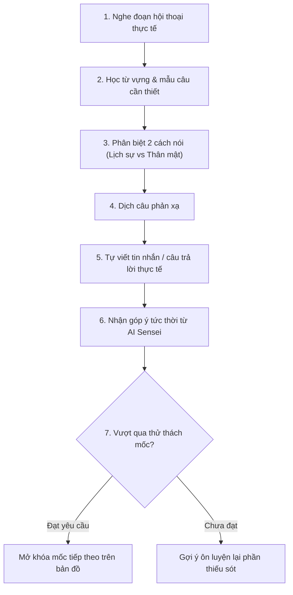
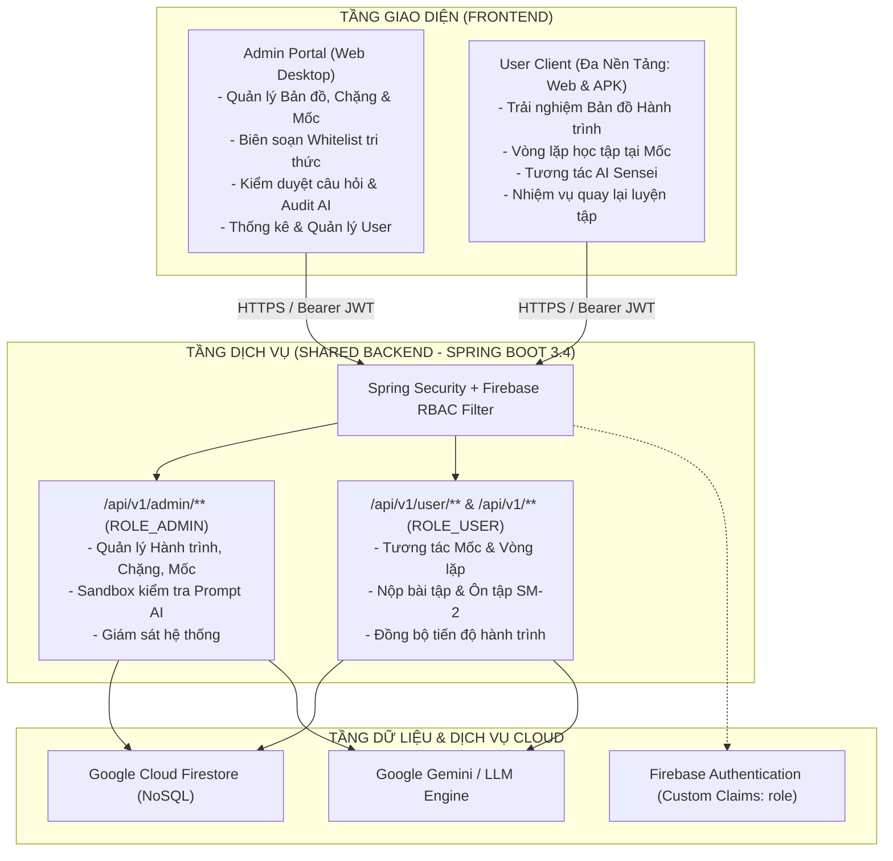

# 📜 TÀI LIỆU YÊU CẦU SẢN PHẨM (PRD - PRODUCT REQUIREMENTS DOCUMENT)
## DỰ ÁN: KIZUNA (絆) - HÀNH TRÌNH HỌC TIẾNG NHẬT ĐA NỀN TẢNG HỖ TRỢ BỞI AI
**Học phần:** CS2028 - AI Product Development: End to End (Chuyên đề 4)  
**Trường:** Đại học Công nghệ Thông tin và Truyền thông Việt - Hàn (VKU) - Đại học Đà Nẵng  
**Giảng viên phụ trách:** ThS. Lê Thành Công  
**Phiên bản tài liệu:** v2.0.0 (Cập nhật Kiến trúc Hành trình & Ranh giới Kiểm soát AI)  

---

## 1. KHÁM PHÁ SẢN PHẨM & TẦM NHÌN MỚI (PRODUCT DISCOVERY)

### 1.1. Bước chuyển dịch mô hình sản phẩm (Paradigm Shift)
- **Mô hình truyền thống (Cũ):** Người học mở danh sách các khóa học tĩnh (N5, N4, N3...) rồi lần lượt học từng bài lý thuyết rời rạc. Cách tiếp cận này tạo cảm giác nặng nề, thiếu định hướng và khiến hơn 60% học viên bỏ cuộc ngay ở giai đoạn đầu.
- **Mô hình KIZUNA (Mới - Journey-based Learning):** 
  - Xem việc học tiếng Nhật như **một chuyến du hành (Journey)** tiến về một điểm đến cụ thể (sống, du lịch, hoặc làm việc tại Nhật Bản).
  - Các giáo trình, khóa học truyền thống chỉ là **nguồn tư liệu kiến thức (Knowledge Base)** để đội ngũ phát triển chắt lọc, biên tập thành các **Chặng (Stages)** và **Mốc (Milestones)** trực quan trên bản đồ.
  - Người học luôn nhìn thấy vị trí hiện tại của mình trên hành trình, mục tiêu phía trước và động lực mở khóa từng vùng đất tri thức mới.

### 1.2. Mô hình tổ chức 5 cấp độ (5-Tier Architecture)
```
Hành trình (Journey)
   └── Chặng (Stage)
         └── Mốc (Milestone / Checkpoint)
               └── Bài học & Nhiệm vụ nhỏ (Quests / Micro-tasks)
                     └── Nhiệm vụ Ôn tập Ngắt quãng (Spaced Re-engagement Quest)
```

### 1.3. Lộ trình Hành trình Mẫu (Journey Roadmap)

| Chặng | Chủ đề hành trình | Nguồn kiến thức chắt lọc | Các mốc điển hình (Milestones) |
| :--- | :--- | :--- | :--- |
| **Chặng 1: Chuẩn bị lên đường** | Làm quen tiếng Nhật cơ bản | Bảng chữ cái Hiragana | Nhận mặt chữ → Ghép âm → Đọc từ đơn → Đọc câu ngắn chào hỏi |
| **Chặng 2: Bắt đầu khám phá** | Đọc những từ thường gặp quanh đời sống | Bảng chữ Katakana & Kiến thức nền | Đọc tên món ăn Nhật → Địa danh nổi tiếng → Từ mượn ngoại lai → Thử thách tổng hợp 2 bảng chữ |
| **Chặng 3: Sinh hoạt hằng ngày** | Giao tiếp và xử lý tình huống cơ bản | Kiến thức nền và ngữ pháp/từ vựng N4 | Tự giới thiệu bản thân → Hỏi đường đi tàu điện → Đổi lịch hẹn → Giải thích lý do |
| **Chặng 4: Tự tin khám phá** | Hiểu nội dung dài và diễn đạt tự nhiên | Lộ trình N3 | Đọc thông báo đời sống → Nghe hội thoại tự nhiên → Nêu ý kiến cá nhân → Giải quyết tình huống phát sinh |
| **Nhánh: Đi làm tại Nhật** *(Specialized Branch)* | Giao tiếp môi trường công sở | Tiếng Nhật thương mại (Business Japanese) | Chào hỏi chuẩn tác phong công ty → Viết email/tin nhắn trao đổi → Báo cáo HORENSO → Thỏa thuận dời lịch công tác |

> [!NOTE]
> **Tính linh hoạt của Chặng:** Chặng không nhất thiết phải trùng với ranh giới của một chứng chỉ JLPT. Ở chặng 1 & 2 (Hiragana/Katakana), hệ thống không ép buộc học viên phải nhồi nhét ngữ pháp hay Kanji phức tạp, mà chỉ tập trung tối đa vào mục tiêu nhận diện và phản xạ đọc.

---

## 2. GAMEPLAY PHỤC VỤ VIỆC HỌC & VÒNG LẶP TẠI MỖI MỐC (MILESTONE MICRO-LOOP)

### 2.1. Vòng lặp trải nghiệm tại mỗi mốc (Milestone Experience Loop)
Tại mỗi mốc trên bản đồ (ví dụ: Mốc *"Đổi lịch hẹn"*), người học không chỉ "bấm qua màn hình" mà phải trải qua một vòng luyện tập khép kín:



### 2.2. Cơ chế "Nhiệm vụ quay lại luyện tập" (Spaced Re-engagement Quest)
- Thay vì bắt người học phải chơi lại nguyên cả chặng khi quên từ, hệ thống áp dụng thuật toán lặp lại ngắt quãng (Spaced Repetition).
- Những từ, mẫu câu người dùng làm sai tại các mốc trước sẽ tự động biến thành **"Nhiệm vụ quay lại luyện tập"** xuất hiện trên bản đồ sau 1, 3, hoặc 7 ngày.
- **Ý nghĩa trải nghiệm:** Người học luôn có cảm giác đang tiến về phía trước tới vùng đất mới, nhưng thỉnh thoảng nhận một tín hiệu ghé lại trạm kiểm soát cũ để gia cố kiến thức bị hổng.

---

## 3. RANH GIỚI KIỂM SOÁT AI (AI BOUNDARIES & QUALITY GUARDRAILS)

Đây là ranh giới kỹ thuật cốt lõi giúp đồ án vững chắc về mặt học thuật và thực tiễn:

```
┌─────────────────────────────────────────────────────────────────────────────┐
│ 1. LỚP TRI THỨC CHUẨN (Human-Curated Knowledge Base - 100% Deterministic)   │
│    - Con người biên soạn và làm chủ: Bản đồ, mục tiêu mốc, từ vựng chuẩn,   │
│      ngữ pháp trọng tâm, tiêu chí mở khóa và đáp án mẫu.                    │
└──────────────────────────────────────┬──────────────────────────────────────┘
                                       │ Whitelist phạm vi kiến thức
                                       ▼
┌─────────────────────────────────────────────────────────────────────────────┐
│ 2. ĐỘNG CƠ TẠO BIẾN THỂ AI (Controlled AI Variation Engine)                 │
│    - AI tạo biến thể bài tập: Đổi ngữ cảnh câu hỏi, thay đổi đối tượng giao │
│      tiếp, đưa tình huống thực hành mở, chấm và góp ý câu viết của học viên.│
└──────────────────────────────────────┬──────────────────────────────────────┘
                                       │ Dữ liệu đầu ra cần kiểm chứng
                                       ▼
┌─────────────────────────────────────────────────────────────────────────────┐
│ 3. HÀNG RÀO KIỂM CHỨNG CHẤT LƯỢNG (AI Output Guardrails & Verification)     │
│    - Kiểm tra độ an toàn: Không dùng từ vựng vượt trình độ của mốc.         │
│    - Kiểm tra đáp án: Đảm bảo có rubric chấm rõ ràng, không bịa đặt kiến thức│
│    - Không đưa trực tiếp raw content từ web/AI vào app khi chưa qua kiểm duyệt│
└─────────────────────────────────────────────────────────────────────────────┘
```

---

## 4. YÊU CẦU HỆ THỐNG MỞ RỘNG (SYSTEM REQUIREMENTS)

### 4.1. Yêu cầu Chức năng (Functional Requirements)
- **FR-01 (Bản đồ Hành trình):** Hiển thị trực quan bản đồ với các chặng và mốc; thể hiện trạng thái mốc: `LOCKED` (khóa), `UNLOCKED` (đang học), `COMPLETED` (hoàn thành), `NEEDS_REVIEW` (có nhiệm vụ quay lại).
- **FR-02 (Vòng lặp Mốc):** Điều phối chuỗi nhiệm vụ tại mốc (Nghe -> Học từ -> Phân biệt -> Dịch -> Viết -> Chấm điểm).
- **FR-03 (Sinh biến thể bài tập AI):** API Backend gọi LLM sinh câu hỏi thực hành dựa trên `milestone_context`, đảm bảo chỉ sử dụng từ vựng nằm trong whitelist của mốc.
- **FR-04 (Động cơ Góp ý AI):** AI phân tích câu trả lời mở của học viên, chỉ ra lỗi ngữ pháp/trợ từ và gợi ý cách diễn đạt tự nhiên hơn.
- **FR-05 (Spaced Re-engagement):** Quản lý danh sách lỗi sai và kích hoạt nhiệm vụ quay lại luyện tập theo chu kỳ ngày.

### 4.2. Yêu cầu Phi chức năng (Non-Functional Requirements)
- **NFR-01 (Scope Containment):** 100% câu hỏi do AI tạo ra phải được kiểm chứng không chứa từ vựng nằm ngoài danh mục đã học quá 10%.
- **NFR-02 (Seamless Offline/Online):** Tiến độ bản đồ được lưu đồng bộ trên Firestore, cho phép học offline một phần trên thiết bị di động và tự động sync khi có mạng.
- **NFR-03 (Responsive Map UX):** Bản đồ hành trình tương tác mượt mà trên cả trình duyệt Web Desktop và màn hình cảm ứng di động.

---

---

## 5. KIẾN TRÚC HỆ THỐNG & PHÂN HỆ KHÁCH HÀNG (MULTI-CLIENT ARCHITECTURE)

Hệ thống được thiết kế theo mô hình **Unified Backend - Dual Frontend**:



### 5.1. Backend dùng chung (Single Unified Backend):
- Một mã nguồn Spring Boot duy nhất quản lý toàn bộ nghiệp vụ, dữ liệu và bảo mật.
- Kiểm soát truy cập dựa trên vai trò (Role-Based Access Control - RBAC) thông qua Firebase Custom Claims:
  - `ROLE_ADMIN`: Toàn quyền quản trị nội dung bài học, cấu hình whitelist, kiểm duyệt bài tập do AI tạo và xem thống kê tổng thể.
  - `ROLE_USER`: Chỉ truy cập dữ liệu học tập cá nhân, lộ trình hành trình và nộp kết quả ôn tập.

### 5.2. Frontend phân tách rõ rệt (Dual Frontend System):
1. **Phân hệ Admin (Admin Web Portal):**
   - Định hướng thiết bị: Chuyên dụng cho **Web Desktop/Laptop** (màn hình lớn).
   - Mục đích: Phục vụ giáo viên, biên tập viên nội dung thao tác với các bảng dữ liệu lớn, trình soạn thảo bản đồ (Journey Editor), thiết lập quy tắc whitelist cho từng mốc và sandbox thử nghiệm prompt AI.
2. **Phân hệ User (User Multi-Platform Client):**
   - Định hướng thiết bị: **Đa nền tảng linh hoạt** - chạy mượt mà trên **Web Browser** và sẵn sàng đóng gói xuất bản thành file cài đặt **Android APK** (thông qua Capacitor / PWA wrapper).
   - Mục đích: Phục vụ người học với giao diện tối ưu hóa cho cảm ứng 1 chạm trên điện thoại di động (Mobile-First UI), điều hướng bản đồ trực quan và làm bài tập mọi lúc mọi nơi.

---

## 6. PHẠM VI DEMO ĐỒ ÁN TINH GỌN (LEAN DEMO SCOPE)

Để đảm bảo chất lượng bảo vệ đồ án kết thúc học phần, nhóm tập trung hiện thực hóa kịch bản trọn vẹn:
1. **Admin Web:** Đăng nhập tài khoản Admin, tạo 1 Mốc mới kèm thiết lập Whitelist từ vựng và xem AI sinh thử bài tập mẫu trong trang quản trị.
2. **User Client (Web/APK):** Đăng nhập tài khoản học viên, thấy Mốc mới xuất hiện trên Bản đồ Hành trình.
3. **Thực hành Mốc:** Trải nghiệm vòng lặp tại Mốc N4, làm bài tập biến thể AI và nộp câu viết tự do.
4. **Ôn tập Spaced Review:** Kiểm chứng nhiệm vụ quay lại luyện tập lỗi sai xuất hiện trên bản đồ vào ngày hôm sau.
5. **Cập nhật Tiến độ:** Bản đồ tự động ghi nhận hoàn thành và mở khóa mốc tiếp theo.

