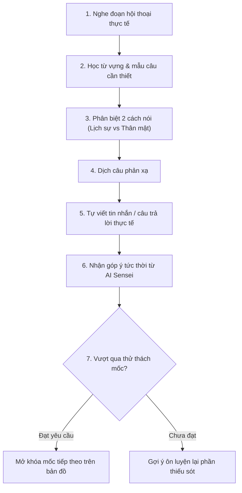
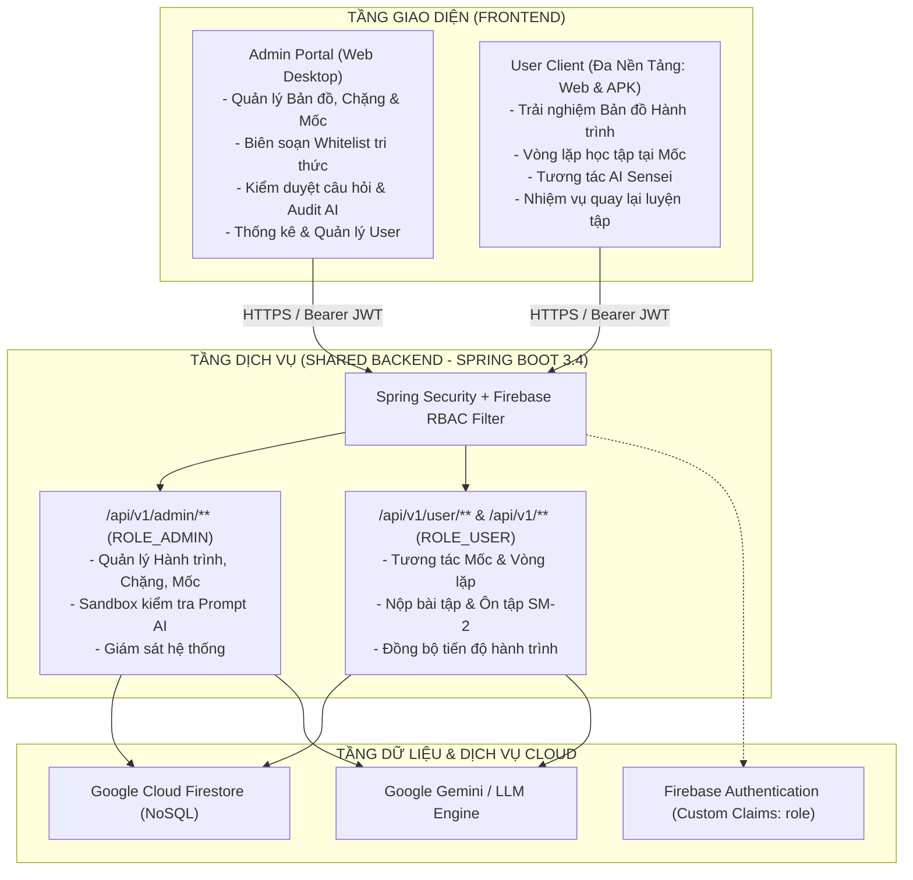

# 📜 TÀI LIỆU YÊU CẦU SẢN PHẨM (PRD - PRODUCT REQUIREMENTS DOCUMENT)
## DỰ ÁN: KIZUNA (絆) - HÀNH TRÌNH HỌC TIẾNG NHẬT ĐA NỀN TẢNG HỖ TRỢ BỞI AI
**Học phần:** CS2028 - AI Product Development: End to End (Chuyên đề 4)  
**Trường:** Đại học Công nghệ Thông tin và Truyền thông Việt - Hàn (VKU) - Đại học Đà Nẵng  
**Giảng viên phụ trách:** ThS. Lê Thành Công  
**Phiên bản tài liệu:** v2.0.0 (Cập nhật Kiến trúc Hành trình & Ranh giới Kiểm soát AI)  

---

## 1. KHÁM PHÁ SẢN PHẨM & TẦM NHÌN MỚI (PRODUCT DISCOVERY)

### 1.1. Bước chuyển dịch mô hình sản phẩm (Paradigm Shift)
- **Mô hình truyền thống (Cũ):** Người học mở danh sách các khóa học tĩnh (N5, N4, N3...) rồi lần lượt học từng bài lý thuyết rời rạc. Cách tiếp cận này tạo cảm giác nặng nề, thiếu định hướng và khiến hơn 60% học viên bỏ cuộc ngay ở giai đoạn đầu.
- **Mô hình KIZUNA (Mới - Journey-based Learning):** 
  - Xem việc học tiếng Nhật như **một chuyến du hành (Journey)** tiến về một điểm đến cụ thể (sống, du lịch, hoặc làm việc tại Nhật Bản).
  - Các giáo trình, khóa học truyền thống chỉ là **nguồn tư liệu kiến thức (Knowledge Base)** để đội ngũ phát triển chắt lọc, biên tập thành các **Chặng (Stages)** và **Mốc (Milestones)** trực quan trên bản đồ.
  - Người học luôn nhìn thấy vị trí hiện tại của mình trên hành trình, mục tiêu phía trước và động lực mở khóa từng vùng đất tri thức mới.

### 1.2. Mô hình tổ chức 5 cấp độ (5-Tier Architecture)
```
Hành trình (Journey)
   └── Chặng (Stage)
         └── Mốc (Milestone / Checkpoint)
               └── Bài học & Nhiệm vụ nhỏ (Quests / Micro-tasks)
                     └── Nhiệm vụ Ôn tập Ngắt quãng (Spaced Re-engagement Quest)
```

### 1.3. Lộ trình Hành trình Mẫu (Journey Roadmap)

| Chặng | Chủ đề hành trình | Nguồn kiến thức chắt lọc | Các mốc điển hình (Milestones) |
| :--- | :--- | :--- | :--- |
| **Chặng 1: Chuẩn bị lên đường** | Làm quen tiếng Nhật cơ bản | Bảng chữ cái Hiragana | Nhận mặt chữ → Ghép âm → Đọc từ đơn → Đọc câu ngắn chào hỏi |
| **Chặng 2: Bắt đầu khám phá** | Đọc những từ thường gặp quanh đời sống | Bảng chữ Katakana & Kiến thức nền | Đọc tên món ăn Nhật → Địa danh nổi tiếng → Từ mượn ngoại lai → Thử thách tổng hợp 2 bảng chữ |
| **Chặng 3: Sinh hoạt hằng ngày** | Giao tiếp và xử lý tình huống cơ bản | Kiến thức nền và ngữ pháp/từ vựng N4 | Tự giới thiệu bản thân → Hỏi đường đi tàu điện → Đổi lịch hẹn → Giải thích lý do |
| **Chặng 4: Tự tin khám phá** | Hiểu nội dung dài và diễn đạt tự nhiên | Lộ trình N3 | Đọc thông báo đời sống → Nghe hội thoại tự nhiên → Nêu ý kiến cá nhân → Giải quyết tình huống phát sinh |
| **Nhánh: Đi làm tại Nhật** *(Specialized Branch)* | Giao tiếp môi trường công sở | Tiếng Nhật thương mại (Business Japanese) | Chào hỏi chuẩn tác phong công ty → Viết email/tin nhắn trao đổi → Báo cáo HORENSO → Thỏa thuận dời lịch công tác |

> [!NOTE]
> **Tính linh hoạt của Chặng:** Chặng không nhất thiết phải trùng với ranh giới của một chứng chỉ JLPT. Ở chặng 1 & 2 (Hiragana/Katakana), hệ thống không ép buộc học viên phải nhồi nhét ngữ pháp hay Kanji phức tạp, mà chỉ tập trung tối đa vào mục tiêu nhận diện và phản xạ đọc.

---

## 2. GAMEPLAY PHỤC VỤ VIỆC HỌC & VÒNG LẶP TẠI MỖI MỐC (MILESTONE MICRO-LOOP)

### 2.1. Vòng lặp trải nghiệm tại mỗi mốc (Milestone Experience Loop)
Tại mỗi mốc trên bản đồ (ví dụ: Mốc *"Đổi lịch hẹn"*), người học không chỉ "bấm qua màn hình" mà phải trải qua một vòng luyện tập khép kín:



### 2.2. Cơ chế "Nhiệm vụ quay lại luyện tập" (Spaced Re-engagement Quest)
- Thay vì bắt người học phải chơi lại nguyên cả chặng khi quên từ, hệ thống áp dụng thuật toán lặp lại ngắt quãng (Spaced Repetition).
- Những từ, mẫu câu người dùng làm sai tại các mốc trước sẽ tự động biến thành **"Nhiệm vụ quay lại luyện tập"** xuất hiện trên bản đồ sau 1, 3, hoặc 7 ngày.
- **Ý nghĩa trải nghiệm:** Người học luôn có cảm giác đang tiến về phía trước tới vùng đất mới, nhưng thỉnh thoảng nhận một tín hiệu ghé lại trạm kiểm soát cũ để gia cố kiến thức bị hổng.

---

## 3. RANH GIỚI KIỂM SOÁT AI (AI BOUNDARIES & QUALITY GUARDRAILS)

Đây là ranh giới kỹ thuật cốt lõi giúp đồ án vững chắc về mặt học thuật và thực tiễn:

```
┌─────────────────────────────────────────────────────────────────────────────┐
│ 1. LỚP TRI THỨC CHUẨN (Human-Curated Knowledge Base - 100% Deterministic)   │
│    - Con người biên soạn và làm chủ: Bản đồ, mục tiêu mốc, từ vựng chuẩn,   │
│      ngữ pháp trọng tâm, tiêu chí mở khóa và đáp án mẫu.                    │
└──────────────────────────────────────┬──────────────────────────────────────┘
                                       │ Whitelist phạm vi kiến thức
                                       ▼
┌─────────────────────────────────────────────────────────────────────────────┐
│ 2. ĐỘNG CƠ TẠO BIẾN THỂ AI (Controlled AI Variation Engine)                 │
│    - AI tạo biến thể bài tập: Đổi ngữ cảnh câu hỏi, thay đổi đối tượng giao │
│      tiếp, đưa tình huống thực hành mở, chấm và góp ý câu viết của học viên.│
└──────────────────────────────────────┬──────────────────────────────────────┘
                                       │ Dữ liệu đầu ra cần kiểm chứng
                                       ▼
┌─────────────────────────────────────────────────────────────────────────────┐
│ 3. HÀNG RÀO KIỂM CHỨNG CHẤT LƯỢNG (AI Output Guardrails & Verification)     │
│    - Kiểm tra độ an toàn: Không dùng từ vựng vượt trình độ của mốc.         │
│    - Kiểm tra đáp án: Đảm bảo có rubric chấm rõ ràng, không bịa đặt kiến thức│
│    - Không đưa trực tiếp raw content từ web/AI vào app khi chưa qua kiểm duyệt│
└─────────────────────────────────────────────────────────────────────────────┘
```

---

## 4. YÊU CẦU HỆ THỐNG MỞ RỘNG (SYSTEM REQUIREMENTS)

### 4.1. Yêu cầu Chức năng (Functional Requirements)
- **FR-01 (Bản đồ Hành trình):** Hiển thị trực quan bản đồ với các chặng và mốc; thể hiện trạng thái mốc: `LOCKED` (khóa), `UNLOCKED` (đang học), `COMPLETED` (hoàn thành), `NEEDS_REVIEW` (có nhiệm vụ quay lại).
- **FR-02 (Vòng lặp Mốc):** Điều phối chuỗi nhiệm vụ tại mốc (Nghe -> Học từ -> Phân biệt -> Dịch -> Viết -> Chấm điểm).
- **FR-03 (Sinh biến thể bài tập AI):** API Backend gọi LLM sinh câu hỏi thực hành dựa trên `milestone_context`, đảm bảo chỉ sử dụng từ vựng nằm trong whitelist của mốc.
- **FR-04 (Động cơ Góp ý AI):** AI phân tích câu trả lời mở của học viên, chỉ ra lỗi ngữ pháp/trợ từ và gợi ý cách diễn đạt tự nhiên hơn.
- **FR-05 (Spaced Re-engagement):** Quản lý danh sách lỗi sai và kích hoạt nhiệm vụ quay lại luyện tập theo chu kỳ ngày.

### 4.2. Yêu cầu Phi chức năng (Non-Functional Requirements)
- **NFR-01 (Scope Containment):** 100% câu hỏi do AI tạo ra phải được kiểm chứng không chứa từ vựng nằm ngoài danh mục đã học quá 10%.
- **NFR-02 (Seamless Offline/Online):** Tiến độ bản đồ được lưu đồng bộ trên Firestore, cho phép học offline một phần trên thiết bị di động và tự động sync khi có mạng.
- **NFR-03 (Responsive Map UX):** Bản đồ hành trình tương tác mượt mà trên cả trình duyệt Web Desktop và màn hình cảm ứng di động.

---

---

## 5. KIẾN TRÚC HỆ THỐNG & PHÂN HỆ KHÁCH HÀNG (MULTI-CLIENT ARCHITECTURE)

Hệ thống được thiết kế theo mô hình **Unified Backend - Dual Frontend**:



### 5.1. Backend dùng chung (Single Unified Backend):
- Một mã nguồn Spring Boot duy nhất quản lý toàn bộ nghiệp vụ, dữ liệu và bảo mật.
- Kiểm soát truy cập dựa trên vai trò (Role-Based Access Control - RBAC) thông qua Firebase Custom Claims:
  - `ROLE_ADMIN`: Toàn quyền quản trị nội dung bài học, cấu hình whitelist, kiểm duyệt bài tập do AI tạo và xem thống kê tổng thể.
  - `ROLE_USER`: Chỉ truy cập dữ liệu học tập cá nhân, lộ trình hành trình và nộp kết quả ôn tập.

### 5.2. Frontend phân tách rõ rệt (Dual Frontend System):
1. **Phân hệ Admin (Admin Web Portal):**
   - Định hướng thiết bị: Chuyên dụng cho **Web Desktop/Laptop** (màn hình lớn).
   - Mục đích: Phục vụ giáo viên, biên tập viên nội dung thao tác với các bảng dữ liệu lớn, trình soạn thảo bản đồ (Journey Editor), thiết lập quy tắc whitelist cho từng mốc và sandbox thử nghiệm prompt AI.
2. **Phân hệ User (User Multi-Platform Client):**
   - Định hướng thiết bị: **Đa nền tảng linh hoạt** - chạy mượt mà trên **Web Browser** và sẵn sàng đóng gói xuất bản thành file cài đặt **Android APK** (thông qua Capacitor / PWA wrapper).
   - Mục đích: Phục vụ người học với giao diện tối ưu hóa cho cảm ứng 1 chạm trên điện thoại di động (Mobile-First UI), điều hướng bản đồ trực quan và làm bài tập mọi lúc mọi nơi.

---

## 6. PHẠM VI DEMO ĐỒ ÁN TINH GỌN (LEAN DEMO SCOPE)

Để đảm bảo chất lượng bảo vệ đồ án kết thúc học phần, nhóm tập trung hiện thực hóa kịch bản trọn vẹn:
1. **Admin Web:** Đăng nhập tài khoản Admin, tạo 1 Mốc mới kèm thiết lập Whitelist từ vựng và xem AI sinh thử bài tập mẫu trong trang quản trị.
2. **User Client (Web/APK):** Đăng nhập tài khoản học viên, thấy Mốc mới xuất hiện trên Bản đồ Hành trình.
3. **Thực hành Mốc:** Trải nghiệm vòng lặp tại Mốc N4, làm bài tập biến thể AI và nộp câu viết tự do.
4. **Ôn tập Spaced Review:** Kiểm chứng nhiệm vụ quay lại luyện tập lỗi sai xuất hiện trên bản đồ vào ngày hôm sau.
5. **Cập nhật Tiến độ:** Bản đồ tự động ghi nhận hoàn thành và mở khóa mốc tiếp theo.

---

## 7. THIẾT KẾ CƠ SỞ DỮ LIỆU & SƠ ĐỒ THỰC THỂ LIÊN KẾT (DATABASE ARCHITECTURE & ERD)

### 7.1. Định hướng kiến trúc cơ sở dữ liệu (Database Architecture Paradigms)
Hệ sinh thái ứng dụng học tiếng Nhật KIZUNA áp dụng kiến trúc dữ liệu lai (Hybrid Data Layer) nhằm phục vụ tối ưu cho trải nghiệm đa nền tảng và tương tác thời gian thực:
1. **Google Cloud Firestore (NoSQL Document Store):**
   - Đóng vai trò là **Primary Operational Data Store**.
   - Cung cấp tính năng **Offline Persistence & Realtime Listeners** tức thời: Ứng dụng di động (Android APK) và Web của học viên có thể tải trước dữ liệu mốc học để làm bài offline khi mất sóng mạng, và tự động đồng bộ tiến độ ngay khi có kết nối Internet trở lại.
   - Cấu trúc Document-oriented linh hoạt: Các cấu trúc dữ liệu giàu ngữ cảnh như bộ thẻ SRS Flashcard, các token thẻ từ ghép câu (Word Tokens), Bảng tổng kết ngữ pháp chuyên sâu (`grammarSummaryBoard`), câu hỏi trắc nghiệm và điền khuyết kèm cơ chế giải thích khi sai (`hintOnError`) được đóng gói dưới dạng JSON Document hoàn chỉnh, đảm bảo tốc độ truy vấn chỉ $O(1)$.
2. **Spring Boot Backend Persistence & RBAC Security:**
   - Điều phối logic xác thực, chấm điểm tự động, giao tiếp với Google Gemini LLM để sinh bài tập biến thể an toàn dựa trên Whitelist kiến thức của mốc.
   - Quản trị bảo mật phân quyền Role-Based Access Control (RBAC) thông qua Firebase Custom Claims (`ROLE_ADMIN` vs `ROLE_USER`).

---

### 7.2. Sơ đồ Thực thể Liên kết (Entity Relationship Diagram - ERD)

Dưới đây là sơ đồ ERD toàn diện mô tả mối quan hệ giữa 10 thực thể / collection cốt lõi trong hệ sinh thái KIZUNA:

```mermaid
erDiagram
    USERS ||--o{ USER_PROGRESS : "tracks_progress_in"
    USERS ||--o{ USER_SRS_ITEMS : "reviews_via_sm2"
    USERS ||--|| LEADERBOARD : "ranks_in"

    STAGES ||--|{ MILESTONES : "contains"
    MILESTONES ||--|{ MILESTONE_QUESTS : "mandates_4_quests"
    MILESTONES ||--o{ VOCABULARY_ITEMS : "teaches"
    MILESTONES ||--o{ KANJI_DICTIONARY : "introduces"
    MILESTONES ||--o{ GRAMMAR_ITEMS : "explains"
    MILESTONES ||--o{ USER_PROGRESS : "recorded_in"

    VOCABULARY_ITEMS ||--o{ USER_SRS_ITEMS : "queued_as_item"
    KANJI_DICTIONARY ||--o{ USER_SRS_ITEMS : "queued_as_item"

    USERS {
        string uid PK "Firebase Auth UID"
        string email "Email người dùng"
        string displayName "Tên hiển thị"
        string avatarUrl "Đường dẫn ảnh đại diện"
        string role "ROLE_USER | ROLE_ADMIN"
        int activePoints "Điểm Năng Động tích lũy"
        int currentStreak "Chuỗi ngày học liên tục"
        int longestStreak "Kỷ lục chuỗi ngày học"
        timestamp lastActiveDate "Ngày hoạt động gần nhất"
        string currentLevel "N5 | N4 | N3"
        int totalXp "Tổng điểm kinh nghiệm"
        timestamp createdAt "Thời điểm tạo"
        timestamp updatedAt "Thời điểm cập nhật"
    }

    STAGES {
        string id PK "e.g. stage_1_onboarding, stage_2_basic_n5"
        int orderIndex "Thứ tự chặng (1..4)"
        string title "Tiêu đề chặng"
        string subtitle "Phụ đề chặng"
        string themeColor "Mã màu chủ đề hex"
        int milestonesCount "Tổng số mốc trong chặng"
        int requiredXpToUnlock "XP yêu cầu để mở khóa"
        string description "Mô tả mục tiêu chặng"
    }

    MILESTONES {
        string id PK "e.g. ms_s2_u01_self_intro"
        string stageId FK "Khóa ngoại tới STAGES"
        int orderIndex "Thứ tự mốc trong toàn lộ trình"
        string title "Tiêu đề mốc"
        string nejUnit "Tên bài chuẩn NEJ (e.g. Unit 1: 自己紹介)"
        string unitType "ALPHABET | NEJ_CORE | SUPPLEMENTARY"
        string targetAudience "Đối tượng học viên"
        string statusDefault "LOCKED | UNLOCKED"
        int totalQuests "Mặc định 4 bài học / mốc"
        int xpReward "Điểm XP thưởng khi hoàn thành mốc"
        int activePointsReward "Điểm Năng Động thưởng khi về đích"
        string prerequisiteMilestoneId FK "Mốc điều kiện tiên quyết"
    }

    VOCABULARY_ITEMS {
        string id PK "e.g. vocab_ms_s2_u01_self_intro_0001"
        string milestoneId FK "Khóa ngoại tới MILESTONES"
        string term "Chữ viết Kanji / Kana"
        string reading "Cách đọc chuẩn Hiragana"
        string sinoVietnamese "Âm Hán Việt"
        string vietnameseMeaning "Định nghĩa tiếng Việt chuẩn ngữ cảnh"
        string wordType "Danh từ, Động từ N1/N2/N3, Tính từ..."
        string nejSource "Nguồn gốc bài học sách NEJ"
        string exampleSentenceJp "Câu ví dụ tiếng Nhật"
        string exampleSentenceVi "Dịch nghĩa câu ví dụ tiếng Việt"
        string audioUrl "Link phát âm audio chuẩn bản xứ"
    }

    KANJI_DICTIONARY {
        string id PK "e.g. kanji_001_一 .. kanji_300_以"
        int kanjiNumber "Số thứ tự 1-300 theo Lời nói đầu NEJ"
        string kanji "Ký tự Hán tự đơn"
        string milestoneId FK "Mốc bắt đầu dạy chữ này"
        int strokeCount "Số nét bút viết"
        string radicals "Bộ thủ cấu tạo"
        string onyomi "Âm On (Katakana)"
        string kunyomi "Âm Kun (Hiragana)"
        string sinoVietnamese "Âm Hán Việt viết hoa"
        string vietnameseMeaning "Giải nghĩa chi tiết tiếng Việt"
        string mnemonicStory "Mẹo câu chuyện tưởng tượng ghi nhớ"
        json exampleCompounds "Mảng từ ghép thực tế [{word, reading, meaning}]"
    }

    GRAMMAR_ITEMS {
        string id PK "e.g. grammar_ms_s2_u01_01"
        string milestoneId FK "Khóa ngoại tới MILESTONES"
        string pattern "Mẫu ngữ pháp (e.g. 〜は〜です)"
        string titleVi "Tên gọi tiếng Việt của mẫu câu"
        string explanation "Giải thích công thức và nguyên tắc dùng"
        string nuanceReason "Sắc thái tự nhiên và lý do chọn cách nói này"
        string masterExampleJp "Câu ví dụ chuẩn mực tiếng Nhật"
        string masterExampleVi "Dịch nghĩa câu ví dụ chuẩn mực"
        json scrambledTest "Dữ liệu bài tập ghép thẻ từ xáo trộn"
    }

    MILESTONE_QUESTS {
        string id PK "e.g. {milestoneId}_q1_srs_deck"
        string milestoneId FK "Khóa ngoại tới MILESTONES"
        int stepIndex "Bước 1, 2, 3, hoặc 4"
        string title "Tiêu đề bài học"
        string questType "SRS_FLASHCARD | VOCAB_GATEKEEPER | GRAMMAR_SCRAMBLE_BOARD | PRACTICE_COMPLETION"
        int xpReward "Điểm XP thưởng bài học"
        int activePointsReward "Điểm Năng Động thưởng bài học"
        json deckContent "Nội dung thẻ từ vựng & chữ Hán (Quest 1)"
        json srsConfig "Cấu hình thuật toán ngắt quãng SM-2 (Quest 1)"
        json questions "Danh sách câu hỏi trắc nghiệm phản xạ (Quest 2)"
        int passingScore "Điểm chuẩn vượt ải: 100% (Quest 2)"
        boolean enableRetryLoop "Vòng lặp làm lại ngay từ sai (Quest 2)"
        json scrambleQuestions "Bộ câu hỏi xếp thẻ từ theo câu mẫu (Quest 3)"
        json grammarSummaryBoard "Bảng tổng kết chuyên sâu toàn bộ ngữ pháp (Quest 3)"
        json fillInBlankQuestions "Câu hỏi điền khuyết kèm hintOnError (Quest 4)"
        json masterNarrativePractice "Đoạn văn ứng dụng ngữ cảnh thực tế (Quest 4)"
    }

    USER_PROGRESS {
        string id PK "{uid}_{milestoneId}"
        string userId FK "Khóa ngoại tới USERS"
        string milestoneId FK "Khóa ngoại tới MILESTONES"
        string status "LOCKED | UNLOCKED | IN_PROGRESS | COMPLETED"
        json completedQuests "Danh sách quest đã vượt qua"
        int currentQuestIndex "Bài học đang dừng lại (1..4)"
        float vocabMasteryRate "Tỉ lệ làm chủ từ vựng (0..100%)"
        int activePointsEarned "Điểm Năng Động nhận được từ mốc"
        timestamp unlockedAt "Thời điểm mở khóa mốc"
        timestamp completedAt "Thời điểm hoàn thành toàn bộ mốc"
        timestamp lastReviewedAt "Thời điểm ôn tập gần nhất"
    }

    USER_SRS_ITEMS {
        string id PK "{uid}_{itemId}"
        string userId FK "Khóa ngoại tới USERS"
        string itemType "VOCABULARY | KANJI | GRAMMAR"
        string itemId FK "ID từ vựng hoặc chữ Hán"
        int repetitionLevel "Cấp độ lặp lại (0..5)"
        int intervalDays "Khoảng cách ngày ôn tập tiếp theo (1, 3, 7, 14, 30)"
        float easeFactor "Hệ số dễ (mặc định 2.5)"
        timestamp nextReviewDate "Thời điểm kích hoạt nhiệm vụ quay lại"
        int failedCount "Số lần trả lời sai tích lũy"
        boolean isFailedQueue "Cờ hàng đợi ôn tập cấp bách trong ngày"
    }

    LEADERBOARD {
        string userId PK "FK tới USERS (1-1)"
        string displayName "Tên hiển thị học viên"
        string avatarUrl "Ảnh đại diện"
        int activePoints "Điểm Năng Động xếp hạng"
        int rankPosition "Vị trí xếp hạng hiện tại (1..N)"
        int currentStreak "Chuỗi ngày học liên tục"
        int weeklyPoints "Điểm tích lũy trong tuần hiện tại"
        timestamp updatedAt "Thời điểm cập nhật điểm số"
    }
```



---

### 7.3. Đặc tả chi tiết các Collection & Bảng dữ liệu (Data Dictionary)

#### 1. Collection `users` (Thông tin Học viên & Chỉ số Gamification)
Lưu trữ hồ sơ người học và các chỉ số tích lũy cá nhân để phục vụ cơ chế tính điểm năng động và chuỗi học tập:
| Trường | Kiểu dữ liệu | Bắt buộc | Mô tả & Ràng buộc |
| :--- | :--- | :---: | :--- |
| `uid` | String | Có | Khóa chính (PK) tương ứng với Firebase Authentication UID. |
| `email` | String | Có | Địa chỉ email đăng nhập của người dùng. |
| `displayName` | String | Có | Tên hiển thị công khai trên ứng dụng và bảng xếp hạng. |
| `avatarUrl` | String | Không | URL hình ảnh đại diện cá nhân của học viên. |
| `role` | String | Có | Phân quyền hệ thống: `ROLE_USER` hoặc `ROLE_ADMIN`. |
| `activePoints` | Integer | Có | Điểm Năng Động (Active Points) dùng để xếp hạng và mở khóa tiện ích. |
| `currentStreak` | Integer | Có | Số ngày học liên tiếp hiện tại (tự động reset nếu bỏ lỡ quá 24h). |
| `longestStreak` | Integer | Có | Kỷ lục chuỗi ngày học liên tục dài nhất từng đạt được. |
| `lastActiveDate` | Timestamp | Có | Dấu thời gian hoạt động học tập cuối cùng trong ngày. |
| `currentLevel` | String | Có | Trình độ ước lượng hiện tại của học viên: `N5`, `N4`, `N3`. |
| `totalXp` | Integer | Có | Tổng điểm kinh nghiệm tích lũy qua mọi bài tập. |
| `createdAt` | Timestamp | Có | Thời điểm khởi tạo tài khoản trên hệ thống. |
| `updatedAt` | Timestamp | Có | Thời điểm cập nhật hồ sơ gần nhất. |

#### 2. Collection `stages` (Chặng Khám phá trên Hành trình)
Phân định 4 vùng đất tri thức lớn trên bản đồ tổng quan:
| Trường | Kiểu dữ liệu | Bắt buộc | Mô tả & Ràng buộc |
| :--- | :--- | :---: | :--- |
| `id` | String | Có | Khóa chính (`stage_1_onboarding`, `stage_2_basic_n5`, `stage_3_intermediate_n5_plus`, `stage_4_advanced_n4`). |
| `orderIndex` | Integer | Có | Thứ tự hiển thị trên bản đồ thế giới (1 đến 4). |
| `title` | String | Có | Tên chặng (e.g. *Chặng 1: Nhập Môn Chữ Viết & Phát Âm Căn Bản*). |
| `subtitle` | String | Có | Phụ đề mô tả mục tiêu hành trình của chặng. |
| `themeColor` | String | Có | Mã màu Hex nhận diện giao diện của chặng (e.g. `#10B981`, `#3B82F6`). |
| `milestonesCount`| Integer | Có | Số lượng mốc học nằm trong chặng (Chặng 1: 3 mốc, Chặng 2: 6 mốc, Chặng 3: 6 mốc, Chặng 4: 13 mốc). |
| `requiredXpToUnlock` | Integer | Có | Số điểm XP tối thiểu học viên cần có để mở khóa chặng tiếp theo. |
| `description` | String | Có | Giới thiệu bối cảnh trải nghiệm và thành tựu sau khi hoàn tất chặng. |

#### 3. Collection `milestones` (Mốc Khám phá & Trạm Kiểm Soát)
Mỗi điểm dừng chân trực quan trên hành trình học, đóng gói bài học thực hành từ giáo trình NEJ:
| Trường | Kiểu dữ liệu | Bắt buộc | Mô tả & Ràng buộc |
| :--- | :--- | :---: | :--- |
| `id` | String | Có | Khóa chính (e.g. `ms_s1_01_hiragana`, `ms_s2_u01_self_intro`, `ms_s4_u13_daily_flow`). |
| `stageId` | String | Có | Khóa ngoại (FK) liên kết tới `stages.id`. |
| `orderIndex` | Integer | Có | Thứ tự tuần tự của mốc trên toàn bộ bản đồ học tập (1 đến 28). |
| `title` | String | Có | Tiêu đề mốc học (e.g. *Unit 1: Bản Thân Tôi - Tự Giới Thiệu & Quê Quán*). |
| `nejUnit` | String | Có | Đơn vị bài học đối chiếu trong sách NEJ (e.g. *Unit 1: 自己紹介*). |
| `unitType` | String | Có | Phân loại mốc: `ALPHABET_PHONETICS`, `NEJ_CORE_UNIT`, `SUPPLEMENTARY_N4_BRIDGE`. |
| `targetAudience` | String | Có | Đối tượng mục tiêu của mốc học. |
| `statusDefault` | String | Có | Trạng thái mặc định: Mốc 1 là `UNLOCKED`, các mốc sau là `LOCKED`. |
| `totalQuests` | Integer | Có | Số bài tập bắt buộc trong mốc (chuẩn hóa cố định là 4 bài). |
| `xpReward` | Integer | Có | Tổng điểm kinh nghiệm nhận được khi hoàn tất cả 4 bài (155 XP). |
| `activePointsReward`| Integer | Có | Tổng Điểm Năng Động nhận được khi vượt ải mốc (70 Active Points). |
| `prerequisiteMilestoneId` | String | Không | Khóa ngoại mốc điều kiện cần vượt qua trước đó. |

#### 4. Collection `vocabulary_items` (Kho Từ Vựng Chuyên Sâu)
Kho dữ liệu 728+ từ vựng phong phú được chuẩn hóa theo từng chủ đề bài học của sách NEJ và JLPT (26 từ/mốc):
| Trường | Kiểu dữ liệu | Bắt buộc | Mô tả & Ràng buộc |
| :--- | :--- | :---: | :--- |
| `id` | String | Có | Khóa chính (e.g. `vocab_ms_s2_u01_self_intro_0001`). |
| `milestoneId` | String | Có | Khóa ngoại (FK) liên kết tới `milestones.id`. |
| `term` | String | Có | Chữ viết chuẩn (Kanji/Kana, e.g. `はじめまして`, `会社員`, `金曜日`). |
| `reading` | String | Có | Phiên âm cách đọc thuần Hiragana (e.g. `かいしゃいん`, `きんようび`). |
| `sinoVietnamese` | String | Không | Âm Hán Việt chuẩn xác (e.g. *Hội xã viên, Kim diệu nhật*). |
| `vietnameseMeaning`| String | Có | Nghĩa tiếng Việt chuẩn ngữ cảnh thực tế của bài học. |
| `wordType` | String | Có | Từ loại: Danh từ, Động từ nhóm 1/2/3, Tính từ đuôi i/na, Phó từ, Cụm từ. |
| `nejSource` | String | Có | Nguồn trích xuất từ sách NEJ Vol 1/2 hoặc chuyên đề JLPT N5/N4. |
| `exampleSentenceJp`| String | Có | Câu văn tiếng Nhật chuẩn ngữ cảnh áp dụng từ vựng. |
| `exampleSentenceVi`| String | Có | Câu dịch nghĩa tiếng Việt tương ứng giúp học viên hiểu cách dùng. |
| `audioUrl` | String | Không | Đường dẫn file phát âm mp3 của từ vựng bản xứ. |

#### 5. Collection `kanji_dictionary` (Bảng 300 Hán Tự Mục Tiêu Giáo Trình NEJ)
Danh mục chuẩn xác 300 chữ Hán theo đúng Lời nói đầu (Trang 2 & 3) của NEJ Vol 1 & 2:
| Trường | Kiểu dữ liệu | Bắt buộc | Mô tả & Ràng buộc |
| :--- | :--- | :---: | :--- |
| `id` | String | Có | Khóa chính theo cú pháp `kanji_{number:03d}_{char}` (e.g. `kanji_001_一`, `kanji_130_早`, `kanji_300_以`). |
| `kanjiNumber` | Integer | Có | Số thứ tự chính xác từ 1 đến 300 trong danh mục NEJ. |
| `kanji` | String | Có | Ký tự chữ Hán đơn lẻ (e.g. `一`, `日`, `国`, `語`, `早`, `以`). |
| `milestoneId` | String | Có | Khóa ngoại (FK) tới mốc mà chữ Hán này lần đầu được dạy viết. |
| `strokeCount` | Integer | Có | Số nét bút chuẩn theo quy tắc thư pháp tiếng Nhật. |
| `radicals` | String | Có | Bộ thủ cấu tạo nên chữ Hán (e.g. `一`, `日`, `口`, `人`). |
| `onyomi` | String | Có | Âm On (phiên âm âm Hán bằng Katakana). |
| `kunyomi` | String | Có | Âm Kun (phiên âm âm thuần Nhật bằng Hiragana). |
| `sinoVietnamese` | String | Có | Âm Hán Việt in hoa (e.g. `NHẤT`, `NHẬT`, `QUỐC`, `NGỮ`, `TẢO`, `DĨ`). |
| `vietnameseMeaning`| String | Có | Giải nghĩa tiếng Việt súc tích và bao quát. |
| `mnemonicStory` | String | Có | Câu chuyện mẹo ghi nhớ mặt chữ giàu hình tượng sáng tạo. |
| `exampleCompounds` | Array[JSON] | Có | Danh sách từ ghép thực tế: `[{"word": "一人", "reading": "ひとり", "meaning": "1 người"}]`. |

#### 6. Collection `grammar_items` (Ngữ Pháp Trọng Điểm & Ghép Câu)
Các cấu trúc ngữ pháp giao tiếp thực tế và câu hỏi thực hành ghép câu:
| Trường | Kiểu dữ liệu | Bắt buộc | Mô tả & Ràng buộc |
| :--- | :--- | :---: | :--- |
| `id` | String | Có | Khóa chính (e.g. `grammar_ms_s2_u01_01`). |
| `milestoneId` | String | Có | Khóa ngoại (FK) liên kết tới `milestones.id`. |
| `pattern` | String | Có | Mẫu cấu trúc câu tiếng Nhật (e.g. `〜は〜です / 〜じゃありません`). |
| `titleVi` | String | Có | Tên gọi tiếng Việt của mẫu câu. |
| `explanation` | String | Có | Giải thích công thức và nguyên tắc dùng. |
| `nuanceReason` | String | Có | Lý do lựa chọn cách nói và sắc thái giao tiếp tự nhiên của người Nhật. |
| `masterExampleJp`| String | Có | Câu nói mẫu chuẩn ngữ cảnh tiếng Nhật từ giáo trình NEJ. |
| `masterExampleVi`| String | Có | Dịch nghĩa tiếng Việt chuẩn xác của câu nói mẫu. |
| `scrambledTest` | Object[JSON]| Có | Dữ liệu thử thách ghép thẻ từ: `{vietnamesePrompt, wordTokens, correctSequence}`. |

#### 7. Collection `milestone_quests` (Hệ Thống 4 Bài Học Bắt Buộc Mỗi Mốc)
Cấu trúc 4 nhiệm vụ cốt lõi tại mỗi mốc học (tổng cộng 112 nhiệm vụ trên toàn bộ hệ thống):
| Trường | Kiểu dữ liệu | Bắt buộc | Mô tả & Ràng buộc |
| :--- | :--- | :---: | :--- |
| `id` | String | Có | Khóa chính cú pháp `{milestoneId}_q{stepIndex}_{type}` (e.g. `ms_s2_u01_self_intro_q1_srs_deck`). |
| `milestoneId` | String | Có | Khóa ngoại (FK) liên kết tới `milestones.id`. |
| `stepIndex` | Integer | Có | Thứ tự bài học trong mốc: 1 (SRS), 2 (Gatekeeper), 3 (Scramble & Board), 4 (Practice). |
| `title` | String | Có | Tên bài học rõ ràng theo chuẩn thiết kế KIZUNA. |
| `questType` | String | Có | Phân loại: `SRS_FLASHCARD`, `VOCAB_GATEKEEPER`, `GRAMMAR_SCRAMBLE_BOARD`, `PRACTICE_COMPLETION`. |
| `xpReward` | Integer | Có | Điểm XP thưởng khi hoàn thành bài học (25, 35, 45, 50 XP). |
| `activePointsReward`| Integer | Có | Điểm Năng Động thưởng khi hoàn thành (10, 15, 20, 25 Active Points). |
| `deckContent` | Object[JSON]| Tùy chọn | Dành cho **Bài 1**: Chứa mảng `vocabularyCards` và `kanjiCards`. |
| `srsConfig` | Object[JSON]| Tùy chọn | Dành cho **Bài 1**: Cấu hình thuật toán ngắt quãng SM-2 (`intervals: [1, 3, 7, 14, 30]`). |
| `questions` | Array[JSON] | Tùy chọn | Dành cho **Bài 2**: Bộ câu hỏi trắc nghiệm phản xạ từ vựng với đáp án nhiễu đảo vị trí ngẫu nhiên. |
| `passingScore` | Integer | Tùy chọn | Dành cho **Bài 2**: Chuẩn vượt ải bắt buộc đạt 100%. |
| `enableRetryLoop` | Boolean | Tùy chọn | Dành cho **Bài 2**: Bật cơ chế vòng lặp `retryQueuePolicy: FAILED_ITEMS_ONLY`. |
| `scrambleQuestions`| Array[JSON] | Tùy chọn | Dành cho **Bài 3**: Danh sách câu hỏi ghép thẻ từ xáo trộn thành câu hoàn chỉnh. |
| `grammarSummaryBoard`| Object[JSON]| Tùy chọn | Dành cho **Bài 3**: Bảng tổng kết ngữ pháp chuyên sâu giải thích công thức, cách dùng và sắc thái. |
| `fillInBlankQuestions`| Array[JSON] | Tùy chọn | Dành cho **Bài 4**: Câu hỏi điền trợ từ/từ vào chỗ trống kèm gợi ý chi tiết khi sai (`hintOnError`). |
| `masterNarrativePractice`| Object[JSON]| Tùy chọn | Dành cho **Bài 4**: Bối cảnh ứng dụng đoạn văn kể chuyện thực tế và thông điệp về đích mốc. |

#### 8. Collection `user_progress` (Tiến Độ Học Tập Cá Nhân Theo Mốc)
Lưu trữ trạng thái và thành tích của từng người học tại từng mốc cụ thể:
| Trường | Kiểu dữ liệu | Bắt buộc | Mô tả & Ràng buộc |
| :--- | :--- | :---: | :--- |
| `id` | String | Có | Khóa chính kết hợp: `{uid}_{milestoneId}`. |
| `userId` | String | Có | Khóa ngoại (FK) liên kết tới `users.uid`. |
| `milestoneId` | String | Có | Khóa ngoại (FK) liên kết tới `milestones.id`. |
| `status` | String | Có | Trạng thái: `LOCKED`, `UNLOCKED`, `IN_PROGRESS`, `COMPLETED`. |
| `completedQuests` | Array[String]| Có | Danh sách mã ID bài học đã vượt qua trong mốc. |
| `currentQuestIndex`| Integer | Có | Bài học hiện tại đang thực hiện (1, 2, 3, 4). |
| `vocabMasteryRate` | Float | Có | Tỉ lệ thành thạo từ vựng của mốc (từ 0.0% đến 100.0%). |
| `activePointsEarned`| Integer | Có | Điểm Năng Động học viên đã thu hoạch được từ mốc này. |
| `unlockedAt` | Timestamp | Có | Thời điểm mốc được mở khóa cho người dùng. |
| `completedAt` | Timestamp | Không | Thời điểm học viên hoàn tất bài học số 4 để chính thức hoàn thành mốc. |
| `lastReviewedAt` | Timestamp | Có | Lần học viên quay lại ôn tập gần đây nhất. |

#### 9. Collection `user_srs_items` (Hàng Đợi Ôn Tập Ngắt Quãng Cá Nhân Hóa)
Hiện thực hóa thuật toán SuperMemo-2 (SM-2) để quản lý lịch ôn tập từ vựng & chữ Hán:
| Trường | Kiểu dữ liệu | Bắt buộc | Mô tả & Ràng buộc |
| :--- | :--- | :---: | :--- |
| `id` | String | Có | Khóa chính kết hợp: `{uid}_{itemId}`. |
| `userId` | String | Có | Khóa ngoại (FK) liên kết tới `users.uid`. |
| `itemType` | String | Có | Phân loại đối tượng học: `VOCABULARY`, `KANJI`, `GRAMMAR`. |
| `itemId` | String | Có | Khóa ngoại tới `vocabulary_items.id` hoặc `kanji_dictionary.id`. |
| `repetitionLevel` | Integer | Có | Cấp độ lặp lại hiện tại theo chuỗi (0, 1, 2, 3, 4, 5). |
| `intervalDays` | Integer | Có | Khoảng cách số ngày ôn tập tiếp theo (1 ngày, 3 ngày, 7 ngày, 14 ngày, 30 ngày...). |
| `easeFactor` | Float | Có | Hệ số độ dễ của thẻ học (khởi tạo 2.5, điều chỉnh theo mức độ nhớ của người dùng). |
| `nextReviewDate` | Timestamp | Có | Mốc thời gian kích hoạt thẻ học xuất hiện lại trong hàng đợi ôn tập hằng ngày. |
| `failedCount` | Integer | Có | Số lần người dùng nhớ sai từ này. |
| `isFailedQueue` | Boolean | Có | Đánh dấu thẻ vừa làm sai trong phiên học, cần ôn lại ngay lập tức trước khi kết thúc phiên. |

#### 10. Collection `leaderboard` (Bảng Xếp Hạng Năng Động Toàn Hệ Thống)
Cung cấp dữ liệu thời gian thực cho bảng vinh danh người học:
| Trường | Kiểu dữ liệu | Bắt buộc | Mô tả & Ràng buộc |
| :--- | :--- | :---: | :--- |
| `userId` | String | Có | Khóa chính (PK), đồng thời là khóa ngoại 1-1 tới `users.uid`. |
| `displayName` | String | Có | Tên hiển thị công khai của học viên. |
| `avatarUrl` | String | Không | Đường dẫn ảnh đại diện. |
| `activePoints` | Integer | Có | Tổng Điểm Năng Động (Active Points) dùng để xếp thứ hạng từ cao xuống thấp. |
| `rankPosition` | Integer | Có | Vị trí thứ hạng hiện tại (1, 2, 3...). |
| `currentStreak` | Integer | Có | Số ngày học liên tục để vinh danh tinh thần bền bỉ. |
| `weeklyPoints` | Integer | Có | Điểm Năng Động gặt hái được trong tuần hiện tại. |
| `updatedAt` | Timestamp | Có | Dấu thời gian cập nhật điểm số gần nhất. |

---

### 7.4. Chiến lược Đánh chỉ mục (Indexing Strategy) & Tối ưu hóa Hiệu năng

Để đảm bảo các truy vấn trên ứng dụng di động và giao diện web đạt độ trễ cực thấp (< 50ms) ngay cả khi dữ liệu tăng trưởng quy mô lớn, các chỉ mục phức hợp (Compound Indexes) sau được cấu hình sẵn trên Firestore:

1. **Truy vấn Mốc theo Chặng:**
   - Collection: `milestones`
   - Fields: `stageId ASC` + `orderIndex ASC`
   - *Mục đích:* Tải nhanh danh sách các mốc theo đúng thứ tự hiển thị của từng chặng trên bản đồ.

2. **Truy vấn Thẻ học Hàng đợi Ôn tập (Spaced Repetition Query):**
   - Collection: `user_srs_items`
   - Fields: `userId ASC` + `nextReviewDate ASC`
   - *Mục đích:* Lấy chính xác các thẻ từ vựng/Kanji đến hạn cần ôn tập hôm nay cho một học viên cụ thể.

3. **Truy vấn Bảng Xếp Hạng (Leaderboard Query):**
   - Collection: `leaderboard`
   - Fields: `activePoints DESC` + `updatedAt ASC`
   - *Mục đích:* Hiển thị tức thời Top 50 / Top 100 học viên năng động nhất mà không tốn công tính toán lại toàn bộ bảng.

4. **Truy vấn Tiến độ Học tập của Người dùng:**
   - Collection: `user_progress`
   - Fields: `userId ASC` + `status ASC`
   - *Mục đích:* Phục vụ render bản đồ hành trình hiển thị chính xác các mốc nào đang mở khóa, mốc nào đã hoàn thành.

---

### 7.5. Quy tắc An toàn Dữ liệu & Phân quyền Truy cập (Security Rules)

Hệ thống thiết lập nguyên tắc bảo mật chặt chẽ:
- **Dữ liệu Giáo trình Tĩnh (`stages`, `milestones`, `vocabulary_items`, `kanji_dictionary`, `grammar_items`, `milestone_quests`):**
  - Mọi người dùng đã xác thực (`auth != null`) đều có quyền **Đọc (Read-only)**.
  - Chỉ có quản trị viên (`request.auth.token.role == 'ROLE_ADMIN'`) mới có quyền **Tạo / Sửa / Xóa (Write/Update/Delete)**.
- **Dữ liệu Cá nhân Học viên (`user_progress`, `user_srs_items`):**
  - Người dùng chỉ được phép Đọc và Ghi vào tài liệu thuộc về chính mình (`request.auth.uid == resource.data.userId`).
- **Dữ liệu Xếp hạng (`leaderboard`):**
  - Đọc công khai cho tất cả người học đã đăng nhập.
  - Ghi điểm được kiểm soát thông qua API Backend Spring Boot hoặc Firestore Cloud Function để chống gian lận thay đổi điểm số ở client.


