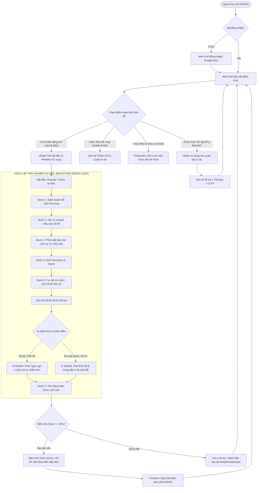
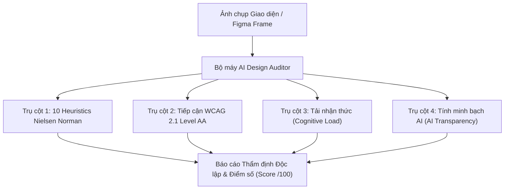

# 🎨 TÀI LIỆU YÊU CẦU THIẾT KẾ UX/UI TÍCH HỢP AI (PRD UX/UI DESIGN DOCUMENT)
## CHƯƠNG 4: AI TRONG THIẾT KẾ SẢN PHẨM (AI IN PRODUCT DESIGN)
### DỰ ÁN: KIZUNA (絆) - HÀNH TRÌNH HỌC TIẾNG NHẬT ĐA NỀN TẢNG HỖ TRỢ BỞI AI
**Học phần:** CS2028 - AI Product Development: End to End (Chuyên đề 4)  
**Trường:** Đại học Công nghệ Thông tin và Truyền thông Việt - Hàn (VKU) - Đại học Đà Nẵng  
**Giảng viên phụ trách:** ThS. Lê Thành Công  
**Thời lượng phân bổ:** 3 tiết (2 tiết Lý thuyết + 1 tiết Thực hành)  
**Phiên bản tài liệu:** v1.0.0 (Chuẩn hóa Thiết kế Giao diện & Đánh giá Tự động bằng AI)  

---

## 📌 BỐI CẢNH SƯ PHẠM & KẾ HOẠCH BÀI HỌC (SYLLABUS & PEDAGOGY)

### 1. Phân bổ Thời lượng & Mục tiêu Bài học
- **Thời lượng:** 3 tiết (2 tiết Lý thuyết + 1 tiết Thực hành).
- **Mục tiêu học tập (Learning Outcomes):**
  - **Về Kiến thức:** Hiểu và áp dụng được Generative AI vào chu trình thiết kế sản phẩm số: từ chuyển hóa yêu cầu tính năng (PRD) sang Luồng người dùng (User Flow), Bố cục khung (Wireframing), Bản mẫu tương tác (Prototyping), đến Đánh giá thiết kế tự động (AI Design Review).
  - **Về Kỹ năng:** Sử dụng thành thạo các AI prompts chuyên biệt để sinh layout, đánh giá độ tương phản, phát hiện lỗi Heuristic Nielsen, và tối ưu hóa tải nhận thức (Cognitive Load) cho học viên học tiếng Nhật.
  - **Về Thái độ:** Hình thành tư duy thiết kế lấy người dùng làm trung tâm (User-Centered Design) kết hợp thẩm định phản biện trước các đề xuất tự động của AI.

### 2. Phương pháp Giảng dạy (Dành cho Giảng viên)
- **Nêu vấn đề thực tế (Problem-based Learning):**
  - Đặt bài toán: *"Làm sao thiết kế giao diện học tiếng Nhật dạng Bản đồ Hành trình (Journey Map) kết hợp Trợ lý AI Sensei phản hồi tức thời mà không làm người học bị ngợp thông tin và duy trì được thói quen học tập mỗi ngày?"*.
  - Hướng dẫn sinh viên phân tích sự khác biệt giữa UI tĩnh truyền thống và UI thích ứng do AI điều phối (AI-assisted Adaptive UI).
- **Hỗ trợ & Cố vấn (Facilitation & Mentoring):**
  - Hỗ trợ các nhóm sinh viên vượt qua "bẫy Prompt" (Prompt sơ sài dẫn đến AI tạo layout rập khuôn, thiếu tính khả dụng).
  - Giúp sinh viên thiết lập Guardrail về UI: Xử lý trạng thái chờ AI (Skeleton / Shimmer loading), dự phòng khi mất mạng (Offline fallback), và kiểm soát độ dài phản hồi của AI Sensei trên màn hình di động.

### 3. Hoạt động của Sinh viên (Student Activities)
- **Tìm hiểu vấn đề (Exploration):** Nghiên cứu case-study Mốc *"Đổi lịch hẹn"* (Chặng 3 - Tiếng Nhật giao tiếp N4) từ PRD kỹ thuật của KIZUNA.
- **Thảo luận nhóm (Collaborative Brainstorming):** 
  - Phân tích hành vi lữ khách (Learner Persona), xác định các điểm chạm (Touchpoints) và điểm nghẽn nhận thức (Friction Points).
  - Phác thảo nhanh User Flow và sơ đồ cấu trúc thông tin (Information Architecture).
- **Làm bài thực hành cá nhân (Hands-on Practice):**
  - Xây dựng Wireframe và Interactive Prototype trên công cụ thiết kế.
  - Viết Master Prompt và chạy thẩm định AI Design Review theo 10 nguyên lý Heuristics & WCAG 2.1 AA.
  - Xuất báo cáo cải tiến thiết kế dựa trên phản hồi của AI.

---

## 4.1. LUỒNG NGƯỜI DÙNG TÍCH HỢP AI (AI-ENHANCED USER FLOW)

### 4.1.1. Triết lý Thiết kế Luồng: "Cuộc phiêu lưu không ma sát" (Frictionless Odyssey)
Khác với mô hình danh sách khóa học truyền thống khiến người học cảm thấy áp lực bài vở, KIZUNA tổ chức luồng người dùng theo dạng **Bản đồ Hành trình RPG**:
1. **Khám phá tự nhiên:** Người học luôn biết mình đang ở đâu, đã vượt qua những gì và mốc kế tiếp là gì.
2. **Vòng lặp tương tác có AI đồng hành (Co-pilot Loop):** AI không xuất hiện như một chatbot độc lập gây xao nhãng mà được tích hợp trực tiếp vào từng bước làm bài.
3. **Phục hồi nhẹ nhàng:** Khi làm sai, người học không bị phạt trừ điểm nặng nề mà được phân nhánh sang *Trạm ôn tập ngắt quãng (Spaced Re-engagement)* để củng cố kiến thức.

### 4.1.2. Sơ đồ Luồng Tổng thể (Master User Flow Diagram)



### 4.1.3. Phân tích Luồng Edge Cases & Cơ chế Phục hồi (Recovery Paths)

| Mã ngoại lệ | Tình huống phát sinh | Phản ứng giao diện (UI Response) | Luồng phục hồi (Recovery Flow) |
| :--- | :--- | :--- | :--- |
| **EC-01** | Người dùng bấm gửi câu ở Bước 5 khi mất kết nối Internet | Hiển thị Toast cảnh báo màu vàng: *"Mất kết nối mạng. Bản nháp của bạn đã được lưu an toàn."* Nút "Gửi" chuyển sang *"Thử lại khi có mạng"*. | Khi có mạng trở lại, tự động gửi lại mà không làm mất nội dung người học đã gõ. |
| **EC-02** | AI Sensei phản hồi chậm quá thời gian quy định ($t > 4\text{s}$) | Chuyển từ Skeleton loader sang thông báo: *"AI Sensei đang suy nghĩ kỹ hơn một chút..."* kèm nút bấm *"Bỏ qua và dùng đáp án mẫu"*. | Nếu timeout $8\text{s}$, hệ thống tự động đối chiếu câu trả lời với tập mẫu chuẩn (Rule-based Regex) để người học không bị gián đoạn. |
| **EC-03** | Người học nhập nội dung độc hại hoặc Prompt Injection vào ô viết | AI Guardrail phát hiện và trả về mã phản hồi an toàn: *"Sensei chỉ có thể hỗ trợ bạn trong phạm vi học tiếng Nhật chủ đề này thôi nhé!"* | Giữ nguyên câu nhập liệu, tô viền cam cảnh báo, yêu cầu người học nhập câu đúng ngữ cảnh bài học. |
| **EC-04** | Người học muốn thoát giữa chừng khi đang làm vòng lặp | Bấm nút (X) ở góc trên bên trái -> Hiển thị Confirmation Dialog: *"Bạn có muốn tạm dừng? Tiến độ câu hiện tại sẽ được lưu lại."* | Nếu xác nhận thoát, lưu trạng thái vào `localStorage` và đưa người học về Bản đồ an toàn. |

---

## 4.2. BỐ CỤC KHUNG (WIREFRAMING)

### 4.2.1. Quy chuẩn Hệ thống Lưới & Không gian (Grid & Layout System)
- **Hệ thống bước nhảy 8pt (8-Point Grid):** Toàn bộ padding, margin, kích thước component đều là bội số của 8 (4px cho micro-spacing, 8px, 16px, 24px, 32px, 48px).
- **Thiết kế Ưu tiên Di động (Mobile-First):**
  - Màn hình cơ sở: **390px $\times$ 844px** (tương thích iPhone 13/14/15 và các thiết bị Android tầm trung).
  - Khung giới hạn Responsive trên Web Desktop: Max-width container **480px** căn giữa cho trải nghiệm học dạng Mobile Viewport, hoặc mở rộng **12-column grid** (Gutter 24px, Margin 32px) cho giao diện Quản trị/Thống kê.
- **Vùng an toàn ngón tay cái (Thumb-Zone Optimization):** Các nút CTA hành động quan trọng (Tiếp tục, Nghe lại, Gửi câu) luôn nằm ở $1/3$ dưới của màn hình.

---

### 4.2.2. Wireframe Màn hình 1: Bản đồ Hành trình (Journey Map Screen)

```
+-------------------------------------------------------------+
| [Avatar] Level 3: N4 Explorer      (🔥 5 Ngày) (⭐ 340 XP)  |  <- Top Bar
+-------------------------------------------------------------+
| Chặng 3: Sinh hoạt hằng ngày (Tiếng Nhật N4)                |  <- Stage Header
| Tiến độ chặng: [=========>                  ] 35%           |
+-------------------------------------------------------------+
|                                                             |
|                         ( Mốc 1: Tự giới thiệu )            |
|                                [COMPLETED]                  |
|                                     |                       |
|                                    /                        |
|                     ( Mốc 2: Hỏi đường tàu điện )           |
|                                [COMPLETED]                  |
|                                     \                       |
|                                      |                      |
|                         ( Mốc 3: Đổi lịch hẹn )             |  <- Node tiêu điểm
|                              [⭐ UNLOCKED]                  |
|                                  /     \                    |
|       [Trạm Ôn tập Lỗi cũ] <----+       |                   |
|        (! 3 câu từ都合)                 |                   |
|                                    ( Mốc 4: Giải thích lý do)|
|                                         [LOCKED 🔒]         |
|                                              |              |
|                                             ...             |
+-------------------------------------------------------------+
|    [ 🗺️ Bản đồ ]     [ 📚 Sổ tay ]     [ 👤 Cá nhân ]       |  <- Bottom Navigation
+-------------------------------------------------------------+
```

#### Phân tích cấu trúc thành phần (Component Breakdown):
1. **Top Bar Header:**
   - Cụm thông tin định danh: Avatar tròn 40px, Tên cấp bậc học viên.
   - Chỉ số động lực (Gamification Chips): Streak lửa ngày (giữ lửa thói quen), Điểm kinh nghiệm XP.
2. **Stage Progression Card:**
   - Tiêu đề Chặng hiện tại, thanh tiến độ tuyến tính (Progress Bar) với phần trăm hoàn thành.
3. **Interactive Path Canvas:**
   - Trục đường đi uốn lượn (SVG Path Bezier Curve).
   - Node mốc có 3 trạng thái rõ ràng:
     - `COMPLETED`: Màu xanh lá cây, icon tích v, có thể bấm vào xem lại.
     - `UNLOCKED`: Màu đỏ cam thương hiệu KIZUNA, hiệu ứng phát sáng nhẹ (Pulse Glow), kích thước lớn hơn 15% để thu hút chú ý.
     - `LOCKED`: Màu xám Slate, biểu tượng ổ khóa, không cho phép click kích hoạt.
     - `REVISIT NODE`: Trạm dừng chân phụ phân nhánh, màu hổ phách, hiển thị số lượng câu lỗi cần khắc phục.
4. **Bottom Navigation Bar:**
   - 3 tab điều hướng chính với chiều cao cố định 64px, icon 24px kèm nhãn văn bản 12px.

---

### 4.2.3. Wireframe Màn hình 2: Màn hình Vòng lặp Mốc (Milestone Quest Screen)

```
+-------------------------------------------------------------+
| [X] Hủy mốc      Bước 5/7: Tự viết tin nhắn      [ ❤️ 5/5 ] |  <- Progress Bar
| [======================================>         ] 71%      |
+-------------------------------------------------------------+
| 状況 (BỐI CẢNH GIAO TIẾP):                                  |
| Bạn có hẹn đi ăn với đồng nghiệp Tanaka vào tối thứ Hai.    |
| Đột nhiên bạn có lịch trực gấp, hãy nhắn tin xin dời lịch   |
| hẹn sang thứ Tư tuần sau.                                   |
+-------------------------------------------------------------+
| [🔊 Nghe lại đoạn hội thoại mẫu]  (00:15 / 00:45)           |
+-------------------------------------------------------------+
| Từ vựng gợi ý: [ 都合 (thuận tiện) ]  [ 変更 (thay đổi) ]   |  <- Whitelist Chips
+-------------------------------------------------------------+
| HÃY SOẠN TIN NHẮN BẰNG TIẾNG NHẬT:                          |
| +---------------------------------------------------------+ |
| | 来週の月曜日は都合が悪いですから、火曜日に            | |  <- Textarea
| | 変更してください。                                     | |     Input
| |                                                         | |
| +---------------------------------------------------------+ |
| [ ⌨️ Bật gõ Romaji -> Kana ]         Độ dài: 32 ký tự        |
+-------------------------------------------------------------+
|                                                             |
|                 [ 🚀 GỬI CHO AI SENSEI CHẤM ]               |  <- Sticky CTA
+-------------------------------------------------------------+
```

---

### 4.2.4. Wireframe Màn hình 3: Khung Phản hồi AI Sensei (AI Evaluation Bottom Sheet)

```
+=============================================================+
|                      [ Thanh kéo Drawer ]                   |
+-------------------------------------------------------------+
| [🤖 AI Sensei Avatar]  ĐÁNH GIÁ CỦA SENSEI: RẤT TỰ NHIÊN!   |
|                        Điểm độ chính xác: 85/100 ⭐         |
+-------------------------------------------------------------+
| 🔍 PHÂN TÍCH NGỮ PHÁP & SẮC THÁI:                           |
| • Ngữ pháp: Bạn dùng cấu trúc "都合が悪い" rất chính xác.    |
| • Góp ý sắc thái (Nuance):                                  |
|   Cách nói "...変更してください" (Hãy đổi lịch) hơi mang tính|
|   áp đặt với đồng nghiệp. Trong môi trường công sở Nhật,    |
|   nên dùng thể nhờ vả lịch sự để thể hiện sự khiêm nhường.  |
+-------------------------------------------------------------+
| 💡 CÂU ĐỀ XUẤT TỰ NHIÊN HƠN (NATIVE EXPRESSION):             |
| +---------------------------------------------------------+ |
| | 来週の月曜日は都合が悪くなってしまい、火曜日に          | |
| | 変更していただけないでしょうか。                        | |
| +---------------------------------------------------------+ |
| [🔊 Nghe phát âm mẫu]               [📋 Sao chép câu này]   |
+-------------------------------------------------------------+
|                   [ TIẾP TỤC BÀI HỌC (Bước 6/7) -> ]        |
+=============================================================+
```

---

## 4.3. TẠO BẢN MẪU (PROTOTYPING & DESIGN SYSTEM)

### 4.3.1. Bảng Mã Định danh Thiết kế (Design Tokens Specification)

#### A. Hệ thống Màu sắc (Color System)
Hệ thống màu của KIZUNA được thiết kế để cân bằng giữa bản sắc văn hóa Nhật Bản (Màu đỏ Torii, Trắng Washi), nét công nghệ hiện đại (AI Electric Violet) và tiêu chuẩn tiếp cận thị giác (WCAG Contrast).

| Token Name | Hex Code | Vai trò & Ứng dụng | Độ tương phản trên nền trắng |
| :--- | :--- | :--- | :--- |
| `--color-primary-600` | `#DC2626` | Màu thương hiệu chính: Cổng Torii, Mốc đang chọn, CTA chính | $5.9:1$ (Đạt AAA Large, AA Normal) |
| `--color-primary-700` | `#B91C1C` | Trạng thái nút bấm khi Active / Pressed | $7.4:1$ (Đạt AAA) |
| `--color-journey-indigo` | `#4338CA` | Đại diện cho các mốc kiến thức, liên kết bản đồ | $8.6:1$ (Đạt AAA) |
| `--color-ai-accent` | `#8B5CF6` | Vùng phản hồi của AI Sensei, tia sáng gợi ý thông minh | $4.6:1$ (Đạt AA Normal) |
| `--color-ai-surface` | `#F5F3FF` | Nền khung phản hồi của AI (Violet Tint nhẹ) | Nền phụ dịu mắt |
| `--color-success-green` | `#059669` | Mốc đã hoàn thành, câu trả lời đúng | $4.8:1$ (Đạt AA) |
| `--color-warning-amber` | `#D97706` | Trạm ôn tập ngắt quãng (Spaced Quest), cần lưu ý | $4.5:1$ (Đạt AA) |
| `--color-surface-card` | `#FFFFFF` | Thẻ nội dung câu hỏi, Bottom sheet | Tương phản chuẩn |
| `--color-bg-canvas` | `#F8FAFC` | Nền canvas bản đồ học tập | Giảm mỏi mắt khi học lâu |
| `--color-text-primary` | `#0F172A` | Tiêu đề, chữ bối cảnh, câu hỏi chính | $15.8:1$ (Siêu tương phản) |
| `--color-text-secondary`| `#475569` | Chú thích phụ, hướng dẫn gõ Kana | $5.2:1$ (Đạt AA) |

#### B. Hệ Thống Kiểu Chữ (Typography Tokens)
Kết hợp hài hòa giữa font chữ hệ thống không chân hiện đại (Inter) và font tiếng Nhật tiêu chuẩn (Noto Sans JP) có hỗ trợ Furigana (chữ phiên âm nhỏ trên đầu Kanji).

```css
/* Typography Scale */
--font-family-latin: 'Inter', system-ui, -apple-system, sans-serif;
--font-family-jp: 'Noto Sans JP', 'Hiragino Kaku Gothic ProN', sans-serif;

--text-display-lg: 700 28px/36px var(--font-family-latin);  /* Tiêu đề Chặng */
--text-heading-md: 600 20px/28px var(--font-family-latin);  /* Tiêu đề Mốc */
--text-body-jp:    500 18px/28px var(--font-family-jp);     /* Câu tiếng Nhật người học đọc/viết */
--text-body-vn:    400 15px/22px var(--font-family-latin);  /* Bối cảnh tiếng Việt */
--text-caption:    400 12px/16px var(--font-family-latin);  /* Tag phụ, thời gian */
--text-furigana:   400 10px/12px var(--font-family-jp);     /* Phiên âm Kana trên chữ Hán */
```

#### C. Độ cong góc (Border Radius) & Đổ bóng (Elevation)
- `--radius-sm: 6px` (Badge, Chip từ vựng)
- `--radius-md: 12px` (Thẻ câu hỏi, Input textarea)
- `--radius-lg: 20px` (Modal bối cảnh, Bottom sheet Drawer)
- `--radius-full: 9999px` (Nút tròn bấm mốc, Avatar)
- `--shadow-node: 0 4px 14px rgba(220, 38, 38, 0.25)` (Hiệu ứng nổi cho Mốc đang mở)
- `--shadow-drawer: 0 -10px 25px rgba(0, 0, 0, 0.1)` (Hiệu ứng Bottom Sheet nổi lên)

---

### 4.3.2. Đặc tả Trạng thái Tương tác & Bản mẫu Vi mô (Micro-interactions)

```
[Bình thường (Default)] 
       │
       ▼ (Tap vào nút Gửi câu)
[Đang tải (Loading) - Vòng xoay mờ 200ms]
       │
       ▼ (Backend gọi LLM)
[AI Đang Streaming (Skeleton Shimmer + Text gõ từng chữ)]
       │
       ▼ (Kết thúc stream thành công)
[Hiển thị Kết quả Drawer + Rung nhẹ Haptic Feedback + Âm thanh Chime nhẹ]
```

1. **Hiệu ứng Mốc UNLOCKED trên Bản đồ:**
   - Sử dụng animation CSS keyframe `pulse-glow`: Chu kỳ $2\text{s}$ phóng to $1.05\times$ và tỏa vầng hào quang `#DC2626` với độ mờ $40\% \to 0\%$.
2. **Trạng thái AI Đang Suy nghĩ (Streaming Feedback):**
   - Không được để màn hình trống trơn làm người dùng hoang mang.
   - Hiển thị 3 dòng Skeleton màu tím nhạt `#EDE9FE` lấp lánh (Shimmer effect $1.2\text{s}$) kèm icon AI Sensei đang chớp mắt nhẹ nhàng.
3. **Cơ chế Kéo - Thả Bottom Sheet:**
   - Cho phép người học vuốt nhẹ xuống để ẩn drawer nếu muốn xem lại câu mình đã viết, và vuốt ngược lên để đọc lại phân tích của AI.

---

## 4.4. AI ĐÁNH GIÁ THIẾT KẾ (AI DESIGN REVIEW)

### 4.4.1. Khung Thẩm định Thiết kế 4 Trụ cột (4-Pillar AI Review Framework)
Để đảm bảo bản thiết kế UX/UI của sinh viên đạt tiêu chuẩn công nghiệp trước khi lập trình, quy trình kiểm thử sử dụng AI Đa phương thức (Multimodal LLM) để phân tích ảnh chụp giao diện dựa trên 4 trụ cột:



#### Trụ cột 1: 10 Nguyên lý Khả dụng Nielsen Norman (Usability Heuristics)
1. **Visibility of system status:** Có hiển thị bước hiện tại (5/7) và thanh tiến độ rõ ràng không?
2. **Match between system and real world:** Phép ẩn dụ bản đồ hành trình và cách dùng từ có gần gũi với lữ khách không?
3. **User control and freedom:** Có nút thoát (X) và hộp thoại xác nhận hủy mốc không?
4. **Consistency and standards:** Các icon âm thanh, màu trạng thái mốc có đồng nhất trên toàn hệ thống không?
5. **Error prevention:** Có chặn bấm gửi khi chưa nhập ký tự nào không?
6. **Recognition rather than recall:** Từ vựng gợi ý (Whitelist chips) có hiện ngay dưới ô gõ không?
7. **Flexibility and efficiency of use:** Có hỗ trợ phím tắt gõ tiếng Nhật và nút nghe lại phát âm nhanh không?
8. **Aesthetic and minimalist design:** Màn hình có bị nhồi nhét quá nhiều banner hay quảng cáo không cần thiết không?
9. **Help users recognize and recover from errors:** Lời giải thích của AI có chỉ rõ vị trí từ sai và cách sửa cụ thể không?
10. **Help and documentation:** Có tooltip giải thích ý nghĩa các huy hiệu và mốc ôn tập không?

#### Trụ cột 2: Tiêu chuẩn Tiếp cận Web/Mobile (WCAG 2.1 AA Compliance)
- **Contrast Ratio:** Văn bản chính tối thiểu $4.5:1$, thành phần đồ họa tối thiểu $3:1$.
- **Touch Target:** Kích thước vùng bấm tối thiểu đạt **$44 \times 44\text{ pt}$** (theo Apple HIG) hoặc **$48 \times 48\text{ dp}$** (theo Google Material).
- **Text Scalability:** Giao diện không bị vỡ khi người dùng phóng to cỡ chữ lên $130\%$.

#### Trụ cột 3: Kiểm soát Tải nhận thức (Cognitive Load Optimization)
- **Định luật Miller ($7 \pm 2$ items):** Mỗi màn hình không xuất hiện quá 5 nút bấm hành động cùng lúc.
- **Định luật Hick:** Giảm thiểu số lượng quyết định cần đưa ra tại mỗi bước học.

#### Trụ cột 4: Tính Minh bạch & Đạo đức AI (AI Transparency & Guardrails)
- Giao diện phải phân định rõ đâu là **Nội dung chuẩn của giáo trình** và đâu là **Lời nhận xét/gợi ý do AI tạo**.
- Luôn cung cấp nút *"Báo cáo phản hồi không chính xác"* để học viên phản ánh khi AI Sensei bị ảo giác (hallucination).

---

### 4.4.2. Bộ Prompt Master phục vụ AI Design Review (Prompt Engineering for Auditing)

#### Master Prompt: Thẩm định Độc lập Giao diện UI/UX (Dành cho Giảng viên & SV)
```markdown
[ROLE]: Bạn là Chuyên gia Trưởng về Đánh giá Trải nghiệm Người dùng (Lead UX/UI & Accessibility Auditor) tại một công ty công nghệ EdTech hàng đầu, đồng thời là chuyên gia kiểm định tiêu chuẩn WCAG 2.1 AA và Heuristics Nielsen Norman.

[INPUT]: Tôi cung cấp ảnh chụp giao diện/bản thiết kế màn hình của ứng dụng học tiếng Nhật KIZUNA. Màn hình này đang thực hiện chức năng: [Điền tên chức năng, ví dụ: Vòng lặp Mốc 3 - Học viên tự viết câu và nhận phản hồi từ AI Sensei].

[TASK]: Hãy tiến hành đánh giá phản biện chi tiết (Design Critique) theo các tiêu chí sau:
1. Đánh giá 10 Nguyên tắc Nielsen Norman: Chỉ ra ít nhất 2 điểm làm tốt và 2 vi phạm khả dụng (Usability Issues) kèm mã nguyên tắc (ví dụ: H1, H4, H8).
2. Kiểm tra Tiếp cận (Accessibility Check):
   - Đo lường và nhận xét tỷ lệ tương phản màu sắc của các nút CTA, text phụ trên nền card.
   - Đánh giá kích thước vùng bấm (Touch target size) cho thiết bị di động.
3. Phân tích Tải nhận thức (Cognitive Load): Học viên có bị phân tâm giữa bối cảnh bài học, ô gõ phím và khung nhận xét của AI không?
4. Đánh giá Trải nghiệm Tương tác AI (AI UX Patterns): Trạng thái chờ phản hồi, tính minh bạch của AI gợi ý, và đường thoát cho người dùng khi AI phản hồi sai.

[OUTPUT FORMAT]:
- Điểm tổng kết: X/100
- Bảng Ma trận Vấn đề: [Mã lỗi | Mức độ nghiêm trọng (Thấp/Vừa/Nghiêm trọng) | Vị trí màn hình | Đề xuất giải pháp sửa trực quan]
- Đề xuất Prompt cải tiến cho Figma/v0 để sửa ngay lỗi trên.
```

---

## 4.5. BÀI THỰC HÀNH 4: THIẾT KẾ & THẨM ĐỊNH BẢN MẪU KIZUNA (PRACTICE LAB 4)

### 4.5.1. Kịch bản Thực hành (Lab Workflow)
- **Thời lượng:** 1 tiết thực hành trên lớp + Bài tập tự hoàn thiện cá nhân.
- **Dữ liệu đầu vào:** Yêu cầu Mốc *"Đổi lịch hẹn"* (Chặng 3) từ tài liệu `3.5_FEATURE_SPECIFICATIONS.md`.
- **Nhiệm vụ của Sinh viên:**
  1. **Nhiệm vụ 1 (User Flow):** Vẽ sơ đồ luồng người dùng chi tiết khi làm bài tập tự viết câu tiếng Nhật, bao gồm cả trường hợp AI phản hồi tốt và trường hợp AI phát hiện từ nằm ngoài Whitelist.
  2. **Nhiệm vụ 2 (Wireframing & AI Prompting):** Sử dụng công cụ Generative UI (v0.dev / Figma AI / Claude Artifacts) để sinh bố cục khung màn hình Vòng lặp Mốc và Drawer phản hồi của AI Sensei.
  3. **Nhiệm vụ 3 (AI Design Review):** Xuất ảnh chụp màn hình thiết kế, đưa vào mô hình AI Đa phương thức với **Master Prompt**, trích xuất ít nhất 3 khuyến nghị cải tiến và thực hiện chỉnh sửa lại bản vẽ.

### 4.5.2. Tiêu chí Chấm điểm (Evaluation Rubric - Thang điểm 10)

| Tiêu chí đánh giá | Trọng số | Mức Đạt (5.0 - 6.5) | Mức Khá (7.0 - 8.0) | Mức Xuất sắc (8.5 - 10.0) |
| :--- | :---: | :--- | :--- | :--- |
| **1. Tính đầy đủ của User Flow** | 25% | Luồng cơ bản chỉ có trường hợp thành công (Happy path). | Có đủ Happy path và tối thiểu 1 nhánh ngoại lệ (Edge case). | Đầy đủ Happy path, ngoại lệ rớt mạng, AI timeout, kiểm soát Whitelist và phân nhánh Trạm ôn tập. |
| **2. Chất lượng Wireframe & Lưới** | 25% | Layout lộn xộn, không theo chuẩn lưới, vùng bấm quá nhỏ. | Áp dụng hệ thống 8pt grid, phân cấp thị giác rõ ràng, có bản mobile. | Chuẩn mực 8pt grid, tối ưu hóa ngón tay cái (Thumb zone), bố cục card và bottom sheet đạt chuẩn công nghiệp. |
| **3. Design Tokens & Prototype** | 25% | Màu sắc tùy tiện, không đồng nhất font chữ, thiếu trạng thái. | Có bảng màu cơ bản, font chữ tiếng Nhật hiển thị ổn, có trạng thái nút bấm. | Hệ thống Tokens đầy đủ (Primary, AI Accent, States), hỗ trợ tốt Furigana, mô phỏng mượt mà Micro-interaction & AI Streaming. |
| **4. Báo cáo AI Design Review** | 25% | Prompt đánh giá sơ sài, không phân tích được lỗi tiếp cận. | Chạy được AI Review, chỉ ra được lỗi Heuristic và độ tương phản cơ bản. | Phân tích sâu sắc cả 4 trụ cột (Heuristics, WCAG 2.1 AA, Tải nhận thức, AI UX), có bảng ma trận đối sánh trước/sau khi sửa. |

---

## 4.6. DEMO VÍ DỤ MINH HỌA (CASE STUDIES & ILLUSTRATIONS)

### 4.6.1. Ví dụ Minh họa 1: Tối ưu Hóa Khung Phản Hồi AI (Before vs After AI Design Review)

#### 🔴 Bản thiết kế Trước Đánh giá (Before AI Review):
- AI trả lời một đoạn văn bản dài 6 dòng không xuống dòng.
- Màu nền Drawer xám đen (`#334155`) tương phản kém với chữ tím (`#A855F7`) $\implies$ Vi phạm WCAG Contrast ($2.1:1$).
- Nút "Tiếp tục" nằm lọt thỏm ở góc trên màn hình ngoài tầm với của ngón cái.
- **Kết quả AI Review:** Đánh giá $52/100$ điểm - Vi phạm Heuristic H8 (Thiết kế thẩm mỹ & tinh giản) và WCAG Tiếp cận.

#### 🟢 Bản thiết kế Sau Đánh giá (After Refinement):
- Phản hồi được chia làm 3 thẻ trực quan: (1) Huy hiệu trạng thái, (2) Góp ý sắc thái ngắn gọn gạch đầu dòng, (3) Khung câu bản xứ mẫu nền xanh nhạt với nút "Nghe lại" và "Sao chép".
- Màu nền trắng ngà `#FFFFFF` viền tím nhạt `#DDD6FE`, chữ chính đen than `#0F172A` $\implies$ Đạt độ tương phản $15.8:1$ (AAA).
- Nút "Tiếp tục" dạng full-width Sticky Bar ở đáy màn hình, chiều cao 52px, dễ dàng bấm bằng một tay.
- **Kết quả AI Review:** Đánh giá $96/100$ điểm.

---

### 4.6.2. Ví dụ Minh họa 2: Xử lý Trạng thái AI Streaming & Fallback khi Mất Mạng

```
[TRẠNG THÁI STREAMING MƯỢT MÀ]
+-------------------------------------------------------------+
| 🤖 AI Sensei đang phân tích câu của bạn...                  |
| ▰▰▰▰▰▰▰▰▰▰▰▰▰▰▰▰▰▰▰▰▰▰▰▰▰▰▰▰ (Hiệu ứng sóng quét Gradient)  |
| "Tuyệt vời! Bạn đã sử dụng chính xác từ 都合.               |
| Tuy nhiên, để câu văn tự nhiên hơn... ▎                     |
+-------------------------------------------------------------+

[TRẠNG THÁI FALLBACK KHI MẤT MẠNG / QUÁ TẢI]
+-------------------------------------------------------------+
| ⚠️ Không thể kết nối tới AI Sensei (Lỗi mạng hoặc Timeout)   |
| Đừng lo! KIZUNA đã lưu lại câu trả lời của bạn.             |
|                                                             |
| Đáp án mẫu tham khảo từ Giáo trình:                         |
| "来週の月曜日は都合が悪いため、火曜日に変更していただけますか" |
|                                                             |
| [ 🔄 Thử kết nối lại ]            [ ⏩ Tiếp tục học tiếp ]   |
+-------------------------------------------------------------+
```

---

*Tài liệu này được phê duyệt làm căn cứ chính thức cho quá trình triển khai giao diện Frontend (React TypeScript) và đánh giá đồ án môn học CS2028 tại VKU.*
